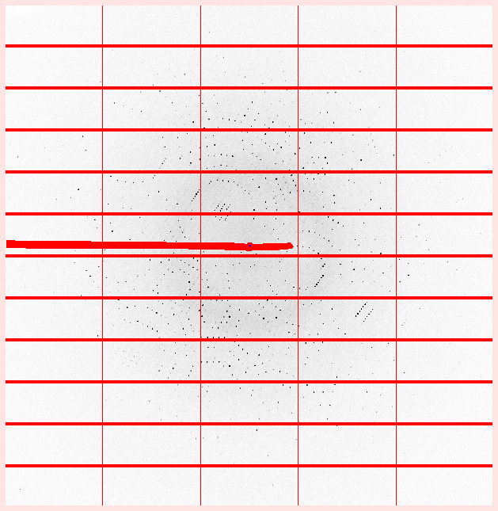

# Data processing tutorial

## Data

To process the data locally using DIALS you will need a copy of the dataset on your computer. At the Diamond workshop, the data set can be found in the directory `/FIXME`. Outside of the workshop, you can download it from [this link](https://ccp4serv6.rc-harwell.ac.uk/jscofe-dev/tmp/ADH4.zip).

## Summary

We will work on a data set recorded from crystals of the enzyme tetrahydroalstonine synthase (THAS1), with thanks to Prof. Dave Lawson for providing the data set. The images were collected at Diamond Light Source on a PILATUS 6M pixel array detector at an X-ray wavelength of 1.282 Å, at the Zinc _K_ edge. There is sufficient anomalous signal to solve the structure by experimental phasing (SAD). There are some more details about the data set [here](https://zenodo.org/records/14541394)) and in the file `ADH4_data_info.pdf` (note that ADH4 is an old name for the gene encoding the protein).

First we will set up a xia2 processing job, running remotely on the CCP4 Cloud at Harwell. This will keep your computer free to simultaneously try out DIALS data processing using the command line.

Once you have completed the "manual" processing, you can compare results with the xia2 job. Are there any differences? Which job has better statistics?

## Processing with xia2 on CCP4 Cloud

If you have CCP4 9.0 icons available, double click on the icon named "CCP4Cloud Remote". Alternatively, in a terminal with the CCP4 9.0 environment sourced, run the script `ccp4cloud-remote`. This will open a web browser allowing you to log in to the CCP4 Cloud at Harwell. Here we assume you already have an account, and know how to create a new project.

Within your Cloud project, add a new "Automatic Image Processing with Xia-2" task. Under "Input Data" make sure sure the task will "Look for X-ray images in cloud storage". :file_folder: Browse for the image directory, selecting _Tutorials/Data/1_from_images/ADH4/ADH4_diffraction_data_. Set a sensible project and crystal name, and don't forget to add "Zn" as the heavy atom type!

There's no need to set any advanced options, just select "Run". Make sure the job starts, but after that you can leave it to process while you look at the images locally with DIALS.

> Running xia2 in CCP4 Cloud requires you first to upload the images to Cloud, so it hasn't been a very popular option in the past. You are more likely to come across xia2 from autoprocessing results at the synchrotron, or by running xia2 locally through ccp4i2 or at the command line. Recently however, uploading images was made easier if you (or your lab) use the Globus file transfer platform, where CCP4 Cloud has an endpoint. However, image data is large and will eventually be deleted from Cloud to save space. So don't consider CCP4 Cloud as a backup solution for your diffraction data!

## Setting up DIALS processing

Now we will process the images using the DIALS command line. In a terminal with the CCP4 environment sourced, first change to a directory where you want to do the processing (at the Diamond workshop, please work in a directory under the location you are moved to when you run `module load ccp4-workshop`):

```bash
cd /study/2025/DP00BA77/personal/myusername
mkdir THAS1-dials
cd THAS1-dials
```

## Importing the images

The first task in data processing with DIALS is to import the images. The program used to do this is unimaginatively named `dials.import`. In common with other `dials.something` commands, running the program without options will print a help message with some usage examples:

```bash
dials.import
```

You may have to scroll up to read the full output. If you add the option `-h` to this command you will not only see the help message, but also the structured definitions of the command line parameters that can be passed to the program.

> What happens if you pass multiple `h` and `v` characters? Try this out later with other DIALS programs too.

Now we are ready to import the images. You can do this by entering the following command, after adjusting the path to the files on your computer:

```bash
dials.import /path/to/images/ADH4_M7S9_6_*.cbf
```

Note the use of the wildcard `*` character in the `dials.import` command. This is not DIALS syntax, but is expanded by the shell to match every image file in that directory, from `ADH4_M7S9_6_0001.cbf` to `ADH4_M7S9_6_0800.cbf`. What `dials.import` does is read the header of each of these files, checks the diffraction geometry, and determines the relationship between the files.

> For EIGER data there is not one file per image, but usually a few files with the extension `.h5`. In this case, just pass the file with the name that ends `_master.h5`, or, (better) if it is present, the file with the extension `.nxs`.
>

All going well you will see output that looks something like this:

```
--------------------------------------------------------------------------------
  format: <class 'dxtbx.format.FormatCBFMiniPilatusDLS6MSN100.FormatCBFMiniPilatusDLS6MSN100'>
  template: /data/ADH4_data_for_summer_school/ADH4_diffraction_data/ADH4_M7S9_6_####.cbf:1:800
  num images: 800
  sequences:
    still:    0
    sweep:    1
  num stills: 0
--------------------------------------------------------------------------------
Writing experiments to imported.expt
```

This tells you that DIALS interprets the 800 images as a single rotation sweep, and writes the diffraction geometry and associated metadata into a new file, `imported.expt`. To get human-readable information from that file try

```bash
dials.show imported.expt
```

## Viewing the images

Although we are doing command-line data processing, we should still look at the images! DIALS contains a feature-rich image viewer for this purpose:

```bash
dials.image_viewer imported.expt
```

> Take a moment to explore the controls in the image viewer. Can you drag the image around and zoom using the mouse? Can you see the intensity and resolution information for a single pixel? What is your preferred colour scheme and brightness? Can you scroll through and see how the diffraction images change as data collection proceeds? Don't be afraid to play with the controls - nothing you can do here will affect processing of the data set.

> Look at images at various points in the data set - at the beginning, in the middle, and at the end. Does the crystal diffract well throughout? Are there any other features present alongside the diffraction spots?

## Masking the backstop shadow (optional)

There is a horizontal backstop shadow across the images. We could mask this out if we wanted, however looking at the rotation axis orientation using `dials.image_viewer`, we see that this is aligned with the backstop shadow. Spots close to the rotation axis are less reliable and will not be integrated anyway (can you figure out why?).

Nevertheless, if you want to try it you can mask out the shadow using the image viewer. First I recommend increasing the brightness to make the shadow more visible. A value of 100 should do fine. Then zoom into the image to make it easier to click around the edge of the shadow. A zoom level of 100% is likely to make the shadow fill the width of your screen. Now, in the "Actions" menu at the top of the main image viewer window, select "Show mask tool", and then choose one of the modes (I recommend "Polygon"). Now click around the edge of the shadow. When you have finished, select a different mode (say "Circle") to ensure that the polygon has been completed. Finally click the "Save" button to save the mask definition to the file `mask.phil`, and close the image viewer.

To actually set the defined mask in the experiments file, run these commands:

```bash
dials.generate_mask imported.expt mask.phil
dials.apply_mask imported.expt mask=pixels.mask
```

If you now open the new file with the image viewer (`dials.image_viewer masked.expt`) then click "Show mask" in the main controls you will see that the backstop shadow mask has been combined with the default mask for the module gaps.



## Finding spots

With the image viewer open, select the "Threshold pixels" checkbox. This shows you which pixels the spot-finding algorithm considers to be "strong".

> Do the strong pixels match the position of the diffraction spots? What happens if you modify parameters of the threshold algorithm (like kernel size and gain)? What happens if you select different threshold algorithms?

The default parameters seem pretty good for this data set, so exit the image viewer and run a default spot-finding job. If you masked the backstop then that job would be:

```bash
dials.find_spots masked.expt
```

Otherwise, if you did not mask the backstop, run this instead:

```bash
dials.find_spots imported.expt
```

DIALS finds spots throughout the entire rotation scan, whereas some other programs default to finding spots on just enough images to perform indexing. This means spot-finding takes longer with DIALS, but the information determined from the entire scan can be reused multiple times. In fact, now DIALS will not need to read the image data again until integration. At the end of the spot-finding procedure you will see an ASCII-art histogram indicating the number of spots found on each image. In this case it is pretty boring because the crystal diffracts consistently well throughout the scan:

```
Histogram of per-image spot count for imageset 0:
307302 spots found on 800 images (max 5525 / bin)
*                                * **** ** * * **  ** *    *
************************************************************
************************************************************
************************************************************
************************************************************
************************************************************
************************************************************
************************************************************
************************************************************
************************************************************
1                         image                          800

--------------------------------------------------------------------------------
Saved 307302 reflections to strong.refl
```

## Viewing the reciprocal lattice

Now we can pass both the experimental geometry file `masked.expt` / `imported.expt`, and spot file `strong.refl` to `dials.reciprocal_lattice_viewer`:

```bash
dials.reciprocal_lattice_viewer masked.expt strong.refl
```

> Using tab completion, if supported by your shell, avoids you having to type out long commands or filenames, like `dials.reciprocal_lattice_viewer`. Even if tab complete does not work, in this case you can use the alias `dials.rlv` instead.

Take some time to explore the controls in the `dials.reciprocal_lattice_viewer`

> What does middle-button drag do? Try setting "Max Z" to something small, like 5. What does this show you? Align the view down the rotation axis and then click to increase the Max Z value (Use Alt-click to jump in blocks of 100). Can you see how data collection sweeps out a volume of reciprocal space? Can you align the view in a direction that clearly shows the crystal lattice?

The main purpose of the `dials.reciprocal_lattice_viewer` prior to indexing is to look for pathologies that might cause indexing to fail, such as poor diffraction geometry, noisy spots, split spots, ice rings, and so on. In this case the reciprocal space lattice looks very clean, so we would not expect indexing to have any problems.


## Indexing

Go ahead and run a default `dials.index` job, which will find a P1 cell, using the 3D FFT algorithm (remember to substitute `imported.expt` for `masked.expt` if you did not mask the backstop):

```bash
dials.index masked.expt strong.refl
```

It is worth taking a moment to read the log output. The program runs through a few stages:

- Setting up for indexing (calculate `max_cell`, setting resolution limits, mapping spots to reciprocal space and forming the FFT grid)
- Performing the FFT, searching for real space basis vectors and forming candidate solutions (in this case 50)
- Ranking the solutions and choosing the single best
- Performing geometry refinement in macrocycles with increasing resolution. At each stage this:
  - Identifies outliers
  - Parameterises the diffraction geometry
  - Refines this geometry against the observations
  - Increases resolution for the next macrocycle
- Once the resolution limit includes all reflections the final refined model and reflections are written to the files `indexed.expt` and `indexed.expt`

> The behaviour of all of these stages can be controlled by parameters given to `dials.index` (remember option switches like `-hhhvv`), but in most cases the defaults suffice.

Now we have a crystal model it is worth looking at the reciprocal lattice again:

```bash
dials.reciprocal_lattice_viewer indexed.expt indexed.refl
```

The spots are now coloured according to whether they are indexed or not.

> Try the "Show reciprocal cell" option. Zoom in and see if you can align the view with one of the reciprocal basis vectors, a\*, b\* or c\*. Try the toggles between "indexed" and "unindexed", "inliers" and "outliers".

## Determining the Bravais lattice

The initial solution from `dials.index` is triclinic, but the α, β and γ angles are very close to 90°. To identify compatible Bravais lattices we run:

```bash
dials.refine_bravais_settings indexed.expt indexed.refl
```

> Like with `dials.reciprocal_lattice_viewer`, `dials.refine_bravais_settings` has a short form alias: `dials.rbs`

This will enforce the Bravais symmetry of compatible lattices (within some tolerance) and run refinement. The results are printed as a table:

```
Chiral space groups corresponding to each Bravais lattice:
aP: P1
mP: P2 P21
oP: P222 P2221 P21212 P212121
+------------+--------------+--------+--------------+----------+-----------+-------------------------------------------+----------+----------+
|   Solution |   Metric fit |   rmsd | min/max cc   |   #spots | lattice   | unit_cell                                 |   volume | cb_op    |
|------------+--------------+--------+--------------+----------+-----------+-------------------------------------------+----------+----------|
|   *      5 |       0.0338 |  0.078 | 0.904/0.947  |    12000 | oP        | 57.10 102.19 112.16  90.00  90.00  90.00  |   654423 | a,b,c    |
|   *      4 |       0.0338 |  0.078 | 0.947/0.947  |    12000 | mP        | 102.18  57.10 112.16  90.00  89.99  90.00 |   654379 | -b,-a,-c |
|   *      3 |       0.0336 |  0.078 | 0.947/0.947  |    12000 | mP        | 57.10 112.16 102.19  90.00  90.00  90.00  |   654411 | -a,-c,-b |
|   *      2 |       0.0083 |  0.071 | 0.904/0.904  |    12000 | mP        | 57.11 102.19 112.18  90.00  89.97  90.00  |   654619 | a,b,c    |
|   *      1 |       0      |  0.071 | -/-          |    12000 | aP        | 57.11 102.19 112.18  89.99  89.97  90.01  |   654702 | a,b,c    |
+------------+--------------+--------+--------------+----------+-----------+-------------------------------------------+----------+----------+
```
The program writes out experimental geometry for all of these solutions (files `bravais_setting_1.expt` to `bravais_setting_5.expt`) but the associated reflections are not written out, as these files are larger and there is no point wasting disk space for the solutions that are not taken on further. The decision of which solution to choose is down to the user, but the program marks solutions deemed acceptable with an asterisk: `*`. In general, we look for the highest symmetry solution with reasonable values for the `Metric fit`, `rmsd` and `min/max cc` columns. Here we will take solution 5, the primitive orthorhombic (`oP`) one.

In general, to get appropriately reindexed reflections we should run the `dials.reindex` program, passing the change of basis operator printed in the last column of the table. In this case that operator is just `a,b,c`, which is identity - the reflections come out with the same indices as they go in, so the reindexing step is not necessary in this case. Nevertheless, we show the command here anyway:

```bash
dials.reindex indexed.refl change_of_basis_op=a,b,c
```

## Refining the solution

We did some refinement during indexing, and again during Bravais lattice determination. Nevertheless, it is still worth running an additional step of refinement using `dials.refine`. This will use a more sophisticated outlier rejection algorithm than before, and it will also refine a "scan-varying" model of the crystal, in which changes to the orientation and unit cell are allowed as a function of the position in the rotation scan. Using the chosen Bravais lattice and our (unnecessarily) reindexed reflections, we type:

```bash
dials.refine bravais_setting_5.expt reindexed.refl
```

From the log you should see that initially 13 parameters are refined during the "scan-static" macrocycle. Then this is followed by a "scan-varying" macrocycle using 37 parameters, where the crystal parameters have been made local to regions of the scan and the model is constructed by smoothing between these points. This more sophisticated model is able to fit the predictions to the data better, and you should see lower RMSDs as a result:

```
RMSDs by experiment:
+-------+--------+----------+----------+------------+
|   Exp |   Nref |   RMSD_X |   RMSD_Y |     RMSD_Z |
|    id |        |     (px) |     (px) |   (images) |
|-------+--------+----------+----------+------------|
|     0 | 254417 |   0.2914 |  0.28382 |     0.1768 |
+-------+--------+----------+----------+------------+
```

> The space group selected by `dials.refine_bravais_settings` is P222; that is, no attempt has been made yet to locate screw axes. That's not a problem, we do not need to know the exact space group prior to integration, just a sub group. There will be another attempt at symmetry determination later.

It useful to look at the way the crystal parameters change during the scan, to make sure there are no unrealistic-looking changes. One way to do that is to use the command:

```bash
dials.plot_scan_varying_model refined.expt
```

This will produce a pair of plots as `.png` files, which you can open in a viewer. Alternatively, you could run:

```bash
dials.report refined.expt refined.refl
```

which will produce an HTML document, `dials.report.html`, containing similar plots as well as lot more information about the current stage of the data processing. This can be opened in any web browser.

> Check that the change in unit cell parameters and orientation angles looks small across the whole scan.

## Integration

We now have a model for how the data set evolves over the whole scan. We are ready to take this to integrate every spot, including the weak ones that were not found during spot-finding. Integration is the most resource-intensive part of processing and takes the longest. After starting this job, maybe now is a good time to go check on the progress of the xia2 job running on CCP4 Cloud.

```bash
dials.integrate refined.expt refined.refl
```

After predicting reflections, `dials.integrate` starts forming a model to determine how big the measurement boxes should be. This is printed to the log at the lines

```
Calculating E.S.D Beam Divergence.
Calculating E.S.D Reflecting Range (mosaicity).
 sigma b: 0.041727 degrees
 sigma m: 0.062834 degrees
```

The `sigma m` value is the standard deviation of the reflecting range of reflections, which is sometimes (and inaccurately) called "mosacicity". It is good to check that this value is not too high. Here it is significantly less than 0.1°, so the sample seems very well behaved.

After this step, `dials.integrate` will split the processing over as many processors as you have available, first modelling reflection profiles, and then performing the actual integration, using both summation integration and profile fitting methods. There are some summary tables at the end of the log file that are worth a glance, but really we don't have a good idea of the quality of the data set until we do scaling.

## Determining the crystal symmetry

Now we have integrated reflections we have much more useful data to perform symmetry checks. The program `dials.symmetry` will first check the Laue group (and we hope that this indicates our earlier choice of Bravais lattice is confirmed). Then it will look for potential screw axes by looking for apparent systematic absences:

```bash
dials.symmetry integrated.expt integrated.refl
```

This systematic absence information is written to a table:

```
+--------------+---------+---------------+--------------+---------------+--------------+-------------------+------------------+
| Screw axis   |   Score |   No. present |   No. absent |   <I> present |   <I> absent |   <I/sig> present |   <I/sig> absent |
|--------------+---------+---------------+--------------+---------------+--------------+-------------------+------------------|
| 21a          |       0 |            10 |           10 |       1253.16 |      340.318 |            35.204 |           17.228 |
| 21b          |       1 |            30 |           30 |       1575.34 |        1.901 |            45.998 |            0.318 |
| 21c          |       1 |            38 |           39 |       1167.44 |        3.281 |            74.032 |            1.487 |
+--------------+---------+---------------+--------------+---------------+--------------+-------------------+------------------+
```

Here we see clear screw axes along _b_ and _c_, which have high average intensity and I/σ for reflections that are expected to be present, but low values for absences. For the potential axis along _a_, while there is higher intensity and I/σ for expected present reflections compared to absences, the intensity in the putative absences is actually rather high. This indicates that the a screw axis along _a_ is not supported by the data. As a result, `dials.symmetry` ultimately writes the files `symmetrized.expt` and `symmetrized.refl`, using the space group P212121

## Scaling and exporting

The scaling program, `dials.scale`, uses algorithms similar to Aimless to fit a physically-interpretable scaling model to the data set. This consists of three components:

- an overall rotation angle-dependent scale factor (accounting for beam intensity changes, variation in illuminated volume and similar effects)
- a relative B-factor decay term (accounting roughly for the loss of high resolution reflections caused by radiation damage)
- an absorption surface (accounting for absorption along the differing path lengths of scattered rays through the crystal volume)

The parameters of these components are adjusted in order to minimise the differences between reflections and their symmetry mates (which ought to have the same intensity). While performing this fit, an error model is also optimised so that the errors associated with the merged intensity for each reflection group is appropriate. We run the program with default options:

```bash
dials.scale symmetrized.expt symmetrized.refl
```

At the end of the job a standard table of merging statistics is printed, parts of which may be familiar to you from "Table 1" of crystallographic structure papers:
```
            -------------Summary of merging statistics--------------

                                             Overall    Low     High
High resolution limit                           1.26    3.42    1.26
Low resolution limit                          112.16  112.61    1.28
Completeness                                   82.6    97.7     5.8
Multiplicity                                    3.8     4.3     1.0
I/sigma                                        15.0    44.2     0.8
Rmerge(I)                                     0.066   0.050   0.625
Rmerge(I+/-)                                  0.054   0.043   1.675
Rmeas(I)                                      0.075   0.056   0.884
Rmeas(I+/-)                                   0.068   0.053   2.369
Rpim(I)                                       0.034   0.026   0.625
Rpim(I+/-)                                    0.041   0.031   1.675
CC half                                       0.997   0.995   0.370
Anomalous completeness                         69.8    91.7     0.1
Anomalous multiplicity                          2.1     2.4     1.0
Anomalous correlation                         0.131   0.074   0.000
Anomalous slope                               1.124
dF/F                                          0.071
dI/s(dI)                                      1.255
Total observations                           561027   39438     526
Total unique                                 145885    9107     507
```

> Do the summary statistics look okay? Is there any sign of an anomalous signal?

While the summary table is worth a quick glance, graphical representations of the merging statistics are usually more informative. You can see plots of values against resolution and against image number if you open the file `dials.scale.html` in a web browser.

> Open `dials.scale.html` and look at the plots. What is the main factor determining the usable resolution limit in this case? How does the anomalous signal look?

Although `dials.scale` reports the _merging statistics_, the data set has not actually been merged (meaning only a single record for each unique Miller index is kept). To export a merged MTZ for structure solution we could use:

```bash
dials.merge scaled.expt scaled.refl
```

however, in this case we prefer to export the scaled, unmerged data then perform merging inside CCP4 Cloud, so that we also get the merging statistics recorded there. To do that:

```bash
dials.export scaled.expt scaled.refl
```

produces the file `scaled.mtz`, which we can import into CCP4 Cloud.

## Comparing results with xia2

Hopefully by now the xia2 job you started on CCP4 Cloud will have finished. Following that job, run a "Merging and Scaling with Aimless" job, where under "Basic Options" select "no scaling only merge". Leave everything else as default and run.

Now import your `scaled.mtz` from DIALS processing, and also follow that with a "no scaling only merge" Aimless job.

Once both jobs have finished you can open both results windows to compare results side-by-side. Navigate to the "Scaling and merging" section in each case to compare merging statistics from Aimless.

Which job looks better, yours or xia2's? Or are they about the same?

