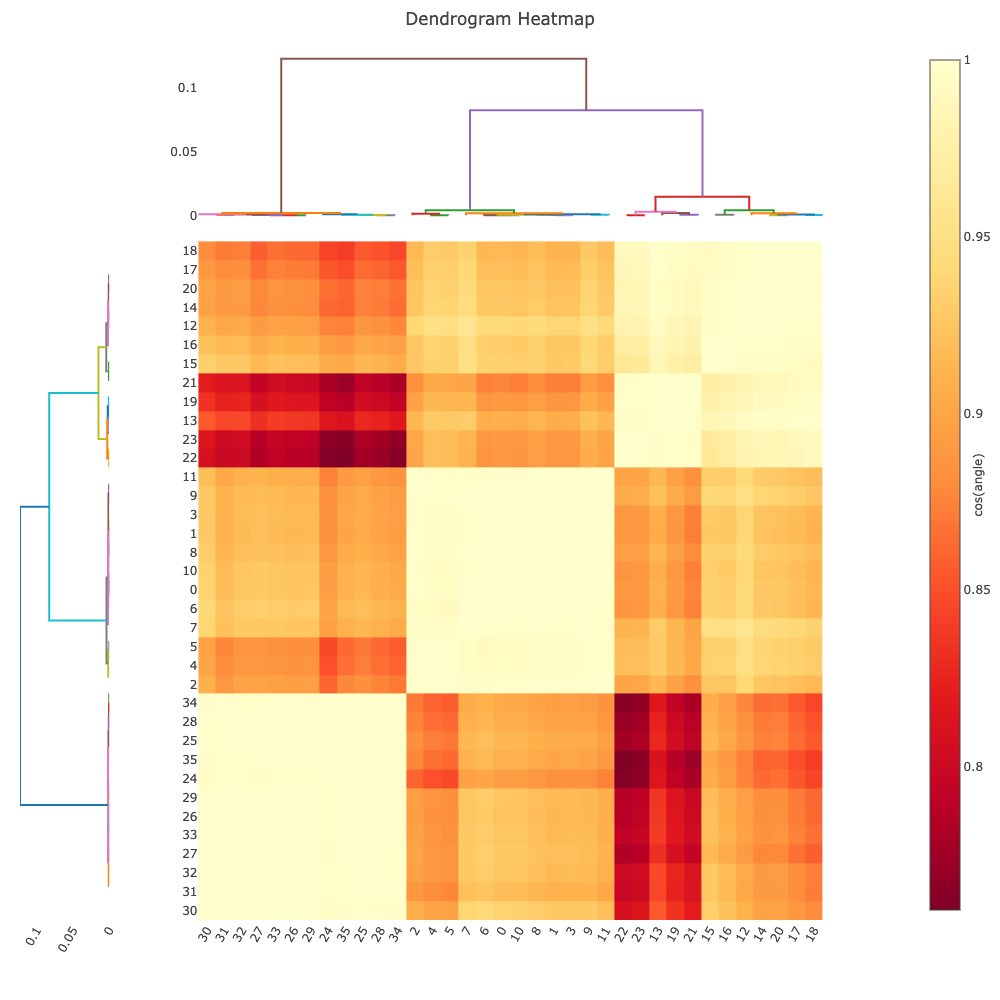

# Processing 🐮🐷🧑‍🦳 with DIALS (CCP4 / APS 2024)

## Introduction

DIALS data processing may be run by automated tools such as `xia2` or interactively on the command line. For a tutorial it is more useful to use the latter, to explain the opportunities afforded by the software. In any data processing package the workflow requires reading data, finding spots, indexing to get an orientation matrix, refinement, integration and then scaling / correction: DIALS is no different.

This tutorial deviates slightly from the mainstream by _starting_ with data from a number of crystals, first from a single sample type and then from a mixture, which will show you how to classify data with subtle differences (e.g. presence or absence of a ligand.)

## The Data

[The data](https://zenodo.org/records/13890874) (~6GB)were taken on i24 at Diamond Light Source as part of routine commissioning work, with a number of small rotation data sets recorded from different crystals. Crystals were prepared of the protein insulin from cows, pigs and people (as described on the Zenodo deposition; bovine, porcine and human insulin, of course all grown in e-coli anyway).

All data have symmetry I213 and very similar unit cell constants so you can _try_ to merge them together and it will work, but won't give you good results as you will be measuring a mixture of structures. The data on the deposition are in `tar` archives so I am assuming you have already downloaded them all and unpacked them into `../data`: if you have done something different you will need to take a little care at the `dials.import` stage.

## The Workflow

The [workflow](../se-thaumatin/processing_in_detail.md) is the same with one data set as with many, with some small deviations - data from multiple crystals will not in general share an orientation matrix so the indexing will need to _not_ join all the lattices.

As mentioned above the flow is to read the data, find spots, index, refine, integrate and then derive some corrections from symmetry related reflections, which involves assigning the symmetry. In DIALS we use the following tools:

- `dials.import` - read all the image headers to make sense of the metadata
- `dials.find_spots` - find the spots - with DIALS we find spots across the whole data set and one spot across multiple images is "found" in 3D
- `dials.index` - assign indices to the spots and derive unit cell, symmetry
- `dials.refine` - improve the models from indexing (separate as allows "wobbles")
- `dials.integrate` - measure the background subtracted spot intensity
- `dials.symmetry` - derive the Patterson symmetry of the crystal from the data
- `dials.scale` - correct the data for sample decay, overall scale from beam or illuminated volume and absorption
- `dials.export` - output processed data for e.g. use in CCP4 or PHENIX

With multiple sweeps from a single crystal, we can assign a single orientation matrix and then use this throughout the processing (the default) - however if you have data from multiple crystals some of the assumptions will break down so we need to (i) tell the software that the crystals _do not_ share a matrix and in the symmetry determination also resolve any indexing ambiguity: we therefore replace `dials.symmetry` with `dials.cosym`.

## Import

The data are in `../data`: for the first pass through this tutorial we will just process the "cow" data `CIX...` to keep things simple. There are data from 12 crystals in here and if we simply import every frame, `dials.import` will make sense of what it finds:

```
dials.import ../data/CIX*gz
```

to get:

```
DIALS (2018) Acta Cryst. D74, 85-97. https://doi.org/10.1107/S2059798317017235
DIALS 3.dev.1184-gb491c224e
The following parameters have been modified:

input {
  experiments = <image files>
}

--------------------------------------------------------------------------------
  format: <class 'dxtbx.format.FormatCBFFullPilatus.FormatCBFFullPilatus'>
  template: /Users/graeme/data/ccp4-aps-tutorials/cix/data/CIX1_1_#####.cbf.gz:1:100
  template: /Users/graeme/data/ccp4-aps-tutorials/cix/data/CIX2_1_#####.cbf.gz:1:100
  template: /Users/graeme/data/ccp4-aps-tutorials/cix/data/CIX3_1_#####.cbf.gz:1:100
  template: /Users/graeme/data/ccp4-aps-tutorials/cix/data/CIX5_1_#####.cbf.gz:1:100
  template: /Users/graeme/data/ccp4-aps-tutorials/cix/data/CIX6_1_#####.cbf.gz:1:100
  template: /Users/graeme/data/ccp4-aps-tutorials/cix/data/CIX8_1_#####.cbf.gz:1:100
  template: /Users/graeme/data/ccp4-aps-tutorials/cix/data/CIX9_1_#####.cbf.gz:1:100
  template: /Users/graeme/data/ccp4-aps-tutorials/cix/data/CIX10_1_#####.cbf.gz:1:100
  template: /Users/graeme/data/ccp4-aps-tutorials/cix/data/CIX11_1_#####.cbf.gz:1:100
  template: /Users/graeme/data/ccp4-aps-tutorials/cix/data/CIX12_1_#####.cbf.gz:1:100
  template: /Users/graeme/data/ccp4-aps-tutorials/cix/data/CIX14_1_#####.cbf.gz:1:100
  template: /Users/graeme/data/ccp4-aps-tutorials/cix/data/CIX15_1_#####.cbf.gz:1:100
  num images: 1200
  sequences:
    still:    0
    sweep:    12
  num stills: 0
--------------------------------------------------------------------------------
Writing experiments to imported.expt
```

This shows the filename patterns, how many images for each and the total it found - 12 sweeps each of 100 images. We can get much more detail on this with `dials.show` which can print the "DIALS understanding" of what the data look like. There are ways to streamline this for very large numbers of images, but for now this is fine.

At this point: scan the output - do you have what you expected? Many problems with DIALS processing can be solved here.

## Spot Finding

Spot finding is exactly what it sounds like: finding where all the spots are in the data sets. In DIALS spots in the same place on adjacent images are considered to be joined so the spot is a three dimensional object. You can explore the spot finding by opening the images in `dials.image_viewer` with

```
dials.image_viewer imported.expt
```

and then clicking through the options at the bottom of the control window (I will demo this in real life, and make a video, but you can click through the steps to "threshold" which is the set of pixels the spot fiding will pick out). The spot finding:

```
dials.find_spots imported.expt
```

will give a summary of the number of signal pixels on every image, the number of found spots on each run and at the end a histogram of the distribution of spots across the images on each run, as:

```
Histogram of per-image spot count for imageset 10:
7446 spots found on 100 images (max 231 / bin)
*                                                          *
*                                                          *
*                                                          *
*                                                          *
** *    *   **   *          *  **     *  * * *  *    *     *
*************************** * *** *** ** ********** ********
************************************************************
************************************************************
************************************************************
************************************************************
1                         image                          100

Histogram of per-image spot count for imageset 11:
7370 spots found on 100 images (max 209 / bin)
*                                                           
*                                                          *
*                                                          *
* *     *                                             *    *
**** * ***  **  ***  *** *********   * * ******* * *  *** **
********************************** *************************
************************************************************
************************************************************
************************************************************
************************************************************
1                         image                          100

--------------------------------------------------------------------------------
Saved 80603 reflections to strong.refl
```

You can also look at the spot finding result in the image viewer with


```
dials.image_viewer imported.expt strong.refl
```

which should look like:


More details about the image viewer can be found [here](./image_viewer.md). Now that we have found the spots we can start to consider some initial analysis - for example, looking at the distribution of the spots in reciprocal space. For a single scan we will see a single lattice, but in this case we will see the same 10° wedge many times, because right now we don't know anything about the reciprocal space orientation. You can pick out one lattice and rotate it, to see the actual reciprocal space orientations. You may want to run this in full-screen to see the options e.g. to select individual runs.

Open the reciprocal lattice view with:

```
dials.reciprocal_lattice_viewer imported.expt strong.refl
```

which should look a little like this:


## Indexing and Refinement

If you played with the lattice viewer in the previous step you will have seen some nice lattices. The computational approach to finding them is to use `dials.index`: you pass the experiments and the spots and it will puzzle everything out. Here, we have multiple lattices so we need to tell the program that:

```
dials.index imported.expt strong.refl joint=false
```

This will go through and assign a lattice for each run. You can best look at what it has done by again using the reciprocal lattice viewer and this time passing the output:

```
dials.reciprocal_lattice_viewer indexed.expt indexed.refl
```

If you select "show in crystal frame" you can see how the lattices _may_ align in reciprocal space - at this point we don't have a true understanding of the symmetry, only the unit cell, but already you can check for things like preferred orientation. With these data, the distribution looks like:


i.e. there is no evidence of preferential orientation. Obviously at this point we would hope that the data have a consistent unit cell - you can look at this by switching on the unit cell view in the reciprocal lattice viewer, or by running `dials.show` and checking the unit cells:

```
dials.show indexed.expt | grep "Unit cell"
```

should look like:

```
    Unit cell: 67.459(10), 67.524(8), 67.498(7), 109.470(2), 109.519(4), 109.401(4)
    Unit cell: 67.442(10), 67.423(9), 67.377(7), 109.432(5), 109.421(4), 109.507(5)
    Unit cell: 67.279(9), 67.246(5), 67.248(5), 109.3630(16), 109.500(4), 109.517(4)
    Unit cell: 67.456(8), 67.478(9), 67.505(6), 109.496(4), 109.488(3), 109.392(4)
    Unit cell: 67.61(2), 67.465(12), 67.472(11), 109.474(3), 109.457(8), 109.491(8)
    Unit cell: 67.307(10), 67.333(6), 67.317(7), 109.4589(13), 109.420(5), 109.486(3)
    Unit cell: 67.342(11), 67.370(6), 67.380(6), 109.4701(10), 109.458(4), 109.484(4)
    Unit cell: 67.361(9), 67.346(9), 67.230(13), 109.517(6), 109.429(5), 109.489(2)
    Unit cell: 67.489(12), 67.464(8), 67.454(8), 109.479(2), 109.427(6), 109.467(4)
    Unit cell: 67.306(14), 67.316(13), 67.287(9), 109.439(5), 109.463(6), 109.470(6)
    Unit cell: 67.503(9), 67.554(5), 67.480(7), 109.475(2), 109.398(4), 109.516(4)
    Unit cell: 67.404(11), 67.421(6), 67.419(7), 109.449(2), 109.479(5), 109.474(5)
```

Here we can see they are all variations on a theme of 67Å / 109° x 3 - what I would expect for cubic insulin. If there are outliers you can re-run with the known cell as a prior, as

```
dials.index imported.expt strong.refl joint=false unit_cell=67,67,67,109,109,109
```

to give consistency: this is not necessary here.

After indexing, we can refine the models used to describe the data - this allows for e.g. variations in the unit cell parameters or small amounts of movement of the crystal with respect to the goniometer. The refinement will improve the alignment between where the spots are observed to be and where they are calculated to be from the current models, which ideally should be substantially under a pixel e.g.

```
RMSDs by experiment:
+-------+--------+----------+----------+------------+
|   Exp |   Nref |   RMSD_X |   RMSD_Y |     RMSD_Z |
|    id |        |     (px) |     (px) |   (images) |
|-------+--------+----------+----------+------------|
|     0 |   4357 |  0.14889 |  0.17023 |   0.11384  |
|     1 |   5744 |  0.16005 |  0.18727 |   0.13167  |
|     2 |   7394 |  0.18018 |  0.20274 |   0.12098  |
|     3 |   5806 |  0.15758 |  0.19395 |   0.092621 |
|     4 |   3202 |  0.16366 |  0.18025 |   0.17487  |
|     5 |   4672 |  0.15909 |  0.18351 |   0.12361  |
|     6 |   5083 |  0.16466 |  0.17997 |   0.087815 |
|     7 |   3589 |  0.17571 |  0.20227 |   0.11977  |
|     8 |   4545 |  0.17111 |  0.1968  |   0.13475  |
|     9 |   5350 |  0.20085 |  0.24863 |   0.17832  |
|    10 |   5765 |  0.1588  |  0.1747  |   0.086947 |
|    11 |   5718 |  0.17015 |  0.18516 |   0.081736 |
+-------+--------+----------+----------+------------+
```

in this case.

## Integration

Given a refined model, we need to now compute the locations of all the spots on the images and measure their intensities: this process has a few steps:

- calculation of the location of all the spots from the current model
- estimation of the spot dimensions modelled as Gaussians on the image and in rotation
- gathering of the spot to compute a reciprocal space "average" spot shape
- scaling this against the observed spots on the images

For education, these steps can be run somewhat independently (e.g. using `dials.create_profile_model` and `dials.predict`) which can allow inspection of what the models are _before_ attempting integration, which can be useful for investigating problematic data sets. Actual integration is run with:

```
dials.integrate refined.expt refined.refl
```

Which will take some time. Viewing the results of integration can be reassuring, but is generally not necessary (use `dials.image_viewer integrated.expt integrated.refl`):


This step can be computationally challenging for substantial data sets but for this set it should be pretty quick.

## Symmetry Determination and Scaling

Up to now all of the processing has ignored the crystal symmetry, working with a triclinic cell. For scaling the symmetry relationships between reflections are needed. For a single data set, `dials.symmetry` will determine the Patterson symmetry and frequently the correct space group. In this case we have 12 data sets which are individually rather incomplete, and we know there is some indexing ambiguity i.e. the lattice symmetry is higher than the rotational symmetry of the data.

For this tutorial we have 12 data sets, so we will use `dials.cosym` to derive the symmetry and resolve indexing ambiguity simultaneously. This will first try and align the lattices in reciprocal space, then estimates the crystal symmetry based on the alignment: in this case identifying the Patterson symmetry `I m -3` with close to half-half split across the "twin" operation:

```
Best solution: I m -3
Unit cell: 77.855, 77.855, 77.855, 90.000, 90.000, 90.000
Reindex operator: -b-c,a+c,-a-b
Laue group probability: 1.000
Laue group confidence: 1.000
Reindexing operators:
x,y,z: [2, 3, 5, 10, 11]
-x+y,y,y-z: [0, 1, 4, 6, 7, 8, 9]
```

In many cases there will be no indexing ambiguity, so there will only be one reindexing operation. After deriving the symmetry the data can be placed onto a common scale with `dials.scale`: this adjusts the scale factors to accomodate:

- variation in illuminated volume / beam intensity
- sample decay as modelled by a teperature factor
- sample absorption (though not in this case as the sweeps are narrow)

This is the first point where we can really assess the quality and completeness of the data, and the resolution of diffraction. The initial scaling is performed with:

```
dials.scale symmetrized.expt symmetrized.refl
```

This will produce a _lot_ of output then:

```
Resolution limit suggested from CC½ fit (limit CC½=0.3): 1.26
```

At this point it is up to the user to decide the resolution of the data to keep, but at this stage we have no more insight than this, so

```
dials.scale symmetrized.expt symmetrized.refl d_min=1.26
```

is a rational action. This gives the table of merging statistics but more importantly a long log file in HTML format with useful graphs. The "table 1" is included at the end which usually gives a good indication of data quality:

```
                                             Overall    Low     High
High resolution limit                           1.26    3.42    1.26
Low resolution limit                           55.06   55.11    1.28
Completeness                                  100.0   100.0   100.0
Multiplicity                                   12.8    12.3    10.9
I/sigma                                        12.5    64.2     0.4
Rmerge(I)                                     0.082   0.047   2.445
Rmerge(I+/-)                                  0.079   0.045   2.337
Rmeas(I)                                      0.086   0.049   2.566
Rmeas(I+/-)                                   0.086   0.048   2.580
Rpim(I)                                       0.024   0.014   0.765
Rpim(I+/-)                                    0.033   0.018   1.066
CC half                                       0.999   0.999   0.320
Anomalous completeness                         99.9    99.9    98.6
Anomalous multiplicity                          6.6     6.8     5.6
Anomalous correlation                         0.060   0.140  -0.057
Anomalous slope                               0.436
dF/F                                          0.051
dI/s(dI)                                      0.595
Total observations                           272777   14068   11963
Total unique                                  21392    1142    1100
```

## Isomorphism and Clustering

In the processing so far, we have assumed that the data are isomorphous i.e. merge together well but we have not _tested_ this hypothesis. DIALS now has a tool (`dials.correlation_matrix`) to measure the similarity of data sets and cluster isomorphous ones. In this case

```
dials.correlation_matrix symmetrized.expt symmetrized.refl
```

_or_

```
dials.correlation_matrix scaled.expt scaled.refl
```

will classify the data into one cluster with no outliers, which aligns well with the preconceptions exposed above. The program may take either scaled data, which may be biased but will show clearer clusters, or unscaled data which is less biased but may be more "fuzzy" - you may find you get a clearer signal one way or the other.

```
Evaluating Significant Clusters from Cosine-Angle Coordinates:
Using OPTICS Algorithm (M. Ankerst et al, 1999, ACM SIGMOD)
Setting Minimum Samples to 5
OPTICS identified 1 clusters and 0 outlier datasets.
Cluster 0
  Number of datasets: 12
  Completeness: 90.2 %
  Multiplicity: 9.55
  Datasets:0,1,2,3,4,5,6,7,8,9,10,11
For separated clusters in DIALS .expt/.refl output please re-run with significant_clusters.output=True
Saving graphical output of correlation matrices to dials.correlation_matrix.html.
```

here it is well worth looking at the HTML output. We have no need to split the data are there _is_ only one cluster and no outliers, so we did the right thing above just scaling the data. However it is not always that way.

## Cows, Pigs and People

Now, let's re-do all the above steps but this time with a mixture of data sets: 12 each from human, bovine and porcine insulin. On a coarse scale they are isomorphous, but obviously deviate from one another at the scale of individual residues: this split is small enough that we could accidentally merge the data from all crystals if we were not careful: let's be careful. But first, let's be ignorant and see how that works out!

Going back to the instructions above, we carefully imported just the `CIX` data with:

```
dials.import ../data/CIX*gz
```

This time around, we will be importing _all_ the data and proceeding as before as far as the `dials.cosym` step. As a reminder:

```
dials.import ../data/*gz
dials.find_spots imported.expt
dials.index imported.expt strong.refl joint=False
dials.refine indexed.expt indexed.refl
dials.integrate refined.expt refined.refl
dials.cosym integrated.expt integrated.refl
```

At this point we have found a common symmetry and indexing setting, and derived an average unit cell:

```
Best solution: I m -3
Unit cell: 77.842, 77.842, 77.842, 90.000, 90.000, 90.000
Reindex operator: -b-c,a+c,-a-b
Laue group probability: 1.000
Laue group confidence: 1.000
Reindexing operators:
-x+y,y,y-z: [2, 3, 5, 10, 11, 13, 14, 15, 16, 18, 19, 20, 21, 22, 27, 34, 35]
x,y,z: [0, 1, 4, 6, 7, 8, 9, 12, 17, 23, 24, 25, 26, 28, 29, 30, 31, 32, 33]
```

however at this stage we can also start looking at the isomorphism analysis performed by cosym, by looking at `dials.cosym.html` - this includes some measure of unit cell isomorphism, but from the dendrogram you can see it does not cleanly split into three categories:


Scaling the data is "succcessful" in that you get results, but the merging stats are pretty poor. Looking at the logs you can see the data split (not shown) but it is not obvious unless you know in advance that there are different crystals here.

We can however see the different groups if we run `dials.correlation_matrix` - a new tool to run after cosym which helps to look for different isomorphism classes. This is rather more helpful: using the correlation coefficients to define distances, then using the OPTICS algorithm to define clusters.

```
dials.correlation_matrix symmetrized.expt symmetrized.refl
```

Will recommend clusters:

```
Cluster 0
  Number of datasets: 12
  Completeness: 90.2 %
  Multiplicity: 9.55
  Datasets:0,1,2,3,4,5,6,7,8,9,10,11
Cluster 1
  Number of datasets: 12
  Completeness: 90.0 %
  Multiplicity: 9.52
  Datasets:12,13,14,15,16,17,18,19,20,21,22,23
Cluster 2
  Number of datasets: 12
  Completeness: 90.0 %
  Multiplicity: 9.51
  Datasets:24,25,26,27,28,29,30,31,32,33,34,35
```

but more usefully shows the lattice separation superbly on a pairwise correlation matrix, as modified using the cosine-angle procedure from `cosym`[2,3]:



Here you can clearly see the three clusters. If `significant_clusters.output=True` is added to the command line, the program will split the data according to the clusters for further analysis:

```
-rw-r--r--   1 graeme  staff     528939 14 Oct 14:19 cluster_0.expt
-rw-r--r--   1 graeme  staff  150001603 14 Oct 14:19 cluster_0.refl
-rw-r--r--   1 graeme  staff     527726 14 Oct 14:19 cluster_1.expt
-rw-r--r--   1 graeme  staff  147913867 14 Oct 14:19 cluster_1.refl
-rw-r--r--   1 graeme  staff     528436 14 Oct 14:19 cluster_2.expt
-rw-r--r--   1 graeme  staff  151291087 14 Oct 14:19 cluster_2.refl
```

These can be scaled as above, e.g. by making a directory for each. The algorithm may leave outlier data sets from inclusion in any cluster, so it is possible only one cluster appears as a result. In this case I merged each cluster separately with:

```
mkdir 0 1 2
cd 0
dials.scale ../cluster_0.expt cluster_0.refl
cd ../1
dials.scale ../cluster_1.expt cluster_1.refl
cd ../2
dials.scale ../cluster_2.expt cluster_2.refl
cd ..
```

Individually the merging statistics from each cluster look far better than the three combined.

## Automation

This is a manual process which allows you to look closely at your data. A more automated approach to this can be via `xia2.multiplex` [1] which automates much of the process. That isn't however the objective of this tutorial.

## References

1. [xia2.multiplex](https://journals.iucr.org/d/issues/2022/06/00/gm5092/)
2. [dials.cosym](https://journals.iucr.org/d/issues/2018/05/00/rr5155/)
3. [Brehm-Diederichs algorithm](https://journals.iucr.org/d/issues/2014/01/00/wd5226/)
