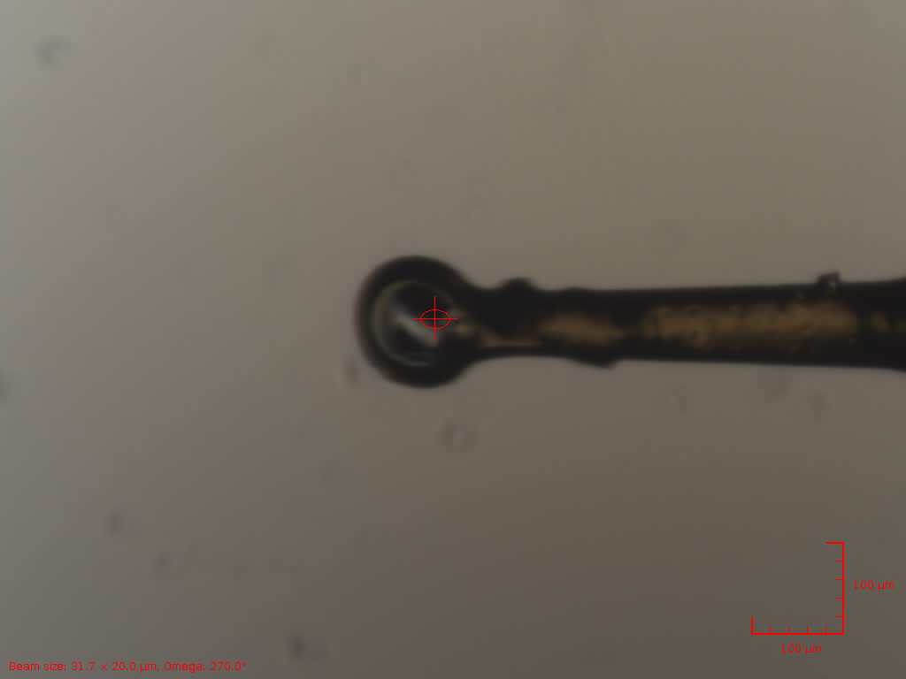
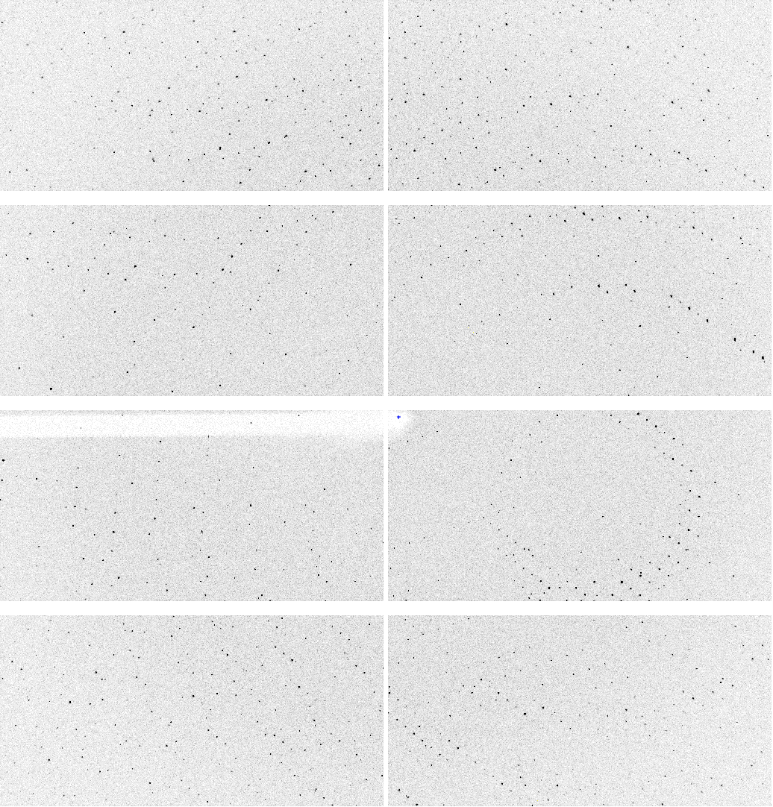
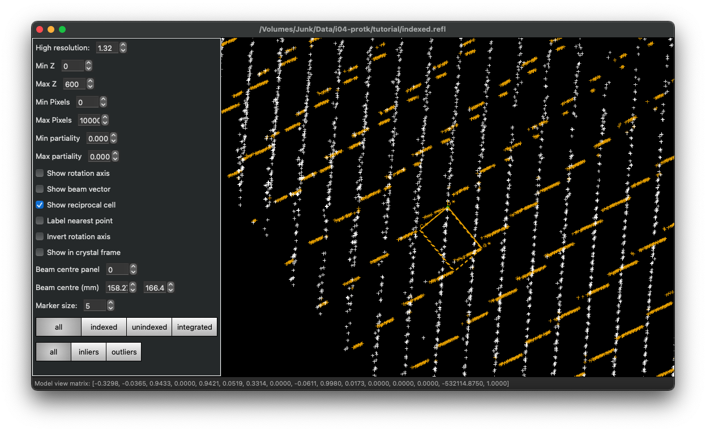
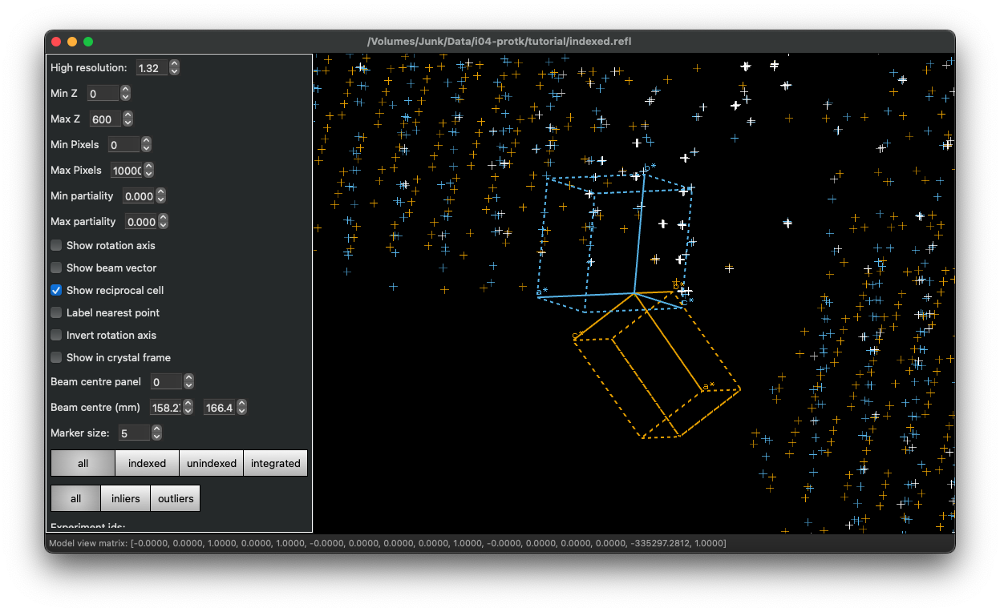
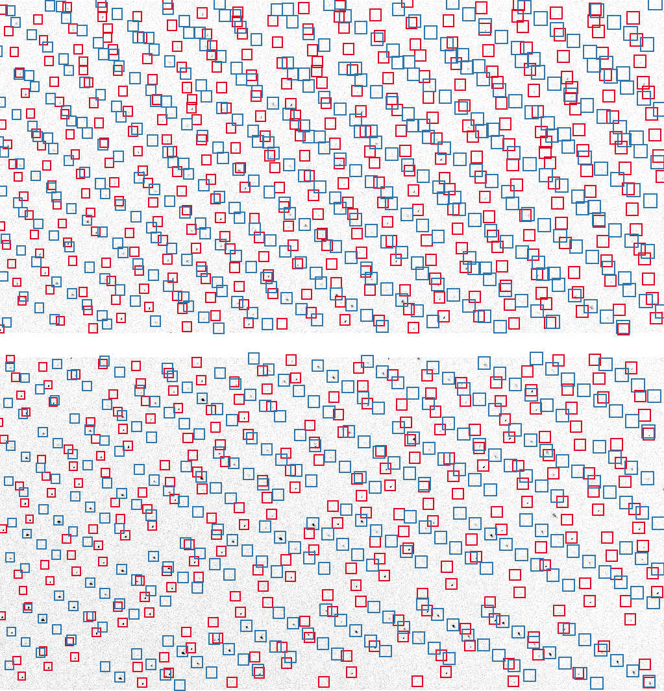

# Multi Lattice Data Processing

The [simple workflow](./WORKFLOW.md) covered the bases for processing a simple data set, and shows the flow we would hope for for a well behaved data set. This isn't guaranteed however, and what looks like single crystals may not be...



The crystals were reported to be fragile, which we will explore. I should upload these data to Zenodo to allow external folks to follow along...

## Start of Processing

The processing workflow starts in the same way as always: importing some data and some spot finding. For brevity we will import only the first 600 images so:

```
dials.import /dls/i04/data/2024/mx39148-1/TestProteinaseK/ProtK_2/ProtK_2_1_master.h5 image_range=1,600
```

This is an arbitrary choice to balance between the quality of the narrative and the time taken to perform the processing steps. Looking at the images with

```
dials.image_viewer imported.expt
```

gives



here I stacked 10 images and zoomed in on the centre: there is evidence here of multiple lattices, since there are overlapping lines of spots. We should be alert to the possibility of more than one crystal in the beam (no surprise, given the title of the tutorial.) We find spots following the usual procedure:

```
dials.find_spots imported.expt
```

which gives:

```
Calculated 108393 spot centroids
Calculated 108393 spot intensities
Filtered 107640 of 108393 spots by peak-centroid distance

Histogram of per-image spot count for imageset 0:
107640 spots found on 600 images (max 1911 / bin)
*          *      ** ** **** ******* ***** * ***           *
************************************************************
************************************************************
************************************************************
************************************************************
************************************************************
************************************************************
************************************************************
************************************************************
************************************************************
1                         image                          600

--------------------------------------------------------------------------------
Saved 107640 reflections to strong.refl
```

At this point we could look at the reciprocal lattice viewer where it will be obvious that there are multiple lattices, however let's proceed to indexing first and see what the results look like.

## Indexing

The usual procedure after spot finding is to index the data: in the previous tutorial this worked very well, indexing almost all of the reflections with a single model:

```
dials.index imported.expt strong.refl
```

After a short time we see:

```
Refined crystal models:
model 1 (66997 reflections):
Crystal:
    Unit cell: 67.8496(11), 67.8423(10), 102.496(2), 89.9862(6), 90.0160(7), 90.0064(4)
    Space group: P 1
    U matrix:  {{-0.1781,  0.9478,  0.2645},
                { 0.5610,  0.3187, -0.7640},
                {-0.8084,  0.0123, -0.5885}}
    B matrix:  {{ 0.0147,  0.0000,  0.0000},
                { 0.0000,  0.0147,  0.0000},
                { 0.0000, -0.0000,  0.0098}}
    A = UB:    {{-0.0026,  0.0140,  0.0026},
                { 0.0083,  0.0047, -0.0075},
                {-0.0119,  0.0002, -0.0057}}
+------------+-------------+---------------+-------------+
|   Imageset |   # indexed |   # unindexed |   % indexed |
|------------+-------------+---------------+-------------|
|          0 |       66997 |         40642 |        62.2 |
+------------+-------------+---------------+-------------+
Saving refined experiments to indexed.expt
Saving refined reflections to indexed.refl
```

i.e. we have a good model, but it only covers just over half of the reflections. This can be confirmed by looking at the reciprocal lattice view:

```
dials.reciprocal_lattice_viewer indexed.expt indexed.refl
```



Where I switched on the "show reciprocal cell" option and rotated the view to sepatate the lattices. We can now guess that there are probably two lattices, so rerun indexing with:

```
dials.index imported.expt strong.refl max_lattices=2
```

which will index the first lattice as before, then _exclude_ those spots and attempt to index the remaining reflections. Once the two lattices have been identified the reflections will be reassigned to each according to the closest one, and refined. The result is then the two models, a summary of the number of indexed reflections and the pairwise relationships between the lattices:

```
RMSDs by experiment:
+-------+--------+----------+----------+------------+
|   Exp |   Nref |   RMSD_X |   RMSD_Y |     RMSD_Z |
|    id |        |     (px) |     (px) |   (images) |
|-------+--------+----------+----------+------------|
|     0 |   6000 |  0.20532 |  0.23851 |    0.20273 |
|     1 |   6000 |  0.22056 |  0.24388 |    0.22892 |
+-------+--------+----------+----------+------------+

Refined crystal models:
model 1 (65834 reflections):
Crystal:
    Unit cell: 67.8552(10), 67.8483(8), 102.5091(19), 89.9843(6), 90.0154(7), 90.0043(4)
    Space group: P 1
    U matrix:  {{-0.1782,  0.9478,  0.2644},
                { 0.5610,  0.3186, -0.7640},
                {-0.8084,  0.0122, -0.5885}}
    B matrix:  {{ 0.0147,  0.0000,  0.0000},
                { 0.0000,  0.0147,  0.0000},
                { 0.0000, -0.0000,  0.0098}}
    A = UB:    {{-0.0026,  0.0140,  0.0026},
                { 0.0083,  0.0047, -0.0075},
                {-0.0119,  0.0002, -0.0057}}
model 2 (39024 reflections):
Crystal:
    Unit cell: 67.8256(10), 67.8398(13), 102.5167(14), 90.0049(7), 89.9964(5), 89.9601(8)
    Space group: P 1
    U matrix:  {{-0.5964, -0.1699, -0.7845},
                {-0.8020,  0.0845,  0.5914},
                {-0.0342,  0.9818, -0.1867}}
    B matrix:  {{ 0.0147,  0.0000,  0.0000},
                {-0.0000,  0.0147,  0.0000},
                {-0.0000,  0.0000,  0.0098}}
    A = UB:    {{-0.0088, -0.0025, -0.0077},
                {-0.0118,  0.0012,  0.0058},
                {-0.0005,  0.0145, -0.0018}}
+------------+-------------+---------------+-------------+
|   Imageset |   # indexed |   # unindexed |   % indexed |
|------------+-------------+---------------+-------------|
|          0 |      104858 |          2781 |        97.4 |
+------------+-------------+---------------+-------------+
Change of basis op: a,b,c
Rotation matrix to transform crystal 1 to crystal 2:
{{-0.262, 0.211, 0.942},
 {0.379, -0.875, 0.301},
 {0.887, 0.436, 0.149}}
Rotation of 173.605 degrees about axis (0.606, 0.244, 0.757)

Saving refined experiments to indexed.expt
Saving refined reflections to indexed.refl
```

We have now indexed almost all the reflections, confirming that we have two lattices, and got good refinement results for each. Looking once more at the reciprocal lattices we see that they are quite well separated:



At this point you can also select "view in crystal frame" to see how the two lattices cover potentially different areas of reciprocal space. Viewing the output of

```
dials.report indexed.expt indexed.refl
```

[Included here](./dials-index-report.html)

Allows the number of reflections indexed on each lattice as a function of rotation angle to be inspected - clearly both lattices are present throughout the data set.

## Continue Processing

At this point we have a model which consists of _two_ lattices for one data set, but otherwise we can proceed along the usual workflow so:

```
dials.refine indexed.expt indexed.refl
dials.integrate refined.expt refined.refl
```

This will take a little longer than processing a single lattice. After this we consider the impact of having two lattices on the data in terms of the overlapping of reflections - in this case we _probably_ got away with it largely:



We do however have some potentially overlapped reflections so some of the measurements will be affected.

Since we have multiple independent lattices, we don't know if there is a relationship between the orientation matrices, so need to use `dials.cosym` not `dials.symmetry` to resolve the symmetry and any indexing ambiguity:

```
dials.cosym integrated.expt integrated.refl
```

Here we find that the symmetry is P4/mmm (i.e. P13212 or similar) and can proceed to scaling the data:

```
dials.scale symmetrized.expt symmetrized.refl
```

giving:

```
            -------------Summary of merging statistics--------------           

                                             Overall    Low     High
High resolution limit                           1.22    3.31    1.22
Low resolution limit                          102.51  102.87    1.24
Completeness                                   85.5   100.0     5.7
Multiplicity                                    6.7     8.4     1.1
I/sigma                                         9.2    40.0     0.5
Rmerge(I)                                     0.135   0.052   0.678
Rmerge(I+/-)                                  0.126   0.049   0.000
Rmeas(I)                                      0.145   0.055   0.959
Rmeas(I+/-)                                   0.143   0.055   0.000
Rpim(I)                                       0.050   0.018   0.678
Rpim(I+/-)                                    0.067   0.025   0.000
CC half                                       0.997   0.998   0.299
Anomalous completeness                         74.5   100.0     0.4
Anomalous multiplicity                          3.7     4.8     1.0
Anomalous correlation                        -0.012  -0.004   0.000
Anomalous slope                               0.917
dF/F                                          0.115
dI/s(dI)                                      0.820
Total observations                           408986   32939     214
Total unique                                  61268    3919     202

Writing html report to dials.scale.html
Saving the scaled experiments to scaled.expt
Saving the scaled reflections to scaled.refl
See dials.github.io/dials_scale_user_guide.html for more info on scaling options
```

Not the greatest data set, but usable.
