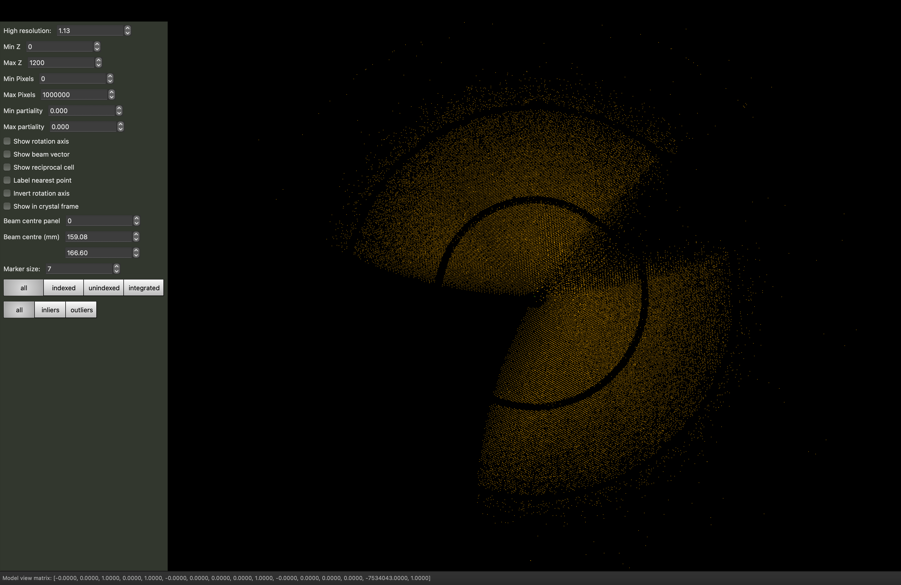
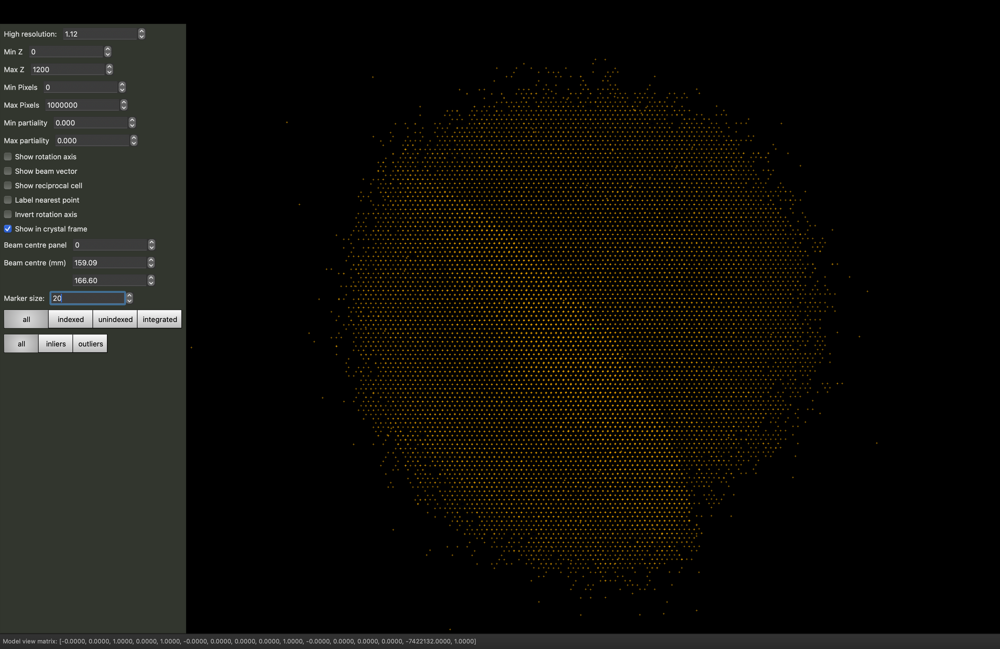

# Processing in Detail: Simple Insulin to Learn Workflow (CCP4 / DLS 2024)

## Introduction

DIALS processing may be performed by either running the individual tools (spot finding, indexing, refinement, integration, symmetry, scaling, exporting to MTZ) or you can run `xia2`, which makes (hopefully) informed choices for you at each stage. In this tutorial we will run through each of the steps in turn, taking a look at the output as we go. We will also look at enforcing the correct lattice symmetry.

The aim of this tutorial is to introduce you to the tools, not teach about data processing - it is assumed you have some idea of the overall process from e.g. associated lectures. With the graphical tools, I am not making so much effort to explain the options as simply "playing" will give you a chance to learn your way around and also find the settings which work for you. Particularly with looking at diffraction images, the "best" settings are very personal.

## DIALS version

This tutorial assumes you are using [DIALS version 3.20 or later](https://dials.github.io/installation.html) and that you have this set up (i.e. you've sourced the setup file).

If you are running at home on Linux or macOS then you should be able to reproduce the results in here. If you are on Windows, try installing the Linux version in a WSL terminal using e.g. Ubuntu or using the version from CCP4, but be aware that there may be small differences in the output.

## Tutorial data

If you are at the workshop then the data are already on disk at:

```
/dls/i04/data/2024/mx39148-1/tutorial_data/workflow
```

So replace `../data` or whatever with that. If you are doing this on your own computer, or you are at home, or not part of the workshop then you need to follow these instructions.

The following example uses [cubic insulin collected on beamline i04 at Diamond Light Source](https://zenodo.org/records/8376818): this was collected with a large beam, depositing ~ 1MGy / scan of dose on the sample. To speed things up, you can run with just a subset of the data rather than a full sweep or all four data sets. The purposes of this is _not_ to be an interesting data set, rather to show how the tools work when there are no problems as a preamble to processing more interesting data sets [in the main tutorial](./README.md). If you have all the time in the world you can process all four together with only a minor change to the import command.

Fetching the data can be performed by writing a file containing

```
https://zenodo.org/records/8376818/files/ins10_1.nxs
https://zenodo.org/records/8376818/files/ins10_1_000001.h5
https://zenodo.org/records/8376818/files/ins10_1_000002.h5
https://zenodo.org/records/8376818/files/ins10_1_000003.h5
https://zenodo.org/records/8376818/files/ins10_1_000004.h5
https://zenodo.org/records/8376818/files/ins10_1_master.h5
https://zenodo.org/records/8376818/files/ins10_1_meta.h5
```

then:

```
wget -i file.list
```

## Files

DIALS creates two principal file types:

- experiment files called `something.expt`
- reflection files called `something.refl`

"Experiment" in DIALS has a very specific meaning - the capturing of data from one set of detector, beam, goniometer and crystal - so if you have two scans from one crystal this is two experiments, if you have two lattices on one data set this is two experiments. In most cases you can ignore this distinction though.

Usually the output filenames will correspond to the name of the DIALS program that created them e.g. `indexed.refl` and `indexed.expt` from `dials.index`. The only deviations from this are on import (see below) where we are only reading experiment models and spot finding where we find _strong_ reflections so write these to `strong.refl` - and we create no models so (by default) there is no output experiment file.

At any time you can _look_ at these files with `dials.show` which will summarise the content of the files to the terminal. You can also `dials.show` reflection files which gives a tabular symmary of the content but this can be rather slow, as the data are much more substantial.

[If you're impatient...](./TLDR.md) - as a note this is essentially the script I would use to have a first look at any data set where I expected the experiment metadata (wavelength, beam centre etc.) to be correct.

## Parameters

All DIALS programs accept parameters in the form of `parameter=value` - in most cases this will be sufficient though some less frequently used options may require "name space" clarification e.g. `index_assignment.method=local`. All of the DIALS programs support the option

```
dials.program -c -e2
```

which will show you all possible configuration options - if you are looking for an option this is the simplest way to search so e.g.

```
dials.index -c -e2 | less
```

will allow you to scroll through the extensive list of options you can adjust. In most cases the defaults are relatively sensible for synchrotron data from a pixel array detector, as we are using in this tutorial.

## Output

In the majority of cases the `dials` programs write their output to `dials.program.log` e.g. `dials.find_spots.log` etc. - everything which is printed to the terminal is also saved in this file, so you can review the processing later. In the case where you are reporting an issue to the developers including these log files in the error report (particularly for the step which failed) is very helpful.

From most stages you can generate a detailed of the current state of processing with:

```
dials.report step.expt step.refl
```

which will generate a HTML html describing the current state of the processing.

## Import

The starting point for any processing with DIALS is to _import_ the data - here the metadata are read and a description of the data to be processed saved to a file named `imported.expt`. This is "human readable" in that the file is JSON format (roughly readable text with brackets around to structure for computers). While you can edit this file if you know what you are doing, usually this is not necessary.

```
dials.import ../ins10_1.nxs
```

will read the metadata from this `NeXus` file and write `imported.expt` from this. For this tutorial I am only processing the first 1200 images so we actually import with:

```
dials.import ../ins10_1.nxs image_range=1,1200
```

It is important to note that for well-behaved data (i.e. anything which is well-collected from a well-behaved sample) the commands below will often be identical after importing. The output from importing describes what was found: this should correspond to our expectations.

```
DIALS (2018) Acta Cryst. D74, 85-97. https://doi.org/10.1107/S2059798317017235
DIALS 3.dev.1215-gb54762037
The following parameters have been modified:

input {
  experiments = <image files>
}
geometry {
  scan {
    image_range = 1 1200
  }
}


Applying input geometry in the following order:
  1. Manual geometry

--------------------------------------------------------------------------------
  format: <class 'dxtbx.format.FormatNXmxDLS16M.FormatNXmxDLS16M'>
  template: /Users/graeme/data/i04-ins-1MGy/ins10_1.nxs:1:1200
  num images: 1200
  sequences:
    still:    0
    sweep:    1
  num stills: 0
--------------------------------------------------------------------------------
Writing experiments to imported.expt
```

You will see that the log file includes the additional commands passed in, which is useful for tracing the processing options used and in this case confirms that we have read ~1200 images. Once you have `imported.expt` you can, if you like, look at the content with `dials.show` as `dials.show imported.expt`. This is a general program in DIALS to allow you to print the current state of models, with output which looks like:

```
DIALS (2018) Acta Cryst. D74, 85-97. https://doi.org/10.1107/S2059798317017235
The following parameters have been modified:

input {
  experiments = imported.expt
}

Experiment 0:
Experiment identifier: 82dbf00d-4836-aded-b32f-c1789f2de707
Image template: /Users/graeme/data/i04-ins-1MGy/ins10_1.nxs
Detector:
Panel:
  name: /entry/instrument/detector/module
  type: SENSOR_PAD
  identifier: 
  pixel_size:{0.075,0.075}
  image_size: {4148,4362}
  trusted_range: {0,33005}
  thickness: 0.45
  material: Si
  mu: 3.66309
  gain: 1
  pedestal: 0
  fast_axis: {1,0,0}
  slow_axis: {0,-1,0}
  origin: {-159.08,166.6,-170}
  distance: 170
  pixel to millimeter strategy: ParallaxCorrectedPxMmStrategy
    mu: 3.66309
    t0: 0.45


Max resolution (at corners): 1.058512
Max resolution (inscribed):  1.337295

Beam:
    probe: x-ray
    wavelength: 0.953738
    sample to source direction : {0,0,1}
    divergence: 0
    sigma divergence: 0
    polarization normal: {0,1,0}
    polarization fraction: 0.999
    flux: 0
    transmission: 1
    sample to source distance: 0

Beam centre: 
    mm: (159.08,166.60)
    px: (2121.07,2221.33)

Scan:
    number of images:   1200
    image range:   {1,1200}
    epoch:    0
    exposure time:    0
    oscillation:   {0,0.1}

Goniometer:
    Rotation axis:   {1,0,0}
    Fixed rotation:  {1,0,0,0,1,0,0,0,1}
    Setting rotation:{1,0,0,0,1,0,0,0,1}
    Axis #0 (phi):  {1,-0.0037,0.002}
    Axis #1 (chi):  {-0.0046,0.0372,-0.9993}
    Axis #2 (omega):  {1,0,0}
    Angles: 0,0,0
    scan axis: #2 (omega)    
```

I recognise that this is quite "computer" in the way that the numbers are presented, but there are a few useful things you can look for in here: does the wavelength, distance, beam centre look OK? Are the number of images what you would expect?

At this point you can also look at the images with the `dials.image_viewer` tool -

```
dials.image_viewer imported.expt
```

in this tool there are many settings you can adjust, which could depend on the source of the data and - most importantly - your preferences. Personally the author finds for basic inspection of the images stacking e.g. 10 images makes the lattice clearer for finely sliced images, and adjusting the brightness depending on how your data were collected:


If the data are not stacked the spot finding process can also be explored - the controls at the bottom of the "Settings" window allow you to step through these and can be very useful for getting a "computer's eye view" of how the data look (particularly for establishing where the diffraction is visible to.)

If you have the time and interest to download all four data sets from the deposition above, you can import all four at once with:

```
dials.import ../ins10_?.nxs
```

Then proceed through the entire tutorial with _all four sweeps_ - note though that this is only possible without changing the defaults as the data were taken from a single sample, with the goniometer rotations correctly recorded. [The main tutorial](./README.md) covers what to do if this is not the case.

## Find Spots

The first "real" task in any processing using DIALS is the spot finding. Since this is looking for spots on every image in the dataset, this process can take some time so by default will use all of the processors available in your machine - if you would like to control this adjust with e.g. `nproc=4` - however the default is usually sensible unless you are sharing the computer with many others.

```
dials.find_spots imported.expt
```

This is one of the two steps where every image in the data set is read and processed and hence can be moderately time-consuming. This contains a reflection file `strong.refl` which contains both the positions of the strong spots and also "images" of the spot pixels which we will use later. You can view these spots on top of the images with

```
dials.image_viewer imported.expt strong.refl
```

to get a sense of what spots were found. You will see that the spots are surrounded by little boxes - these are the _bounding boxes_ of the reflections i.e. the outer extent of the pixels that belong to that spot. The "signal" pixels are highlighted with green blobs giving a sense of what is and is not "strong."


The default parameters for spot finding usually do a good job for Pilatus or Eiger images, such as these. However they may not be optimal for data from other detector types, such as CCDs or image plates. Issues with  incorrectly set gain might, for example, lead to background noise being extracted as spots. You can use the image mode buttons to preview how the parameters affect the spot finding algorithm. The final button 'threshold’ is the one on which spots were found, so ensuring this produces peaks at real diffraction spot positions will give the best chance of success.

The second tool for visualisation of the found spots is the reciprocal lattice viewer - which presents a view of the spot positions mapped to reciprocal space.

```
dials.reciprocal_lattice_viewer imported.expt strong.refl
```

No matter the sample orientation you should be able to rotate the space to "look down" the lines of reflections. If you cannot, or the lines are not straight, it is likely that there are some errors in the experiment parameters e.g. detector distance or beam centre. If these are not too large they will likely be corrected in the subsequent analysis.



Have a play with the settings - you can change the beam centre in the viewer to see how nicely aligned spots move out of alignment. Some of the options will only work after you have indexed the data. If the geometry is not accurately recorded you may find it useful to run:

```
dials.search_beam_position imported.expt strong.refl
```

to determine an updated position for the beam centre - ideally the shift that this calculates should be small if the beamline is well-calibrated - if it is a couple of mm or more it may be worth discussing this with the beamline staff! Running the reciprocal lattice viewer with the optimised experiment output:

```
dials.reciprocal_lattice_viewer optimised.expt strong.refl
```

should show straight lines, provided everything has worked correctly.

## Indexing

The next step will be indexing of the found spots with `dials.index` - by default this uses a 3D FFT algorithm to identify periodicity in the reciprocal space mapped spot positions, though there are other algorithms available which can be better suited to e.g. narrow data sets.

```
dials.index imported.expt strong.refl
```

or

```
dials.index optimised.expt strong.refl
```
   
are the ways to trigger the program, and the most common parameters to set are the `space_group` and `unit_cell` if these are known in advance. While this does index the data it will also perform some refinement with a static crystal model, and indicate in the output the fraction of reflections which have been indexed - ideally this should be close to 100%:

```
Refined crystal models:
model 1 (52907 reflections):
Crystal:
    Unit cell: 67.4575(12), 67.4621(13), 67.5064(10), 109.4906(6), 109.5223(5), 109.4697(5)
    Space group: P 1
    U matrix:  {{ 0.2465,  0.5564, -0.7935},
                { 0.9448, -0.3204,  0.0689},
                {-0.2159, -0.7667, -0.6046}}
    B matrix:  {{ 0.0148,  0.0000,  0.0000},
                { 0.0052,  0.0157,  0.0000},
                { 0.0091,  0.0091,  0.0182}}
    A = UB:    {{-0.0007,  0.0015, -0.0144},
                { 0.0130, -0.0044,  0.0013},
                {-0.0127, -0.0176, -0.0110}}
+------------+-------------+---------------+-------------+
|   Imageset |   # indexed |   # unindexed |   % indexed |
|------------+-------------+---------------+-------------|
|          0 |       52907 |          2522 |        95.5 |
+------------+-------------+---------------+-------------+
```

If it is significantly less than 100% it is possible you have a second lattice - adding `max_lattices=2` (say) to the command-line will indicate to the program that you would like to consider attempting to separately index the unindexed reflections after the first lattice has been identified. Often the second lattice is a satellite of the main one, as crystals sometimes split when cooled.

By default the triclinic lattice i.e. with `P1` no additional symmetry is assumed - for the majority of data there are no differences in the quality of the results from assigning the Bravais lattice at this stage, even if as here it is perfectly obvious what the correct answer is.

If successful, `dials.index` writes the experiments and indexed reflections to two new files `indexed.expt` and `indexed.refl` - if these are loaded in the reciprocal lattice viewer you can see which spots have been indexed and if you have multiple lattices switch them "on and off" for comparison.

The process that the indexing performs is quite complex -

- make a guess at the maximum unit cell from the pairwise separation of spots in reciprocal space
- transform spot positions to reciprocal space using the best available current model of the experimental geometry
- perform a Fourier transform of these positions or other algorithm to identify the _basis vectors_ of these positions e.g. the spacing between one position and the next
- determine a set of these basis vectors which best describes the reciprocal space positions
- transform this set of three basis vectors into a unit cell description, which is then manipulated according to some standard rules to give the best _triclinic_ unit cell to describe the reflections - if a unit cell and space group have been provided these will be enforced at this stage
- _assign indices_ to the reflections by "dividing through" the reciprocal space position by the unit cell parallelopiped (this is strictly the actual indexing step)
- take the indexed reflections and refine the unit cell parameters and model of the experimental geometry by comparing where the reflections should be and where they are found
- save the indexed reflections and experiment models to the output files

The indexing process takes place over a number of cycles, where low resolution reflections are initially indexed and refined before including more reflections at high resolution - this improves the overall success of the procedure by allowing some refinement as a part of the process.
  
During this process an effort is made to eliminate "outlier" reflections - these are reflections which do not strictly belong to the crystal lattice but are accidentally close to a reciprocal space position and hence can be indexed. Most often this is an issue with small satellite lattices or ice / powder on the sample. Usually this should not be a cause for concern. To look at the crystal lattice(s) in the reciprocal space crystal frame you can select "crystal frame":



## Bravais Lattice Determination (optional!)

Once you have indexed the data you may optionally attempt to infer the correct Bravais lattice and assign this to constrain the unit cell in subsequent processing. If, for example, the unit cell from indexing has all three angles close to 90° and two unit cell lengths with very similar values you could guess that the unit cell is tetragonal. In `dials.refine_bravais_settings` we take away the guesswork by transforming the unit cell to all possible Bravais lattices which approximately match the triclinic unit cell, and then performing some refinement - if the lattice constraints are correct then imposing them should have little impact on the deviations between the observed and calculated reflection positions (known as the R.M.S. deviations). If a lattice constraint is incorrect it will manifest as a significant increase in a deviation - however care must be taken as it can be the case that the true _symmetry_ is lower than the shape of the unit cell would indicate.

In the general case there is little harm in skipping this step, however for information if you run

```
dials.refine_bravais_settings indexed.expt indexed.refl
```

you will see a table of possible unit cell / Bravais lattice / R.M.S. deviations printed in the output - in the case of this tutorial data they will all match, as the true symmetry is cubic.

```
DIALS (2018) Acta Cryst. D74, 85-97. https://doi.org/10.1107/S2059798317017235
DIALS 3.dev.1215-gb54762037
The following parameters have been modified:

input {
  experiments = indexed.expt
  reflections = indexed.refl
}

Chiral space groups corresponding to each Bravais lattice:
aP: P1
oF: F222
oI: I222 I212121
tI: I4 I41 I422 I4122
hR: R3:H R32:H
cI: I23 I213 I432 I4132
mI: I2
+------------+--------------+--------+--------------+----------+-----------+-------------------------------------------+----------+-------------------+
|   Solution |   Metric fit |   rmsd | min/max cc   |   #spots | lattice   | unit_cell                                 |   volume | cb_op             |
|------------+--------------+--------+--------------+----------+-----------+-------------------------------------------+----------+-------------------|
|   *     22 |       0.1001 |  0.051 | 0.835/0.951  |    12000 | cI        | 77.96  77.96  77.96  90.00  90.00  90.00  |   473773 | b+c,a+c,a+b       |
|   *     21 |       0.1001 |  0.05  | 0.873/0.874  |    12000 | hR        | 110.24 110.24  67.50  90.00  90.00 120.00 |   710380 | a+2*b+c,-b+c,a    |
|   *     20 |       0.1001 |  0.052 | 0.835/0.837  |    12000 | hR        | 110.25 110.25  67.55  90.00  90.00 120.00 |   711095 | a+b+2*c,a-c,b     |
|   *     19 |       0.1001 |  0.051 | 0.539/0.839  |    12000 | tI        | 77.95  77.95  77.96  90.00  90.00  90.00  |   473640 | b+c,a+c,a+b       |
|   *     18 |       0.0971 |  0.05  | 0.550/0.841  |    12000 | tI        | 77.98  77.98  77.94  90.00  90.00  90.00  |   473898 | a+b,b+c,a+c       |
|         17 |       0.0971 |  0.052 | 0.492/0.932  |    12000 | tI        | 77.96  77.96  77.99  90.00  90.00  90.00  |   474003 | a+c,a+b,b+c       |
|   *     16 |       0.0971 |  0.051 | 0.839/0.932  |    12000 | oI        | 77.95  77.98  78.00  90.00  90.00  90.00  |   474063 | a+c,a+b,b+c       |
|   *     15 |       0.1001 |  0.051 | 0.501/0.839  |    12000 | oF        | 77.97 110.24 110.25  90.00  90.00  90.00  |   947615 | -a-b,a+b+2*c,-a+b |
|   *     14 |       0.0971 |  0.051 | 0.839/0.839  |    12000 | mI        | 77.95  77.98  78.00  90.00  90.01  90.00  |   474126 | -a-c,a+b,-b-c     |
|   *     13 |       0.1001 |  0.051 | 0.501/0.501  |    12000 | mI        | 67.51 110.24  67.54  90.00 109.47  90.00  |   473885 | -a,-a-b-2*c,-b    |
|   *     12 |       0.0722 |  0.037 | 0.526/0.841  |    12000 | oF        | 77.88 110.11 110.28  90.00  90.00  90.00  |   945747 | a+c,a+2*b+c,-a+c  |
|   *     11 |       0.0575 |  0.035 | 0.950/0.951  |    12000 | hR        | 110.05 110.05  67.48  90.00  90.00 120.00 |   707843 | 2*a+b+c,-a+b,c    |
|   *     10 |       0.0663 |  0.038 | 0.566/0.932  |    12000 | oF        | 77.91 110.10 110.26  90.00  90.00  90.00  |   945776 | -b-c,2*a+b+c,-b+c |
|   *      9 |       0.0722 |  0.037 | 0.841/0.841  |    12000 | mI        | 77.92  77.89  77.95  90.00  90.09  90.00  |   473148 | a+b,-a-c,b+c      |
|   *      8 |       0.0663 |  0.037 | 0.932/0.932  |    12000 | mI        | 77.90  77.91  77.92  90.00  90.08  90.00  |   472909 | a+c,-b-c,a+b      |
|   *      7 |       0.0575 |  0.03  | 0.586/0.586  |    12000 | mI        | 67.43 110.05  67.49  90.00 109.54  90.00  |   471963 | -a,a+2*b+c,-c     |
|   *      6 |       0.0561 |  0.035 | 0.613/0.613  |    12000 | mI        | 67.45 110.06  67.50  90.00 109.50  90.00  |   472342 | -b,-2*a-b-c,-c    |
|   *      5 |       0.0445 |  0.033 | 0.884/0.884  |    12000 | hR        | 110.27 110.27  67.43  90.00  90.00 120.00 |   710034 | b-c,-a+c,a+b+c    |
|   *      4 |       0.0445 |  0.033 | 0.526/0.526  |    12000 | mI        | 67.43 110.29  67.50  90.00 109.46  90.00  |   473288 | -a-b-c,-a+c,b     |
|   *      3 |       0.0439 |  0.032 | 0.566/0.566  |    12000 | mI        | 67.42 110.27  67.48  90.00 109.43  90.00  |   473134 | -a-b-c,b-c,a      |
|   *      2 |       0.0247 |  0.028 | 0.586/0.586  |    12000 | mI        | 67.39 110.14  67.50  90.00 109.46  90.00  |   472344 | -a-b-c,a-b,c      |
|   *      1 |       0      |  0.028 | -/-          |    12000 | aP        | 67.46  67.46  67.50 109.49 109.52 109.47  |   236271 | a,b,c             |
+------------+--------------+--------+--------------+----------+-----------+-------------------------------------------+----------+-------------------+
```

If you wish to use one of the output experiments from this process e.g. `bravais_setting_22.expt` you will need to reindex the reflection data from indexing to match this - we do not output every option of reindexed data as these files can be large. In most cases it is simpler to re-run `dials.index` setting the chosen space group.

The reader is reminded here - in most cases it is absolutely fine to proceed without worrying about the crystal symmetry at this stage 🙂.

## Refinement

The model is already refined during indexing, but this is assuming that a single crystal model is appropriate for every image in the data set - in reality there are usually small changes in the unit cell and crystal orientation throughout the experiment as the sample is rotated. `dials.refine` will first re-run refinement with a fixed unit cell and then perform scan-varying refinement. If you have indexed multiple sweeps earlier in processing (not covered in this tutorial) then the crystal models will be copied and split at this stage to allow per-crystal-per-scan models to be refined.

By and large one may run:

```
dials.refine indexed.expt indexed.refl
```

without any options and the program will do something sensible - if you compare the R.M.S. deviations from the end of indexing with the end of refinement you should see a small improvement e.g.

```
RMSDs by experiment:
+-------+--------+----------+----------+------------+
|   Exp |   Nref |   RMSD_X |   RMSD_Y |     RMSD_Z |
|    id |        |     (px) |     (px) |   (images) |
|-------+--------+----------+----------+------------|
|     0 |  12000 |  0.25638 |  0.27142 |    0.30518 |
+-------+--------+----------+----------+------------+
```

to:

```
RMSDs by experiment:
+-------+--------+----------+----------+------------+
|   Exp |   Nref |   RMSD_X |   RMSD_Y |     RMSD_Z |
|    id |        |     (px) |     (px) |   (images) |
|-------+--------+----------+----------+------------|
|     0 |  42850 |  0.21098 |  0.20732 |    0.21382 |
+-------+--------+----------+----------+------------+
```

If you look at the output of `dials.report` at this stage you should see small variations in the unit cell and sample orientation as the crystal is rotated - if these do not appear small then it is likely that something has happened during data collection e.g. severe radiation damage.

## Integration

Once you have refined the model the next step is to integrate the data - in effect this is using the refined model to calculate the positions where all of the reflections in the data set will be found and measure the background-subtracted intensities:

```
dials.integrate refined.expt refined.refl
```

By default this will pass through the data twice, first looking at the shapes of the predicted spots to form a reference profile model then passing through a second time to use this profile model to integrate the data, by being fit to the transformed pixel values. This is by far the most computationally expensive step in the processing of the data. By default all the processors in your computer are used, unless we think this will exceed the memory available in the machine. At times, however, if you have a large unit cell and / or a large data set you may find that processing on a desktop workstation is more appropriate than e.g. a laptop. Optionally you can get a sense of what the integration will do by creating the profile model from the refined reflections and performing the prediction - this will allow viewing the predictions on the images without performing the integration steps.

If you know in advance that the data do not diffract to anything close to the edges of the detector you can assign a resolution limit at this stage by adding `prediction.d_min=1.8` (say) to define a 1.8 Å resolution limit - this should in general not be necessary. At the end of integration two new files are created - `integrated.refl` and `integrated.expt` - looking at these in the image viewer e.g.

```
dials.image_viewer integrated.expt integrated.refl
```

can be very enlightening as you should see little red boxes around every reflection. You may see a selection of reflections close to the rotation axis are missed - these are not well modelled or predicted in any program so typically excluded from processing.

## Symmetry analysis

Before the data may be scaled it is necessary that the crystal symmetry is known - if this was assigned correctly at indexing e.g. `space_group=I213` then you can proceed directly to scaling. In the majority of cases however it will be unknown or not set at this point, so needs to be assigned between integration and scaling. Even if the Bravais lattice was assigned earlier, the correct symmetry _within_ that lattice is needed.

The symmetry analysis in DIALS takes the information from the spot positions and also the spot intensities. The former are used to effectively re-run `dials.refine_bravais_settings` to identify possible lattices and hence candidate symmetry operations, and the latter are used to assess the presence or absence of these symmetry operations. Once the operations are found, the crystal rotational symmetry is assigned by composing these operations into a putative space group. In addition, systematically absent reflections are also assessed to assign a best guess to translational elements of the symmetry - though these are not needed for scaling, they may help with downstream analysis rather than you having to manually identify them.

```
dials.symmetry integrated.expt integrated.refl
```

is how this step is run. At this point it is important to note that the program is trying to identify all symmetry elements, and does not know that e.g. inversion centres are not possible - so for an oP lattice it will be testing for P/mmm symmetry which corresponds to P2?2?2? in standard MX.

In the output you'll see first the individual symmetry operation:

```
Scoring individual symmetry elements

+--------------+--------+------+--------+-----+---------------+
|   likelihood |   Z-CC |   CC |      N |     | Operator      |
|--------------+--------+------+--------+-----+---------------|
|        0.946 |   9.97 | 1    |  85410 | *** | 1 |(0, 0, 0)  |
|        0.166 |   4.55 | 0.45 | 168526 |     | 4 |(1, 1, 0)  |
|        0.172 |   4.66 | 0.47 | 148590 |     | 4 |(1, 0, 1)  |
|        0.168 |   4.6  | 0.46 | 155754 |     | 4 |(0, 1, 1)  |
|        0.945 |   9.96 | 1    | 163264 | *** | 3 |(1, 0, 0)  |
|        0.945 |   9.96 | 1    | 148988 | *** | 3 |(0, 1, 0)  |
|        0.945 |   9.95 | 1    | 166456 | *** | 3 |(0, 0, 1)  |
|        0.945 |   9.96 | 1    | 124276 | *** | 3 |(1, 1, 1)  |
|        0.945 |   9.96 | 1    |  90954 | *** | 2 |(1, 1, 0)  |
|        0.162 |   4.47 | 0.45 |  84768 |     | 2 |(-1, 1, 0) |
|        0.945 |   9.95 | 1    |  70454 | *** | 2 |(1, 0, 1)  |
|        0.173 |   4.67 | 0.47 |  63760 |     | 2 |(-1, 0, 1) |
|        0.945 |   9.96 | 1    |  75290 | *** | 2 |(0, 1, 1)  |
|        0.171 |   4.64 | 0.46 |  95580 |     | 2 |(0, -1, 1) |
|        0.161 |   4.46 | 0.45 |  88804 |     | 2 |(1, 1, 2)  |
|        0.16  |   4.43 | 0.44 |  77824 |     | 2 |(1, 2, 1)  |
|        0.159 |   4.41 | 0.44 |  74274 |     | 2 |(2, 1, 1)  |
+--------------+--------+------+--------+-----+---------------+
```

Which shows clear 2 and 3 fold symmetry but no 4-fold symmetry. This will prove to be important in the main tutorial as this creates ambiguity. These are followed by the results of composing these into the possible space groups and the likelihood assessment of these - which takes into consideration the elements present in the space group and also those not present:

```
Scoring all possible sub-groups

+-------------------+-----+--------------+----------+--------+--------+------+-------+---------+--------------------+
| Patterson group   |     |   Likelihood |   NetZcc |   Zcc+ |   Zcc- |   CC |   CC- |   delta | Reindex operator   |
|-------------------+-----+--------------+----------+--------+--------+------+-------+---------+--------------------|
| I m -3            | *** |            1 |     5.42 |   9.96 |   4.55 | 1    |  0.46 |     0.1 | b+c,a+c,a+b        |
| I m m m           |     |            0 |     3.27 |   9.96 |   6.7  | 1    |  0.66 |     0.1 | -a-c,b+c,a+b       |
| I m -3 m          |     |            0 |     7.59 |   7.59 |   0    | 0.72 |  0    |     0.1 | b+c,a+c,a+b        |
| I 4/m m m         |     |            0 |     0.9  |   8.11 |   7.21 | 0.77 |  0.7  |     0.1 | a+b,b+c,a+c        |
| I 4/m m m         |     |            0 |     0.88 |   8.1  |   7.22 | 0.74 |  0.72 |     0.1 | a+c,a+b,b+c        |
| I 4/m m m         |     |            0 |     0.86 |   8.08 |   7.23 | 0.73 |  0.72 |     0.1 | b+c,a+c,a+b        |
| R -3 :H           |     |            0 |     2.75 |   9.97 |   7.22 | 1    |  0.69 |     0.1 | b-c,-a+c,a+b+c     |
| R -3 :H           |     |            0 |     2.75 |   9.97 |   7.22 | 1    |  0.68 |     0.1 | a+b+2*c,a-c,b      |
| I 1 2/m 1         |     |            0 |     2.75 |   9.97 |   7.22 | 1    |  0.69 |     0.1 | -a-c,-a-b,b+c      |
| R -3 :H           |     |            0 |     2.75 |   9.97 |   7.22 | 1    |  0.68 |     0   | a+2*b+c,-b+c,a     |
| I 1 2/m 1         |     |            0 |     2.75 |   9.97 |   7.22 | 1    |  0.69 |     0.1 | a+c,-b-c,a+b       |
| I 1 2/m 1         |     |            0 |     2.75 |   9.96 |   7.22 | 1    |  0.7  |     0.1 | -b-c,-a-c,a+b      |
| R -3 :H           |     |            0 |     2.75 |   9.96 |   7.22 | 1    |  0.68 |     0.1 | 2*a+b+c,-a+b,c     |
| I 4/m             |     |            0 |     1.2  |   8.57 |   7.37 | 0.77 |  0.72 |     0.1 | a+b,b+c,a+c        |
| I 4/m             |     |            0 |     1.19 |   8.56 |   7.37 | 0.77 |  0.71 |     0.1 | a+c,a+b,b+c        |
| I 4/m             |     |            0 |     1.18 |   8.55 |   7.37 | 0.74 |  0.72 |     0.1 | b+c,a+c,a+b        |
| P -1              |     |            0 |     2.56 |   9.97 |   7.42 | 1    |  0.71 |     0   | a,b,c              |
| F m m m           |     |            0 |     0.2  |   7.75 |   7.54 | 0.76 |  0.72 |     0.1 | -a-c,-a+c,a+2*b+c  |
| F m m m           |     |            0 |     0.2  |   7.74 |   7.54 | 0.74 |  0.72 |     0.1 | -b-c,2*a+b+c,-b+c  |
| F m m m           |     |            0 |     0.17 |   7.72 |   7.55 | 0.73 |  0.72 |     0.1 | a+b,-a+b,a+b+2*c   |
| I 1 2/m 1         |     |            0 |     0.22 |   7.79 |   7.56 | 0.81 |  0.72 |     0.1 | b,a-c,-a-b-c       |
| I 1 2/m 1         |     |            0 |     0.21 |   7.78 |   7.57 | 0.75 |  0.72 |     0   | a,-b+c,-a-b-c      |
| I 1 2/m 1         |     |            0 |     0.16 |   7.73 |   7.57 | 0.74 |  0.72 |     0.1 | c,-a+b,-a-b-c      |
| I 1 2/m 1         |     |            0 |     0.15 |   7.72 |   7.57 | 0.75 |  0.72 |     0   | -a,-a-b-2*c,-b     |
| I 1 2/m 1         |     |            0 |     0.14 |   7.72 |   7.57 | 0.76 |  0.72 |     0   | -a,a+2*b+c,-c      |
| I 1 2/m 1         |     |            0 |     0.14 |   7.71 |   7.58 | 0.73 |  0.72 |     0.1 | -b,-2*a-b-c,-c     |
| R -3 m :H         |     |            0 |    -0.49 |   7.24 |   7.73 | 0.72 |  0.73 |     0.1 | b-c,-a+c,a+b+c     |
| R -3 m :H         |     |            0 |    -0.53 |   7.21 |   7.75 | 0.73 |  0.72 |     0.1 | a+b+2*c,a-c,b      |
| R -3 m :H         |     |            0 |    -0.54 |   7.21 |   7.75 | 0.73 |  0.72 |     0   | a+2*b+c,-b+c,a     |
| R -3 m :H         |     |            0 |    -0.58 |   7.18 |   7.76 | 0.72 |  0.73 |     0.1 | 2*a+b+c,-a+b,c     |
+-------------------+-----+--------------+----------+--------+--------+------+-------+---------+--------------------+

Best solution: I m -3
Unit cell: 77.889, 77.889, 77.889, 90.000, 90.000, 90.000
Reindex operator: b+c,a+c,a+b
Laue group probability: 1.000
Laue group confidence: 1.000
```

Here the symmetry appears to be `I m -3` i.e. 3-fold rotation and three 2-fold mirror axes - and corresponds to some variation of `I2?3` - this information is sufficient for scaling though for structure solution identification of the correct space group is necessary - `dials.symmetry` will also attempt to guess this but in this case it is impossible to see the difference as the screw axes are masked by the centring operation.

## Scaling and Merging

During the experiment there are effects which alter the measured intensity of the reflections, not least radiation damage, changes to beam intensity or illuminated volume or absorption within the sample. The purpose of `dials.scale`, like all scaling programs, is to attempt to correct for these effects by using the fact that symmetry related reflections should share a common intensity. By default no attempt is made to merge the reflections - this may be done independently in `dials.merge` - but a table of merging statistics is printed at the end along with resolution recommendations.

```
dials.scale symmetrized.expt symmetrized.refl anomalous=True
```

for anomalous data or

```
dials.scale symmetrized.expt symmetrized.refl
```

for native - this will run everything with the defaults which allows for:

- modest radiation damage
- changes in overall intensity
- modest sample absorption

with the latter being the parameter most likely changed. If you have a data set recorded from a sample containing a large amount of metal (not common in MX) or recorded at long wavelength e.g, for sulphur SAD it may be necessary to adjust the extent to which the absorption correction is constrained with

```
absorption_level=medium
```

_or_

```
absorption_level=high
```

where setting low, the default, corresponds to ~ 1% absorption, medium to ~ 5% and high to ~ 25% - these are not absolute, more a sense of what you may expect. Testing has indicated that setting it too high is unlikely to do any harm, but setting it too low can have a measurable impact on the quality of the data for phasing experiments. `dials.scale` generates a HTML report `dials.scale.html` which includes a lot of information about how the models look, as well as regions of the data which agree well and poorly - from a practical perspective this is the point where you really _know_ about the final quality of the data. The overall summary data are printed to the console and the log file e.g.:

```
            -------------Summary of merging statistics--------------           

                                            Suggested   Low    High  Overall
High resolution limit                           1.29    3.50    1.29    1.05
Low resolution limit                           55.08   55.13    1.31   55.08
Completeness                                  100.0   100.0   100.0    88.7
Multiplicity                                   13.4    12.9    13.1    10.4
I/sigma                                        17.9   104.0     0.4    11.1
Rmerge(I)                                     0.065   0.024   3.437   0.073
Rmerge(I+/-)                                  0.062   0.023   3.306   0.069
Rmeas(I)                                      0.067   0.025   3.576   0.076
Rmeas(I+/-)                                   0.067   0.025   3.584   0.075
Rpim(I)                                       0.018   0.007   0.984   0.022
Rpim(I+/-)                                    0.025   0.009   1.378   0.029
CC half                                       1.000   1.000   0.268   1.000
Anomalous completeness                        100.0   100.0   100.0    79.1
Anomalous multiplicity                          7.0     7.1     6.7     5.6
Anomalous correlation                        -0.019  -0.035  -0.016  -0.013
Anomalous slope                               0.680                        
dF/F                                          0.050                        
dI/s(dI)                                      0.697                        
Total observations                           267970   13812   13029  335453
Total unique                                  19928    1071     994   32271
```

as well as a better estimate for the resolution, if this is lower than the full extent of the data. Further up you will also see an analysis of the error model:

```
Error model details:
  Type: basic
  Parameters: a = 0.82350, b = 0.02606
  Error model formula: σ'² = a²(σ² + (bI)²)
  estimated I/sigma asymptotic limit: 46.595
```

which is very useful for basic diagnostics. This is immediately comparable with the ISa statistic from XDS. If you have a lot of anomalous signal the difference in error model between `anomalous=true` and `false` can be substantial, as it will be inflating the errors to account for the differences.

## Merging or Exporting

Most downstream software depends on a scaled _and merged_ data set e.g. for molecular replacement, so at the end of processing you can run

```
dials.export scaled.expt scaled.refl
```

to simply export the scaled reflections in MTZ format or

```
dials.merge scaled.expt scaled.refl
```

which will output a scaled and merged MTZ file. At this stage, adding the resolution limit proposed at the end of scaling may be appropriate.
