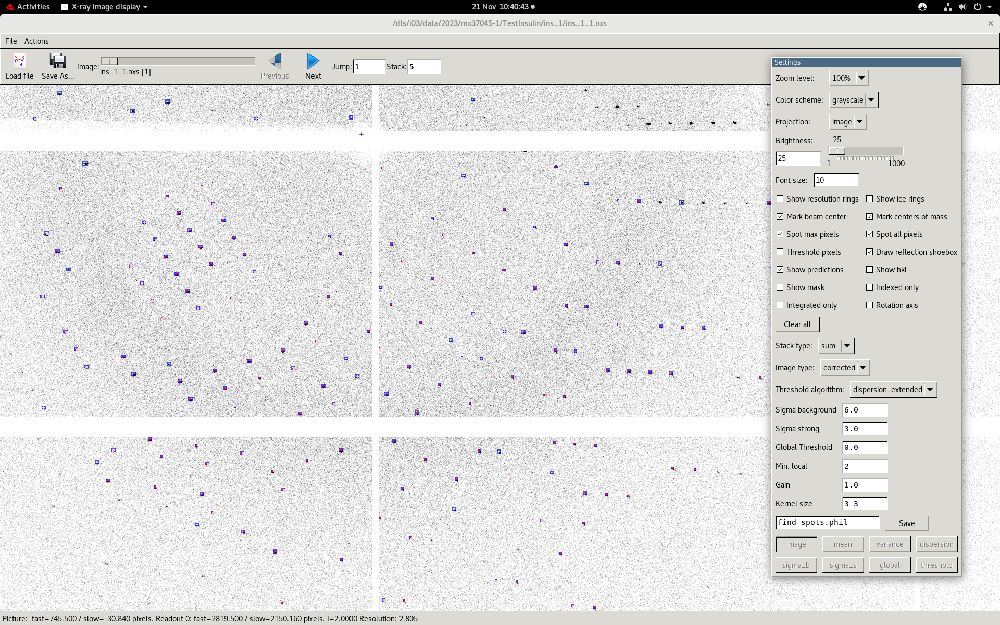
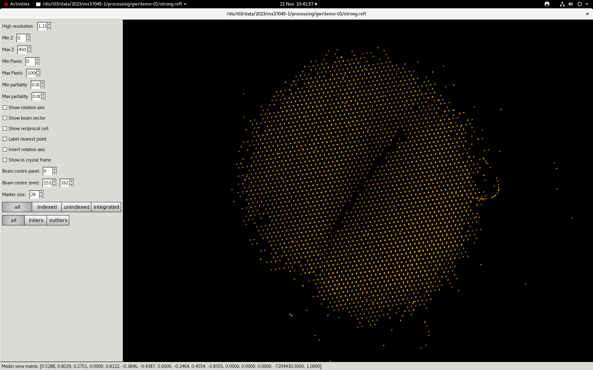
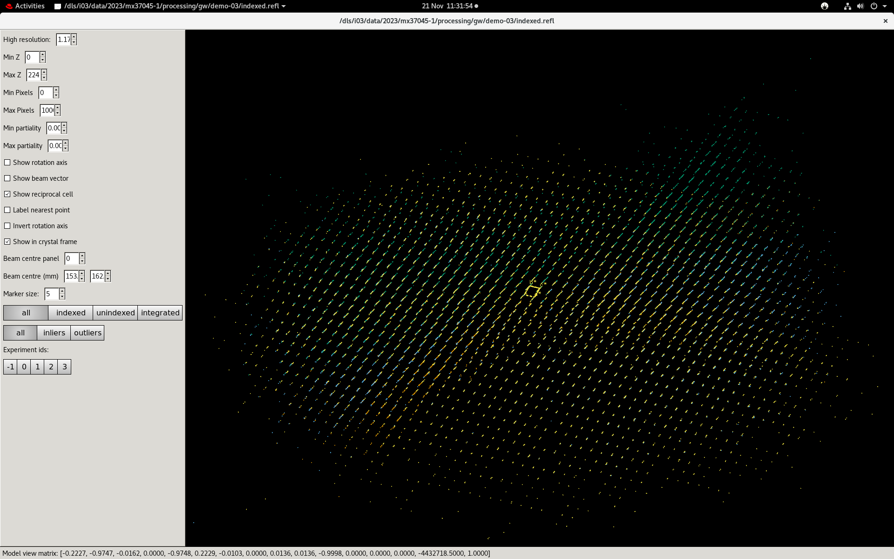

# Processing in Detail (Diamond / CCP4 2023)

## Introduction

DIALS processing may be performed by either running the individual tools (spot finding, indexing, refinement, integration, symmetry, scaling, exporting to MTZ) or you can run `xia2`, which makes informed choices for you at each stage. In this tutorial we will do the former, running through each of the steps in turn, taking a look at the output as we go.

The aim of this tutorial is to introduce you to the tools, not teach about data processing - it is assumed you have some idea of the overall process from e.g. associated lectures. With the graphical tools, I am not making so much effort to explain the options as simply "playing" will give you a chance to learn your way around and also find the settings which work for you. Particularly with looking at diffraction images, the "best" settings are very personal.

One of the key goals of this tutorial is to take you through how to process multiple data sets at once - as an ensemble - which can be very convenient for handling data from e.g. in situ experiments.

## DIALS version

This tutorial assumes you are using [DIALS version 3.17](https://dials.github.io/installation.html) and that you have this set up (i.e. you've run `module load ccp4-workshop`).

If you type `dials.version` you should see something like:

        DIALS 3.17.0-1-g33944f948-release
        Python 3.10.13
        Installed in: /dls_sw/apps/dials/dials-v3-17-0-1/modules/dials/src/dials

If you are running this at home with a different version of DIALS, details may change but the general flow should be the same, provided that it is relatively recent.

## Tutorial data

The data for this tutorial were collected with a deliberately wide-ish rotation angle (i.e. going against my advice in the lectures) to allow quick processing... they are in

        /dls/i03/data/2023/mx37045-1/TestInsulin/

and there are several subdirectories in here. This tutorial will eventually allow you to merge every data set from every crystal, but we will get there by first processing a small subset of some data sets to "get a feel" for how the processing works. The first part of the tutorial will have you work through a chunk of one data set, then the second will take you through processing the first part of two sweeps for a multi-axis data collection from a single crystal. The third will take you through processing a chunk of data from a number of individual crystals - the intention is to show that the workflows are _largely the same_ with only minor variations. In every case the full data set could be used in place of the chunks, but the time taken to perform the processing would obviously be longer.

## Files

DIALS creates two principal file types:

- experiment files called `something.expt`
- reflection files called `something.refl`

"Experiment" in DIALS has a very specific meaning - the capturing of data from one set of detector, beam, goniometer and crystal - so if you have two scans from one crystal this is two experiments, if you have two lattices on one data set this is two experiments. In most cases you can ignore this distinction though.

Usually the output filenames will correspond to the name of the DIALS program that created them e.g. `indexed.refl` and `indexed.expt` from `dials.index`. The only deviations from this are on import (see below) where we are only reading experiment models and spot finding where we find _strong_ reflections so write these to `strong.refl` - and we create no models so (by default) there is no output experiment file.

At any time you can _look_ at these files with `dials.show` which will summarise the content of the files to the terminal.

[If you're impatient...](./tldr.md) - the truth is this is pretty much how I start processing any data set these days.

## Parameters

All DIALS programs accept parameters in the form of `parameter=value` - in most cases this will be sufficient though some less frequently used options may require "name space" clarification e.g. `index_assignment.method=local`. All of the DIALS programs support the option

        dials.program -c -e2

which will show you all possible configuration options - if you are looking for an option this is the simplest way to search so e.g.

        dials.index -c -e2 | less

will allow you to scroll through the extensive list of options you can adjust. In most cases the defaults are relatively sensible for synchrotron data from a pixel array detector, as we are using in this tutorial.

## Output

In the majority of cases the `dials` programs write their output to `dials.program.log` e.g. `dials.find_spots.log` etc. - everything which is printed to the terminal is also saved in this file, so you can review the processing later. In the case where you are reporting an issue to the developers including these log files in the error report (particularly for the step which failed) is very helpful.

From most stages you can generate a more verbose _report_ of the current state of processing with:

        dials.report step.expt step.refl

which will generate a detailed report as HTML describing the current
state of the processing.

## Before You Start

DIALS programs make files - with standard names - so to keep things simple, make a new directory for each processing run. Since this is a tutorial with three parts, I suggest tutorial-1, tutorial-2, tutorial-3.

        mkdir tutorial-1
        cd tutorial-1

## Import

The starting point for any processing with DIALS is to _import_ the data - here the metadata are read and a description of the data to be processed saved to a file named `imported.expt`. This is "human readable" in that the file is JSON format (roughly readable text with brackets around to structure for computers). While you can edit this file if you know what you are doing, usually this is not necessary.

        dials.import /dls/i03/data/2023/mx37045-1/TestInsulin/ins_1/ins_1_1.nxs image_range=1,450

will read the metadata from this `nexus` file and write `imported.expt` from this.

It is important to note that for well-behaved data (i.e. anything which is well-collected from a well-behaved sample) the commands below will often be identical after importing.

At this point you can actually look at the images with the `dials.image_viewer` tool -

        dials.image_viewer imported.expt

in this tool there are many settings you can adjust, which could depend on the source of the data and - most importantly - your preferences.

To get a sense of how the diffraction spots are spread, stacking images can help - for example in this case setting the stack to 5 gives a good idea of the real separation between reflections. If the data are not stacked the spot finding process can also be explored - the controls at the bottom of the "Settings" window allow you to step through these and can be very useful for getting a "computer's eye view" of how the data look (particularly for establishing where the diffraction is visible to.)

## Find Spots

The first "real" task in any processing using DIALS is the spot finding. Since this is looking for spots on every image in the dataset, this process can take some time so by default will use all of the processors available in your machine - if you would like to control this adjust with e.g. `nproc=4` - however the default is usually sensible unless you are sharing the computer with many others.

        dials.find_spots imported.expt

This is one of the two steps where every image in the data set is read and processed and hence can be moderately time-consuming. This contains a reflection file `strong.refl` which contains both the positions of the strong spots and also "images" of the spot pixels which we will use later. You can view these spots on top of the images with

        dials.image_viewer imported.expt strong.refl

to get a sense of what spots were found. You will see that the spots are surrounded by little blue boxes - these are the _bounding boxes_ of the reflections i.e. the outer extent of the connected regions of the signal pixels. The signal pixels are highlighted with green blobs giving a sense of what is and is not "strong."



The default parameters for spot finding usually do a good job for Eiger images, such as these. However they may not be optimal for data from other detector types, such as CCDs or image plates. Issues with incorrectly set gain might, for example, lead to background noise being extracted as spots. You can use the image mode buttons to preview how the parameters affect the spot finding algorithm. The final button "threshold" is the one on which spots were found, so ensuring this produces peaks at real diffraction spot positions will give the best chance of success.

The second tool for visualisation of the found spots is the reciprocal lattice viewer - which presents a view of the spot positions mapped to reciprocal space.

        dials.reciprocal_lattice_viewer imported.expt strong.refl

No matter the sample orientation you should be able to rotate the space to "look down" the lines of reflections. If you cannot, or the lines are not straight, it is likely that there are some errors in the experiment parameters e.g. detector distance or beam centre. If these are not too large they will likely be corrected in the subsequent analysis.



Have a play with the settings - you can change the beam centre in the viewer to see how nicely aligned spots move out of alignment. Some of the options will only work after you have indexed the data. If the geometry is not accurately recorded you may find it useful to run:

        dials.search_beam_position imported.expt strong.refl

to determine an updated position for the beam centre - ideally the shift that this calculates should be small if the beamline is well-calibrated - if it is a couple of mm or more it may be worth discussing this with the beamline staff! Running the reciprocal lattice viewer with the optimised experiment output:

        dials.reciprocal_lattice_viewer optimised.expt strong.refl

should show straight lines, provided everything has worked correctly.

## Indexing

The next step will be indexing of the found spots with `dials.index` - by default this uses a 3D FFT algorithm to identify periodicity in the reciprocal space mapped spot positions, though there are other algorithms available which can be better suited to e.g. narrow data sets.

        dials.index imported.expt strong.refl

or

        dials.index optimised.expt strong.refl

are the ways to trigger the program, and the most common parameters to set are the `space_group` and `unit_cell` if these are known in advance. While this does index the data it will also perform some refinement with a static crystal model, and indicate in the output the fraction of reflections which have been indexed - ideally this should be close to 100%:

```
Refined crystal models:
model 1 (23862 reflections):
Crystal:
    Unit cell: 67.080(3), 67.057(2), 67.089(2), 109.3406(6), 109.5233(8), 109.4662(8)
    Space group: P 1
    U matrix:  {{ 0.1597, -0.2460, -0.9560},
                {-0.8742, -0.4852, -0.0212},
                {-0.4586,  0.8391, -0.2925}}
    B matrix:  {{ 0.0149,  0.0000,  0.0000},
                { 0.0053,  0.0158,  0.0000},
                { 0.0091,  0.0091,  0.0182}}
    A = UB:    {{-0.0076, -0.0126, -0.0174},
                {-0.0158, -0.0079, -0.0004},
                {-0.0051,  0.0106, -0.0053}}
+------------+-------------+---------------+-------------+
|   Imageset |   # indexed |   # unindexed | % indexed   |
|------------+-------------+---------------+-------------|
|          0 |       23862 |           614 | 97.5%       |
+------------+-------------+---------------+-------------+
```

If the fraction of indexed reflections is substantially below 100%, go look - there is probably a reason (and I would place a small wager that your crystal has split). A successful `dials.index` writes the experiments and indexed reflections to two new files `indexed.expt` and `indexed.refl` - if these are loaded in the reciprocal lattice viewer you can see which spots have been indexed and if you have multiple lattices switch them "on and off" for comparison.

The process that the indexing performs is quite complex -

- make a guess at the maximum unit cell from the pairwise separation of spots in reciprocal space
- transform spot positions to reciprocal space using the best available current model of the experimental geometry
- perform a Fourier transform of these positions or other algorithm to identify the _basis vectors_ of these positions e.g. the spacing between one position and the next
- determine a set of these basis vectors which best describes the reciprocal space positions
- transform this set of three basis vectors into a unit cell description, which is then manipulated according to some standard rules to give the best _triclinic_ unit cell to describe the reflections - if a unit cell and space group have been provided these will be enforced at this stage
- _assign indices_ to the reflections by "dividing through" the reciprocal space position by the unit cell parallelopiped (this is strictly the actual indexing step)
- take the indexed reflections and refine the unit cell parameters and model of the experimental geometry by comparing where the reflections should be and where they are found
- save the indexed reflections and experiment models to the output files

The indexing process takes place over a number of cycles, where low resolution reflections are initially indexed and refined before including more reflections at high resolution - this improves the overall success of the procedure by allowing some refinement as a part of the process.
  
During this process an effort is made to eliminate "outlier" reflections - these are reflections which do not strictly belong to the crystal lattice but are accidentally close to a reciprocal space position and hence can be indexed. Most often this is an issue with small satellite lattices or ice / powder on the sample. Usually this should not be a cause for concern.

## Bravais Lattice Determination (optional!)

Once you have indexed the data you may optionally attempt to infer the correct Bravais lattice and assign this to constrain the unit cell in subsequent processing. If, for example, the unit cell from indexing has all three angles close to 90° and two unit cell lengths with very similar values you could guess that the unit cell is tetragonal. In `dials.refine_bravais_settings` we take away the guesswork by transforming the unit cell to all possible Bravais lattices which approximately match the triclinic unit cell, and then performing some refinement - if the lattice constraints are correct then imposing them should have little impact on the deviations between the observed and calculated reflection positions (known as the R.M.S. deviations). If a lattice constraint is incorrect it will manifest as a significant increase in a deviation - however care must be taken as it can be the case that the true _symmetry_ is lower than the shape of the unit cell would indicate.

In the general case there is little harm in skipping this step, however for information if you run

        dials.refine_bravais_settings indexed.expt indexed.refl

you will see a table of possible unit cell / Bravais lattice / R.M.S. deviations printed in the output - in the case of this tutorial data they will all match, as the true symmetry is tetragonal.

```
Chiral space groups corresponding to each Bravais lattice:
aP: P1
oF: F222
oI: I222 I212121
tI: I4 I41 I422 I4122
hR: R3:H R32:H
cI: I23 I213 I432 I4132
mI: I2
+------------+--------------+--------+--------------+----------+-----------+-------------------------------------------+----------+-------------------+
|   Solution |   Metric fit |   rmsd | min/max cc   |   #spots | lattice   | unit_cell                                 |   volume | cb_op             |
|------------+--------------+--------+--------------+----------+-----------+-------------------------------------------+----------+-------------------|
|   *     22 |       0.139  |  0.062 | 0.706/0.829  |     8999 | cI        | 77.69  77.69  77.69  90.00  90.00  90.00  |   468944 | b+c,a+c,a+b       |
|   *     21 |       0.139  |  0.062 | 0.723/0.727  |     8999 | hR        | 109.82 109.82  67.20  90.00  90.00 120.00 |   701849 | a+2*b+c,-b+c,a    |
|   *     20 |       0.139  |  0.058 | 0.706/0.767  |     8999 | hR        | 109.84 109.84  67.17  90.00  90.00 120.00 |   701859 | a+b+2*c,a-c,b     |
|   *     19 |       0.1363 |  0.06  | 0.731/0.731  |     8999 | hR        | 109.97 109.97  67.30  90.00  90.00 120.00 |   704742 | 2*a+b+c,-a+b,c    |
|         18 |       0.139  |  0.053 | 0.463/0.824  |     8999 | tI        | 77.67  77.67  77.56  90.00  90.00  90.00  |   467852 | b+c,a+c,a+b       |
|         17 |       0.1363 |  0.059 | 0.408/0.791  |     8999 | tI        | 77.71  77.71  77.63  90.00  90.00  90.00  |   468834 | a+b,b+c,a+c       |
|         16 |       0.139  |  0.051 | 0.474/0.824  |     8999 | oF        | 77.48 109.60 109.76  90.00  90.00  90.00  |   932014 | a+b,-a+b,a+b+2*c  |
|         15 |       0.1363 |  0.058 | 0.408/0.791  |     8999 | oF        | 77.63 109.84 109.93  90.00  90.00  90.00  |   937355 | -a-c,-a+c,a+2*b+c |
|         14 |       0.139  |  0.051 | 0.474/0.474  |     8999 | mI        | 67.11 109.76  67.12  90.00 109.49  90.00  |   466148 | -b,a+b+2*c,-a     |
|         13 |       0.1363 |  0.057 | 0.408/0.408  |     8999 | mI        | 67.19 109.88  67.22  90.00 109.50  90.00  |   467773 | -a,a+2*b+c,-c     |
|   *     12 |       0.1212 |  0.04  | 0.709/0.780  |     8999 | hR        | 109.63 109.63  67.28  90.00  90.00 120.00 |   700357 | b-c,-a+c,a+b+c    |
|   *     11 |       0.1212 |  0.035 | 0.477/0.477  |     8999 | mI        | 67.12 109.55  67.22  90.00 109.56  90.00  |   465761 | c,-a+b,-a-b-c     |
|   *     10 |       0.1004 |  0.035 | 0.439/0.829  |     8999 | tI        | 77.47  77.47  77.67  90.00  90.00  90.00  |   466155 | a+c,a+b,b+c       |
|   *      9 |       0.1004 |  0.035 | 0.791/0.829  |     8999 | oI        | 77.43  77.47  77.66  90.00  90.00  90.00  |   465874 | a+c,a+b,b+c       |
|   *      8 |       0.1004 |  0.034 | 0.791/0.791  |     8999 | mI        | 77.47  77.44  77.66  90.00  90.03  90.00  |   465871 | a+b,a+c,-b-c      |
|   *      7 |       0.0844 |  0.028 | 0.486/0.829  |     8999 | oF        | 77.69 109.55 109.71  90.00  90.00  90.00  |   933714 | b+c,-b+c,2*a+b+c  |
|   *      6 |       0.0929 |  0.037 | 0.424/0.424  |     8999 | mI        | 67.07 109.63  67.24  90.00 109.53  90.00  |   465983 | b,a-c,-a-b-c      |
|   *      5 |       0.0844 |  0.028 | 0.829/0.829  |     8999 | mI        | 77.50  77.68  77.52  90.00  90.08  90.00  |   466709 | a+c,b+c,-a-b      |
|   *      4 |       0.0742 |  0.033 | 0.824/0.824  |     8999 | mI        | 77.36  77.43  77.59  90.00  90.06  90.00  |   464721 | -a-c,-a-b,b+c     |
|   *      3 |       0.0837 |  0.028 | 0.486/0.486  |     8999 | mI        | 67.14 109.70  67.15  90.00 109.32  90.00  |   466747 | -b,-2*a-b-c,-c    |
|   *      2 |       0.0394 |  0.026 | 0.487/0.487  |     8999 | mI        | 67.13 109.50  67.20  90.00 109.40  90.00  |   465877 | a,-b+c,-a-b-c     |
|   *      1 |       0      |  0.025 | -/-          |     8999 | aP        | 67.08  67.06  67.09 109.34 109.53 109.47  |   232544 | a,b,c             |
+------------+--------------+--------+--------------+----------+-----------+-------------------------------------------+----------+-------------------+
* = recommended solution
```

If you wish to use one of the output experiments from this process e.g. `bravais_setting_22.expt` you will need to reindex the reflection data from indexing to match this - we do not output every option of reindexed data as these files can be large. In most cases it is simpler to re-run `dials.index` setting the chosen space group.

The reader is reminded here - in most cases it is absolutely fine to proceed without worrying about the crystal symmetry at this stage 🙂.

## Refinement

The model is already refined during indexing, but this is assuming that a single crystal model is appropriate for every image in the data set - in reality there are usually small changes in the unit cell and crystal orientation throughout the experiment as the sample is rotated. `dials.refine` will first re-run refinement with a fixed unit cell and then perform scan-varying refinement. If you have indexed multiple sweeps earlier in processing (not covered in this tutorial) then the crystal models will be copied and split at this stage to allow per-crystal-per-scan models to be refined.

By and large one may run:

        dials.refine indexed.expt indexed.refl

without any options and the program will do something sensible - if you compare the R.M.S. deviations from the end of indexing with the end of refinement you should see a small improvement e.g.

```
RMSDs by experiment:
+-------+--------+----------+----------+------------+
|   Exp |   Nref |   RMSD_X |   RMSD_Y |     RMSD_Z |
|    id |        |     (px) |     (px) |   (images) |
|-------+--------+----------+----------+------------|
|     0 |   8999 |  0.25876 |  0.22032 |    0.18062 |
+-------+--------+----------+----------+------------+
```

to:

```
RMSDs by experiment:
+-------+--------+----------+----------+------------+
|   Exp |   Nref |   RMSD_X |   RMSD_Y |     RMSD_Z |
|    id |        |     (px) |     (px) |   (images) |
|-------+--------+----------+----------+------------|
|     0 |  18105 |  0.23028 |  0.18419 |    0.13013 |
+-------+--------+----------+----------+------------+
```

If you look at the output of `dials.report` at this stage you should see small variations in the unit cell and sample orientation as the crystal is rotated - if these do not appear small then it is likely that something has happened during data collection e.g. severe radiation damage.

## Integration

Once you have refined the model the next step is to integrate the data - in effect this is using the refined model to calculate the positions where all of the reflections in the data set will be found and measure the background-subtracted intensities:

        dials.integrate refined.expt refined.refl

By default this will pass through the data twice, first looking at the shapes of the predicted spots to form a reference profile model then passing through a second time to use this profile model to integrate the data, by being fit to the transformed pixel values. This is by far the most computationally expensive step in the processing of the data!

by default all the processors in your computer are used, unless we think this will exceed the memory available in the machine. At times, however, if you have a large unit cell and / or a large data set you may find that processing on a desktop workstation is more appropriate than e.g. a laptop.

If you know in advance that the data do not diffract to anything close to the edges of the detector you can assign a resolution limit at this stage by adding `prediction.d_min=1.6` (say) to define a 1.8 Å resolution limit - this should in general not be necessary. At the end of integration two new files are created - `integrated.refl` and `integrated.expt` - looking at these in the image viewer e.g.

        dials.image_viewer integrated.expt integrated.refl

can be very enlightening as you should see little red boxes around every reflection - if you select "integrated only" you can see what was and was not integrated. You may see a selection of reflections close to the rotation axis are missed - these are not well modelled or predicted in any program so typically excluded from processing.

## Symmetry analysis

Before the data may be scaled it is necessary that the crystal symmetry is known - if this was assigned correctly at indexing e.g. `space_group=I213` then you can proceed directly to scaling. In the majority of cases however it will be unknown or not set at this point, so needs to be assigned between integration and scaling. Even if the Bravais lattice was assigned earlier, the correct symmetry _within_ that lattice is needed.

The symmetry analysis in DIALS takes the information from the spot positions and also the spot intensities. The former are used to effectively re-run `dials.refine_bravais_settings` to identify possible lattices and hence candidate symmetry operations, and the latter are used to assess the presence or absence of these symmetry operations. Once the operations are found, the crystal rotational symmetry is assigned by composing these operations into a putative space group. In addition, systematically absent reflections are also assessed to assign a best guess to translational elements of the symmetry - though these are not needed for scaling, they may help with downstream analysis rather than you having to manually identify them.

        dials.symmetry integrated.expt integrated.refl

is how this step is run. At this point it is important to note that
the program is trying to identify all symmetry elements, and does not
know that e.g. inversion centres are not possible - so for an oP
lattice it will be testing for P/mmm symmetry which corresponds to
P2?2?2? in standard MX.

The data in this tutorial give interesting output for this:

```
+--------------+--------+------+-------+-----+---------------+
|   likelihood |   Z-CC |   CC |     N |     | Operator      |
|--------------+--------+------+-------+-----+---------------|
|        0.944 |   9.96 | 1    | 39916 | *** | 1 |(0, 0, 0)  |
|        0.154 |   4.35 | 0.44 | 70830 |     | 4 |(1, 1, 0)  |
|        0.158 |   4.43 | 0.44 | 35016 |     | 4 |(1, 0, 1)  |
|        0.161 |   4.47 | 0.45 | 57012 |     | 4 |(0, 1, 1)  |
|        0.943 |   9.93 | 0.99 | 46408 | *** | 3 |(1, 0, 0)  |
|        0.943 |   9.93 | 0.99 | 70952 | *** | 3 |(0, 1, 0)  |
|        0.943 |   9.95 | 0.99 | 50368 | *** | 3 |(0, 0, 1)  |
|        0.943 |   9.94 | 0.99 | 43028 | *** | 3 |(1, 1, 1)  |
|        0.943 |   9.94 | 0.99 | 30292 | *** | 2 |(1, 1, 0)  |
|        0.157 |   4.41 | 0.44 | 35168 |     | 2 |(-1, 1, 0) |
|        0.943 |   9.95 | 0.99 | 38878 | *** | 2 |(1, 0, 1)  |
|        0.163 |   4.51 | 0.45 | 28196 |     | 2 |(-1, 0, 1) |
|        0.943 |   9.95 | 1    | 30756 | *** | 2 |(0, 1, 1)  |
|        0.16  |   4.47 | 0.45 | 24116 |     | 2 |(0, -1, 1) |
|        0.154 |   4.35 | 0.44 | 37186 |     | 2 |(1, 1, 2)  |
|        0.161 |   4.49 | 0.45 | 27400 |     | 2 |(1, 2, 1)  |
|        0.152 |   4.31 | 0.43 | 31620 |     | 2 |(2, 1, 1)  |
+--------------+--------+------+-------+-----+---------------+
```

Here it is clear that there are some operations that have close to 100% CC, others that are much lower - in particular the 4-fold rotations in the middle of the faces are not present which means the crystal has a _polar_ space group so care needs to be taken when combining data from multiple samples.

## Scaling and Merging

During the experiment there are effects which alter the measured intensity of the reflections, not least radiation damage, changes to beam intensity or illuminated volume or absorption within the sample. The purpose of `dials.scale`, like all scaling programs, is to attempt to correct for these effects by using the fact that symmetry related reflections should share a common intensity. By default no attempt is made to merge the reflections - this may be done independently in `dials.merge` - but a table of merging statistics is printed at the end along with resolution recommendations.

        dials.scale symmetrized.expt symmetrized.refl

or 

        dials.scale symmetrized.expt symmetrized.refl anomalous=True

runs everything with the defaults which allows for:

- modest radiation damage
- changes in overall intensity
- modest sample absorption

with the latter being the parameter most likely changed. If you have a data set recorded from a sample containing a large amount of metal (not common in MX) or recorded at long wavelength e.g, for sulphur SAD it may be necessary to adjust the extent to which the absorption correction is constrained with one of these options:

- `absorption_level=low`
- `absorption_level=medium`
- `absorption_level=high`
        
where setting low, the default, corresponds to ~ 1% absorption, medium to ~5% and high to ~ 25% - these are not absolute, more a sense of what you may expect. Testing has indicated that setting it too high is unlikely to do any harm, but setting it too low can have a measurable impact on the quality of the data for phasing experiments. `dials.scale` generates a HTML report `dials.scale.html` which includes a lot of information about how the models look, as well as regions of the data which agree well and poorly - from a practical perspective this is the point where you really _know_ about the final quality of the data.

## Estimating resolution

Though `dials.scale` will perform an estimate of the resolution limit, it does not give you lots of pretty output to look at so you can run this separately with a dedicated command: `dials.estimate_resolution` - this performs a fit and reads off where CC-half is 0.3 (by default) -

        dials.estimate_resolution scaled.expt scaled.refl

This will also write out a HTML file with a graph to inspect. You can take the output of this and re-scale the data to this limit with `d_min=1.52` (in this case.) - you can apply this in the scaling by repeating the scaling process if you like, with 

        dials.scale symmetrized.expt symmetrized.refl d_min=1.52

## Merging or Exporting

Most downstream software depends on a scaled _and merged_ data set e.g. for molecular replacement, so at the end of processing you can run

        dials.export scaled.expt scaled.refl

to simply export the scaled reflections in MTZ format or

        dials.merge scaled.expt scaled.refl

which will output a scaled and merged MTZ file.

## Review

If you looked at [tldr](./tldr.md) before working through this many of the commands will be familiar - with good reason, since the script _generally works_ for reasonable data.

If we remind ourselves of what the script looked like:

```
dials.import /dls/i03/data/2023/mx37045-1/TestInsulin/ins_1/ins_1_1.nxs image_range=1,450
dials.find_spots imported.expt
dials.index imported.expt strong.refl
dials.refine indexed.expt indexed.refl
dials.integrate refined.expt refined.refl
dials.symmetry integrated.expt integrated.refl
dials.scale symmetrized.expt symmetrized.refl
```

We essentially imported some data, found the spots, then index, refine, integrate and finally decide on the symmetry and scale. If we are processing data from either more than one sweep from one crystal (e.g. for multiple orientation data collection) or from multiple separate crystals, then fundamentally we would like to do _the same workflow_ but with that instead.

Guess what? You can.

But, like everything in life, there are details you need to pay attention to. The second part of this tutorial will explore those details.

## Multiple Sweeps from One Crystal

Before you start

        cd ..
        mkdir tutorial-2
        cd tutorial-2

Multi-axis goniometers allow the crystal to be reorientated with respect to the goniometer scan axis, to allow areas of reciprocal space to be reached which would otherwise be unavailable. The relationship between scans is therefore calculable, provided that the goniometer information is reasonably accurately recorded. This means, in effect, that we can assign one set of unit cell vectors (characterised as an orientation matrix) to both sets of reflections.

We can get the ball rolling with

        dials.import /dls/i03/data/2023/mx37045-1/TestInsulin/ins_1/ins_1_{1,2}.nxs image_range=1,225

This will import the first 225 images of two scans (so, a similar amount of data to the first tutorial run with 450 images). We can then find spots and index _as before_ though the output is a little different, reflecting the fact that we have two distinct data sets here.

        dials.find_spots imported.expt
        dials.index imported.expt strong.refl

The find spots job will step through each scan one at a time, so you will get two sets of output. The indexing run will map all these reflections to reciprocal space and fit _one_ matrix - you can get a feel for what this looks like with

        dials.reciprocal_lattice_viewer imported.expt strong.refl

as before. The indexing output will however show two sets of output:

```
RMSDs by experiment:
+-------+--------+----------+----------+------------+
|   Exp |   Nref |   RMSD_X |   RMSD_Y |     RMSD_Z |
|    id |        |     (px) |     (px) |   (images) |
|-------+--------+----------+----------+------------|
|     0 |   4499 |  0.83384 |  0.65097 |    0.47335 |
|     1 |   4499 |  0.56526 |  0.33821 |    0.46412 |
+-------+--------+----------+----------+------------+

Refined crystal models:
model 1 (12156 reflections):
Crystal:
    Unit cell: 67.068(9), 67.033(9), 67.150(7), 109.439(3), 109.455(3), 109.394(4)
    Space group: P 1
    U matrix:  {{ 0.1572, -0.2353, -0.9591},
                {-0.8736, -0.4861, -0.0239},
                {-0.4606,  0.8416, -0.2820}}
    B matrix:  {{ 0.0149,  0.0000,  0.0000},
                { 0.0052,  0.0158,  0.0000},
                { 0.0091,  0.0091,  0.0182}}
    A = UB:    {{-0.0076, -0.0124, -0.0175},
                {-0.0158, -0.0079, -0.0004},
                {-0.0050,  0.0107, -0.0051}}
model 2 (12187 reflections):
Crystal:
    Unit cell: 67.068(9), 67.033(9), 67.150(7), 109.439(3), 109.455(3), 109.394(4)
    Space group: P 1
    U matrix:  {{ 0.1572, -0.2353, -0.9591},
                {-0.8736, -0.4861, -0.0239},
                {-0.4606,  0.8416, -0.2820}}
    B matrix:  {{ 0.0149,  0.0000,  0.0000},
                { 0.0052,  0.0158,  0.0000},
                { 0.0091,  0.0091,  0.0182}}
    A = UB:    {{-0.0076, -0.0124, -0.0175},
                {-0.0158, -0.0079, -0.0004},
                {-0.0050,  0.0107, -0.0051}}
+------------+-------------+---------------+-------------+
|   Imageset |   # indexed |   # unindexed | % indexed   |
|------------+-------------+---------------+-------------|
|          0 |       12156 |           357 | 97.1%       |
|          1 |       12187 |           313 | 97.5%       |
+------------+-------------+---------------+-------------+

Saving refined experiments to indexed.expt
Saving refined reflections to indexed.refl
```

here we can see that almost all of the reflections from both scans were indexed but the R.M.S. deviations were rather larger than before - this is a reflection of inaccuracy in the goniometer information and will come out in the wash when we do some refinement.

If here you see only one of the sets properly indexed, and most of the other set not indexed at all, it is likely that the necessary goniometer information is not accurately recorded. We can work around this, as will be shown in the next tutorial example.

The rest of the process largely works as before - we can run

```
dials.refine indexed.expt indexed.refl
dials.integrate refined.expt refined.refl
dials.symmetry integrated.expt integrated.refl
dials.scale symmetrized.expt symmetrized.refl
```

just fine - the R.M.S. deviations in refinement are _vastly_ better as we allow the orientations of the lattices to be a little different between scans, but critically the reflections are consistently indexed - this is critical when we come to the symmetry analysis, particularly if the crystal affords the possibility of indexing ambiguity as in this case.

## Multiple Sweeps from Multiple Crystals

Before you start

        cd ..
        mkdir tutorial-3
        cd tutorial-3

In the above run we relied on the fact that the relationship between the data sets was well defined - the sample was deliberately reorientated in a known manner between scans. If we take data from multiple crystals then we can make no such assumptions and instead have to treat each lattice as independent. Happily this involves only a slight deviation from the "main sequence" processing.

First, let's import a few frames from four different crystals:

        dials.import /dls/i03/data/2023/mx37045-1/TestInsulin/ins_{3,4,5,6}/ins_?_1.nxs image_range=1,225

This is taking the first 225 images from the first sweep of four runs - if you have time you could include all the images to get a much higher multiplicity but this is a learning-the-ropes exercise. Spot finding works exactly as before:

        dials.find_spots imported.expt

but when we hit indexing we have to tell `dials.index` not to try and assign a single matrix:

        dials.index imported.expt strong.refl joint=false

Looking at the spots in the reciprocal lattice viewer will demonstrate the differences in orientation, but once we have indexed the data we have orientation matrices, so we can look at the lattices in the _crystal frame_



It's much easier to play with the lattice viewer here than look at a static picture. Anyway, the next couple of stages are the same as we are used to -

```
dials.refine indexed.expt indexed.refl
dials.integrate refined.expt refined.refl
```

When we get to the symmetry discovery though, we have to pause as we have no idea if the crystals are consistently indexed ergo simply looking for symmetry could be misleading. Instead we have the `dials.cosym` tool, which is there to resolve the crystal symmetry and indexing ambiguity _at the same time_ by using a lot of maths and group theory. The end game though is we can put in multiple data sets from multiple crystals and get out consistently indexed data with the correct rotational symmetry assigned.

As a reminder:

        dials.cosym integrated.expt integrated.refl

After this the data are again ready for scaling:

        dials.scale symmetrized.expt symmetrized.refl

And you can of course apply resolution limits and suchlike. Really the tool for _this_ job is `xia2.multiplex` but this is a different tutorial.
