# Processing 🐮🐷🧑 with DIALS (CCP4 / York 2025)

Adapted from a [tutorial](https://github.com/graeme-winter/dials_tutorials/blob/main/ccp4-dls-2024/COWS_PIGS_PEOPLE.md) by Graeme Winter. Please see [workflow summary](./WORKFLOW.md) for details on how to do basic processing with DIALS.

## Introduction

DIALS data processing may be run by automated tools such as `xia2` or interactively on the command line. For this tutorial, we shall start using the latter, to explain the opportunities afforded by the software, then demonstrate how the same may be achieved using `xia2.multiplex`. In any data processing package the workflow requires reading data, finding spots, indexing to get an orientation matrix, refinement, integration and then scaling / correction: DIALS is no different.

This tutorial deviates slightly from the mainstream by _starting_ with data from a number of different crystals, which will show you how to classify data with subtle differences (e.g. presence or absence of a ligand, or as in this case different species of insulin.)

## The Data

[The data](https://zenodo.org/records/13890874) (~6GB) were taken on I24 at Diamond Light Source as part of routine commissioning work, with a number of small rotation data sets recorded from different crystals. Crystals were prepared of the protein insulin from cows, pigs and people (as described on the Zenodo deposition; bovine, porcine and human insulin, of course all grown in e-coli anyway).

All data have symmetry I213 and very similar unit cell constants so you can _try_ to merge them together and it will work, but won't give you good results as you will be measuring a mixture of structures.

If you are at the workshop in real life, the data are already in: *CHECK THIS PRIOR TO WORKSHOP AND EDIT PATH*

```console
/dls/i04/data/2024/mx39148-1/tutorial_data/cows_pigs_people
```

so you don't need to download the data - but you'll need to use this path in place of `../data` - you do not need to follow these instructions here.

If you don't already have the data downloaded, you can do this with this script on linux / UNIX:

```bash
mkdir data
cd data
for set in CIX1_1 CIX2_1 CIX3_1 CIX5_1 CIX6_1 CIX8_1 CIX9_1 CIX10_1 CIX11_1 CIX12_1 CIX14_1 CIX15_1 PIX5_1 PIX6_1 PIX7_1 PIX8_1 PIX9_1 PIX10_1 PIX11_1 PIX12_1 PIX13_1 PIX14_1 PIX15_1 PIX16_1 X1_1 X2_1 X3_1 X4_1 X5_1 X6_1 X7_1 X8_1 X9_1 X11_1 X13_1 X14_1 ; do
wget https://zenodo.org/records/13890874/files/${set}.tar
tar xvf ${set}.tar
rm -v ${set}.tar
done
```

## The DIALS Workflow

The [workflow](./WORKFLOW.md) is the same with one data set as with many, with some small deviations - data from multiple crystals will not in general share an orientation matrix so the indexing will need to _not_ join all the lattices.

As mentioned above the flow is to read the data, find spots, index, refine, integrate and then derive some corrections from symmetry related reflections, which involves assigning the symmetry. In DIALS we use the following tools:

- `dials.import` - read all the image headers to make sense of the metadata
- `dials.find_spots` - find the spots - with DIALS we find spots across the whole data set and one spot across multiple images is "found" in 3D
- `dials.index` - assign indices to the spots and derive unit cell, symmetry
- `dials.refine` - improve the models from indexing (separate as allows "wobbles")
- `dials.integrate` - measure the background subtracted spot intensity
- `dials.symmetry` - derive the Patterson symmetry of the crystal from the data
- `dials.scale` - correct the data for sample decay, overall scale from beam or illuminated volume and absorption
- `dials.export` - output processed data for e.g. use in CCP4 or PHENIX

With multiple sweeps from a single crystal, we can assign a single orientation matrix and then use this throughout the processing (the default) - however if you have data from multiple crystals some of the assumptions will break down so we need to tell the software that the crystals _do not_ share a matrix and in the symmetry determination also resolve any indexing ambiguity: we therefore replace `dials.symmetry` with `dials.cosym`.

For this tutorial, there is some assumed knowledge of what these different steps in DIALS do. If you are attending the CCP4 School in York, you will have just covered this in a previous session. If you have stumbled across this tutorial outside of that event, you can find additional details on these DIALS steps explained in [this tutorial](https://github.com/graeme-winter/dials_tutorials/blob/main/ccp4-dls-2024/COWS_PIGS_PEOPLE.md)

## Cows, Pigs and People

In this tutorial, you will be processing a mixture of data sets: 12 each from human, bovine and porcine insulin. On a coarse scale they are isomorphous, but obviously deviate from one another at the scale of individual residues: this split is small enough that we could accidentally merge the data from all crystals if we were not careful: let's be careful. But first, let's be ignorant and see how that works out!

We will first need to import _all_ the data and proceed through the workflow as far as symmetry determination. Remember to replace `../data` with the actual data path if you are using pre-downloaded data at the CCP4 School! Notice as well that we will be using `dials.cosym` instead of `dials.symmetry`:

```bash
dials.import ../data/*gz
dials.find_spots imported.expt
dials.index imported.expt strong.refl joint=False
dials.refine indexed.expt indexed.refl
dials.integrate refined.expt refined.refl
dials.cosym integrated.expt integrated.refl
```

At this point we have found a common symmetry and indexing setting, and derived an average unit cell:

```console
Best solution: I m -3
Unit cell: 77.842, 77.842, 77.842, 90.000, 90.000, 90.000
Reindex operator: -b-c,a+c,-a-b
Laue group probability: 1.000
Laue group confidence: 1.000
Reindexing operators:
-x+y,y,y-z: [2, 3, 5, 10, 11, 13, 14, 15, 16, 18, 19, 20, 21, 22, 27, 34, 35]
x,y,z: [0, 1, 4, 6, 7, 8, 9, 12, 17, 23, 24, 25, 26, 28, 29, 30, 31, 32, 33]
```

however at this stage we can also start looking at the isomorphism analysis performed by cosym, by looking at `dials.cosym.html` - this includes some measure of unit cell isomorphism, but from the dendrogram you can see it does not cleanly split into three categories:

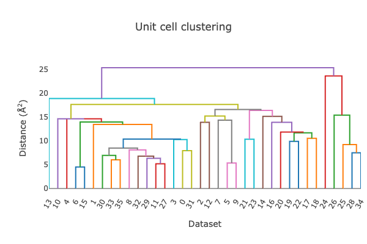

Scaling the data is "succcessful" in that you get results, but the merging stats are pretty poor. Test this out using:

```bash
dials.scale symmetrized.expt symmetrized.refl
```

Looking at the logs you can see the data split (not shown) but it is not obvious unless you know in advance that there are different crystals here. Take a look at `dials.scale.html` and look at the merging statistics as a function of image / batch number.

We can however see the different groups if we run `dials.correlation_matrix` - a new tool to run after cosym which helps to look for different isomorphism classes. This is more helpful: using the correlation coefficients to define distances, then using the OPTICS algorithm to define clusters.

```bash
dials.correlation_matrix symmetrized.expt symmetrized.refl
```

_or_

```bash
dials.correlation_matrix scaled.expt scaled.refl
```

The program may take either scaled data, which may be biased but will show clearer clusters, or unscaled data which is less biased but may be more "fuzzy" - you may find you get a clearer signal one way or the other. Regardless of which method you choose, the program will recommend clusters:

```console
Cluster 0
  Number of datasets: 12
  Completeness: 90.2 %
  Multiplicity: 9.55
  Datasets:0,1,2,3,4,5,6,7,8,9,10,11
Cluster 1
  Number of datasets: 12
  Completeness: 90.0 %
  Multiplicity: 9.52
  Datasets:12,13,14,15,16,17,18,19,20,21,22,23
Cluster 2
  Number of datasets: 12
  Completeness: 90.0 %
  Multiplicity: 9.51
  Datasets:24,25,26,27,28,29,30,31,32,33,34,35
```

but more usefully shows the lattice separation superbly on a pairwise correlation matrix, as modified using the cosine-angle procedure from `cosym`[2,3]:

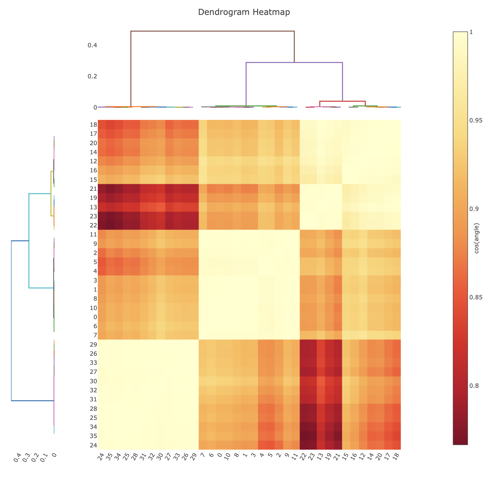

Here you can clearly see the three clusters. If `significant_clusters.output=True` is added to the command line, the program will split the data according to the clusters for further analysis:

```console
-rw-r--r--   1 graeme  staff     528939 14 Oct 14:19 cluster_0.expt
-rw-r--r--   1 graeme  staff  150001603 14 Oct 14:19 cluster_0.refl
-rw-r--r--   1 graeme  staff     527726 14 Oct 14:19 cluster_1.expt
-rw-r--r--   1 graeme  staff  147913867 14 Oct 14:19 cluster_1.refl
-rw-r--r--   1 graeme  staff     528436 14 Oct 14:19 cluster_2.expt
-rw-r--r--   1 graeme  staff  151291087 14 Oct 14:19 cluster_2.refl
```

These can be scaled as above, e.g. by making a directory for each. The algorithm may leave outlier data sets from inclusion in any cluster, so it is possible only one cluster appears as a result. In this case I merged each cluster separately with:

```bash
mkdir 0 1 2
cd 0
dials.scale ../cluster_0.expt ../cluster_0.refl
cd ../1
dials.scale ../cluster_1.expt ../cluster_1.refl
cd ../2
dials.scale ../cluster_2.expt ../cluster_2.refl
cd ..
```

Individually, the merging statistics from each cluster look far better than the three combined.

## Intensity-Based Clustering

If you open `dials.correlation_matrix.html` and click on the `Data correlation matrices` tab, you will see four tabs: 
 - Correlation coefficient clustering
 - Cos angle clustering
 - Cosym cluster plots
 - Principal component analysis

Click through the tabs and have a look at the output. The different plots are briefly explained below. For more in-depth mathematical descriptions, see [1].

#### Correlation Coefficient Clustering

The correlation coefficient clustering displays the result of calculating the pairwise correlation coefficients on all datasets. In the heat map, yellow corresponds to a higher correlation, while red is a lower correlation. Note that these colours are relative, with the scale bar showing what the pairwise correlations actually are. The dendrograms on the top and left hand side are alternative representations, and show how the data clusters, with datasets that join towards the bottom being more similar than groups that join at the top. 

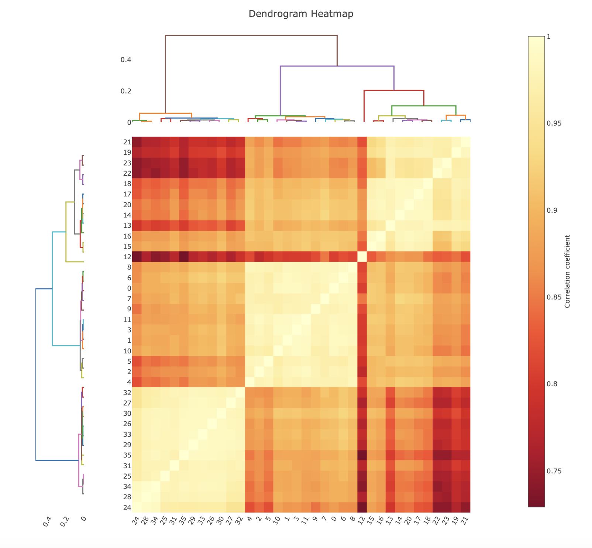

#### Cos Angle Clustering

The cosine angle clustering is an extension of the correlation coefficient clustering. Firstly, a lower-dimension representation of the pairwise correlation matrix is calculated. In this (relatively small) example, the pairwise correlation matrix is 36 x 36. Meaning each dataset could be represented as a set of coordinates in 36-dimensional space. This is too many dimensions for efficient maths. By representing each dataset in 3D space (i.e. reducing the pairwise correlation matrix to a 36 x 3 matrix) the data is easier to deal with (why 3-dimensions were chosen will be explored in the next section). It has been shown that this procedure separates the effect of random and systematic differences[3], so looking at the cosine angle between pairs of datasets offers a different metric by which to classify similarity. The heatmap in this case is based on these cosine angles. 


#### Cosym Cluster Plots

This section gives some further insight into how the cos angle clustering functions under the hood (called *cosym* as it utilises the same maths as `dials.cosym`). The first graph displays the pairwise correlation coefficients as a histogram. This can be helpful to visualise if multiple clusters may be present (shown by multiple gaussian-like distributions).

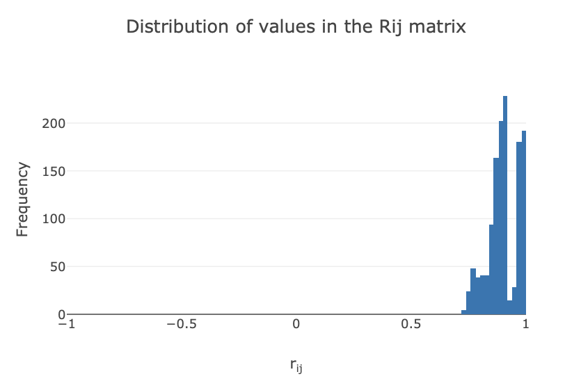

The next plot shows the dimension optimisation of the pairwise correlation matrix. The residual (y-axis) of the graph corresponds to the difference between the pairwise correlation matrix and the reduced dimension coordinates. When this value is close to 0, it means that all the information in the high-dimensional pairwise correlation matrix is captured by the reduced dimension coordinates. `dials.correlation_matrix` identifies the elbow point in this plot and defines that as the ideal dimension to use. 

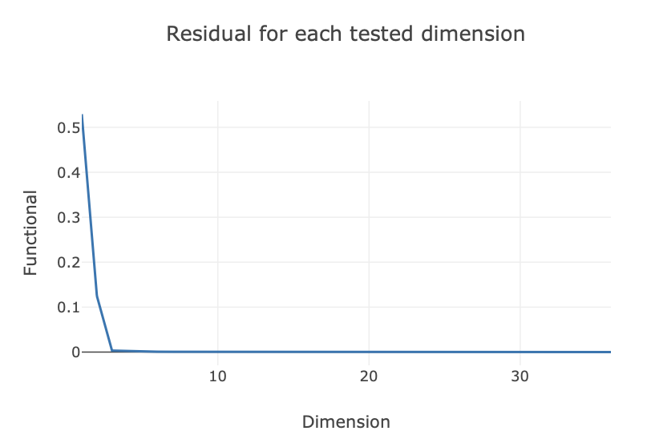

Once the reduced dimension coordinates are optimised, an algorithm called OPTICS[5] is run. Simply, this is an unsupervised machine learning algorithm that looks for dense groups of points in some arbitrary dimensional space. In other words, it looks for dense clusters in our reduced coordinates. OPTICS does this using the reachability plot below, where 'valleys' correspond to clusters, and 'spikes' correspond to boundaries between clusters. Low reachability means datasets are close in space, where high reachability means far away in space. 

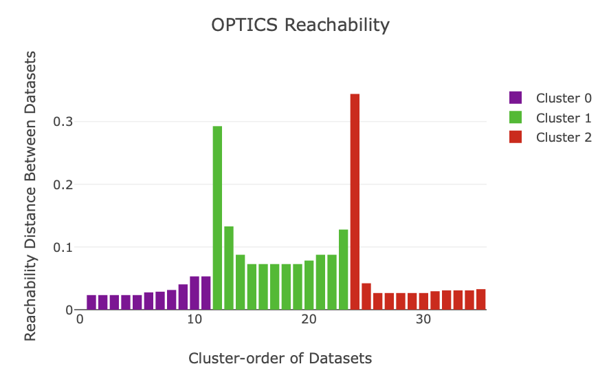

Finally, a plot is given of the reduced dimension coordinates, coloured by automatic OPTICS classification. Note that only the two most significant dimensions (as identified by principal component analysis) are shown in this plot, and the data are rotated to align with these principal components. 

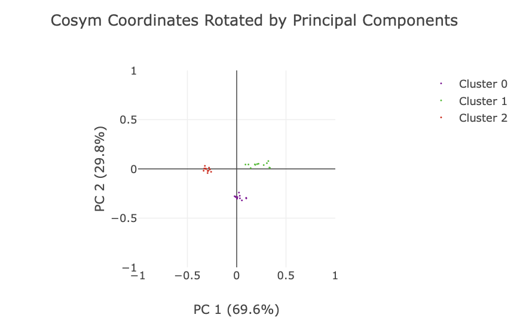

#### Principal Component Analysis

For analyses where more than 2-dimensions are used during the cosine clustering (such as this 3D example), it may be interesting to examine the graphs in this section. Here, the coordinate plot from the previous tab is shown for all combinations of principal components (1 for each dimension). There are some neat features here that are useful to explore.

The initial plot is zoomed out. 

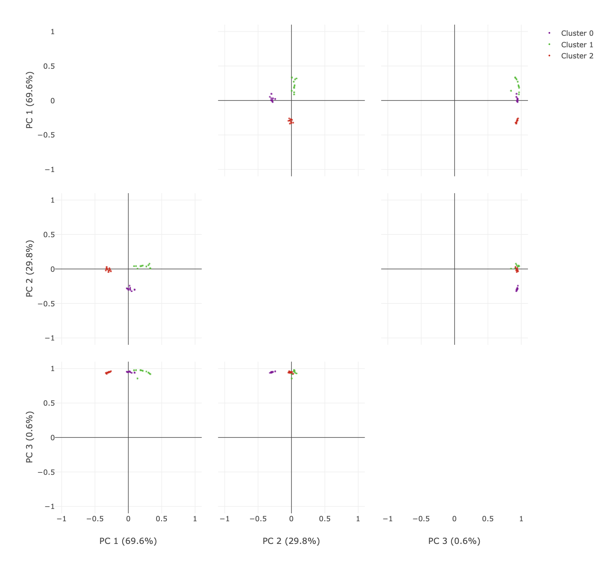

You can click and drag over the plots to zoom in. 

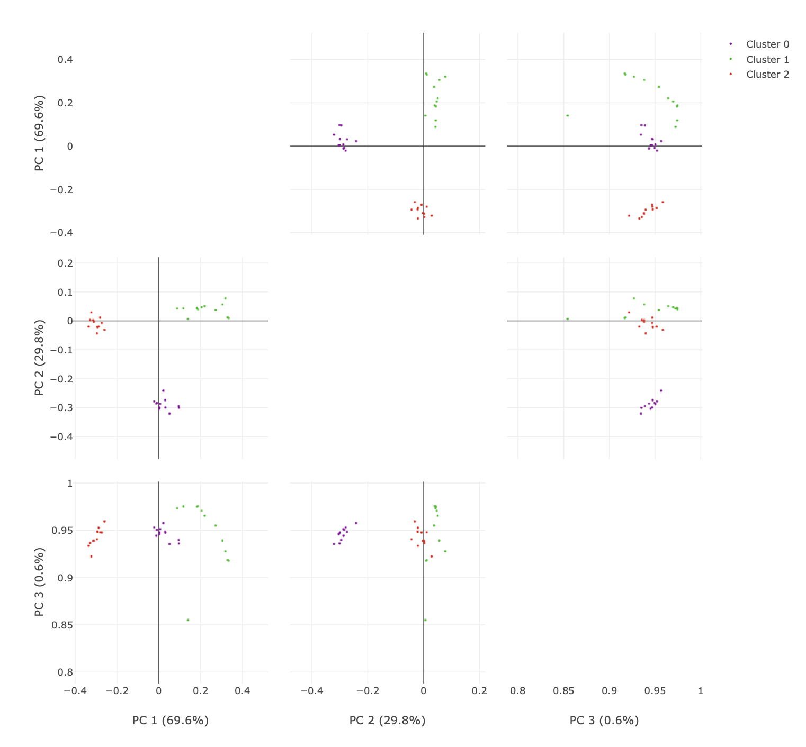

You can also select the lasso tool and highlight only specific datapoints. The advantage here is being able to easily visualise specific points over multiple dimensions!

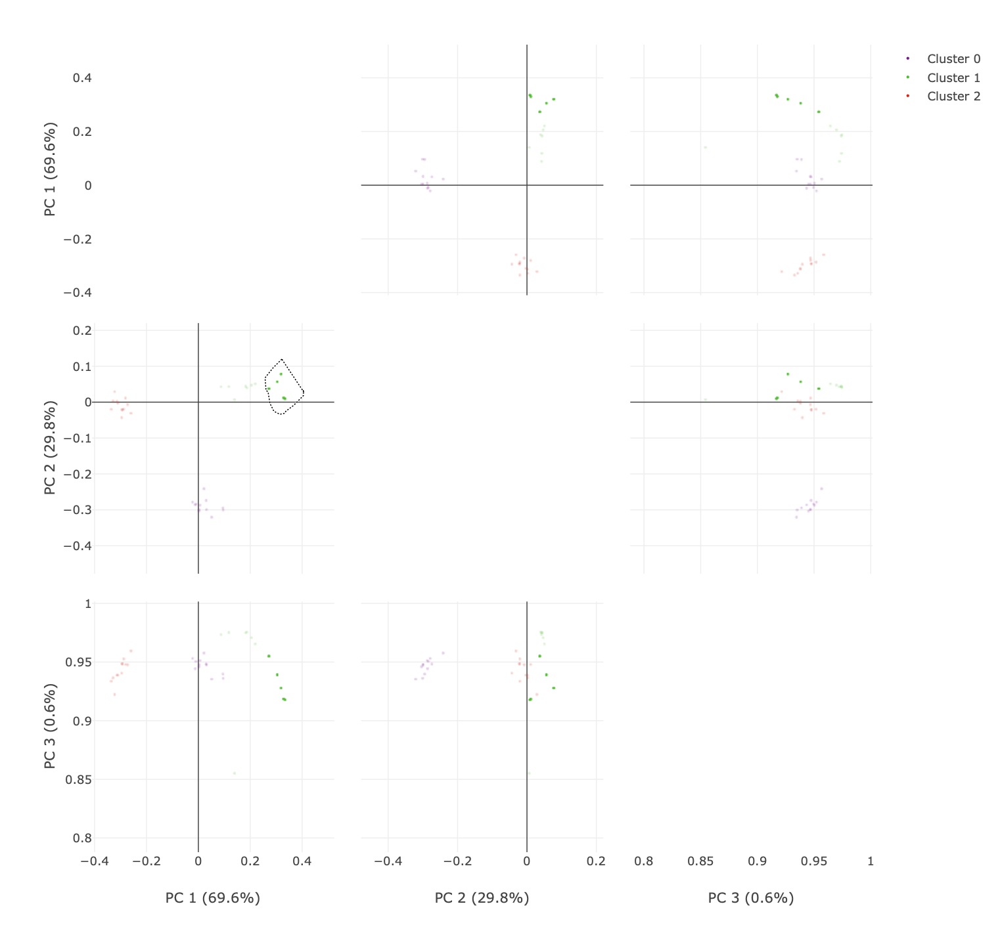

## Automation

So far, this has been a manual process which allows you to look closely at your data. A more automated approach to this can be via `xia2.multiplex`[4] which automates much of the process. The input to `xia2.multiplex` are a series of individual integrated data files. `xia2.multiplex` will then automatically call a series of DIALS programs (ie `dials.cosym`, `dials.scale`, `dials.correlation_matrix`) and includes some additional intelligent filtering of datasets. Try running `xia2.multiplex` on this data (NOTE: you may want to make a clean directory as `xia2.multiplex` writes a lot of files!). Note, as we know what the space group is, we will define it as an input parameter to speed up the processing. It will work without this specified, but the cosym step will be slower! 

```bash
mkdir multiplex
cd multiplex
xia2.multiplex ../integrated.expt ../integrated.refl symmetry.space_group=I213
```

If you examine the HTML and/or logfile (will be demonstrated for those at the tutorial in-person), you will see the data have been grouped into the same clusters. The cosine-angle clustering will look like this. 

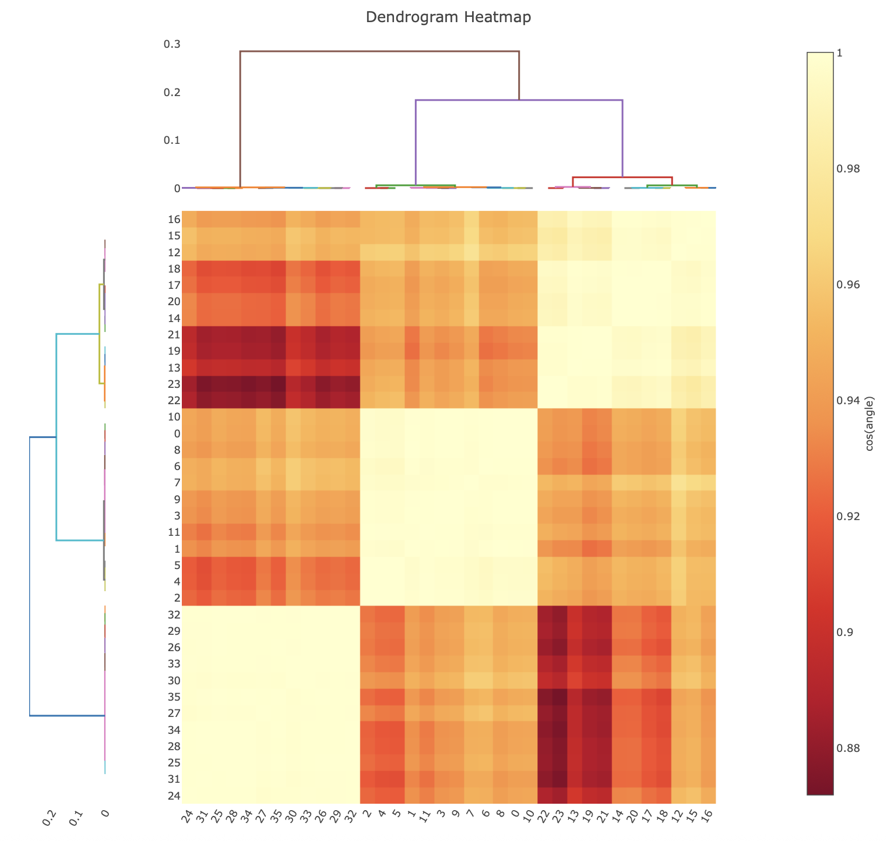

To individually scale and merge the key clusters identified, re-run multiplex with some additional parameters:

```bash
xia2.multiplex ../integrated.expt ../integrated.refl symmetry.space_group=I213 clustering.output_clusters=True clustering.method=coordinate
```

Note that the merging statistics for these additional clusters are available in both `xia2.multiplex.log` and `xia2.multiplex.html` for comparison of merging statistics. 

## References

1. [dials.correlation_matrix](https://journals.iucr.org/d/issues/2025/06/00/rr5252/index.html)
2. [dials.cosym](https://journals.iucr.org/d/issues/2018/05/00/rr5155/)
3. [Brehm-Diederichs algorithm](https://journals.iucr.org/d/issues/2014/01/00/wd5226/)
4. [xia2.multiplex](https://journals.iucr.org/d/issues/2022/06/00/gm5092/)
5. [OPTICS](https://scikit-learn.org/stable/modules/generated/sklearn.cluster.OPTICS.html)
