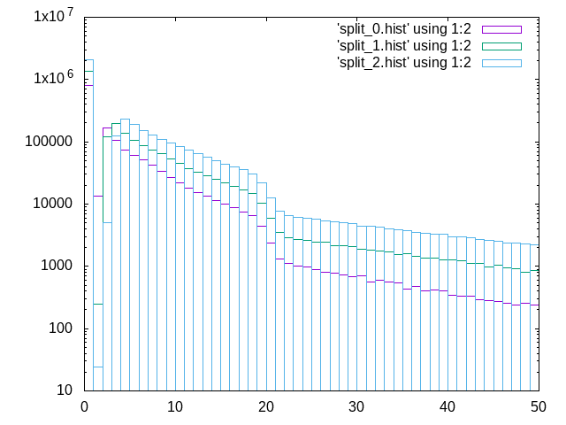
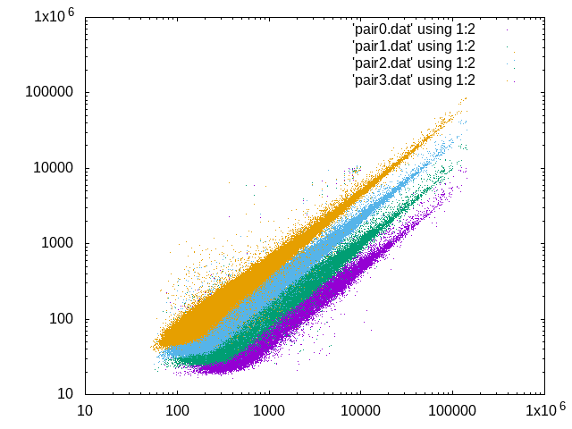

# Looking at Data and Pixels in Detail

Goals:

- individual pixel values histogram to show discontinuity
- histogram of the spot intensities, to show that there is not a discontinuity
- spot intensities as a function of transmission, to assess linearity
- masks

Example data to use:

```console
pc0098 jungfrau_commissioning :) $ pwd
/dls/i24/data/2024/cm37275-4/jungfrau_commissioning
pc0098 jungfrau_commissioning :) $ ls -d 0066[1-5]*
00661_insulin_scan_360deg_0.064transmission
00662_insulin_scan_360deg_0.127transmission
00663_insulin_scan_360deg_0.253transmission
00664_insulin_scan_360deg_0.503transmission
00665_insulin_scan_360deg_1.000transmission
```

Import all 5 data sets to start with:

```console
pc0098 john_tutorial :) $ dials.import /dls/i24/data/2024/cm37275-4/jungfrau_commissioning/0066[1-5]*/*nxs
DIALS (2018) Acta Cryst. D74, 85-97. https://doi.org/10.1107/S2059798317017235
DIALS 3.23.0-g7aff524e7-release
100%|█████████████████████████████████████████████| 5/5 [00:00<00:00,  7.23it/s]
The following parameters have been modified:

input {
  experiments = <image files>
}

--------------------------------------------------------------------------------
  format: <class 'dxtbx.format.FormatNXmxDLS.FormatNXmxDLS'>
  template: /dls/i24/data/2024/cm37275-4/jungfrau_commissioning/00661_insulin_scan_360deg_0.064transmission/insulin_scan_360deg_0.064transmission_corrected.nxs:1:3600
  template: /dls/i24/data/2024/cm37275-4/jungfrau_commissioning/00662_insulin_scan_360deg_0.127transmission/insulin_scan_360deg_0.127transmission_corrected.nxs:1:3600
  template: /dls/i24/data/2024/cm37275-4/jungfrau_commissioning/00663_insulin_scan_360deg_0.253transmission/insulin_scan_360deg_0.253transmission_corrected.nxs:1:3600
  template: /dls/i24/data/2024/cm37275-4/jungfrau_commissioning/00664_insulin_scan_360deg_0.503transmission/insulin_scan_360deg_0.503transmission_corrected.nxs:1:3600
  template: /dls/i24/data/2024/cm37275-4/jungfrau_commissioning/00665_insulin_scan_360deg_1.000transmission/insulin_scan_360deg_1.000transmission_corrected.nxs:1:3600
  num images: 18000
  sequences:
    still:    0
    sweep:    5
  num stills: 0
--------------------------------------------------------------------------------
Writing experiments to imported.expt
```

Will process all 5 together as an "ensemble" data set. Then:

```console
dials.find_spots imported.expt
```

which will find spots across the 5 runs, could take a while on a weak computer. At this point we can make a histogram of the strong spots, but this could be contaminated by bad pixels. Correct thing to do is find the bad pixels in the data set and mask them. We can also just index the images to find the "real" spots.

```console
dials.index imported.expt strong.refl

----8<-----

+------------+-------------+---------------+-------------+
|   Imageset |   # indexed |   # unindexed |   % indexed |
|------------+-------------+---------------+-------------|
|          0 |       43041 |          5103 |        89.4 |
|          1 |       58045 |          6819 |        89.5 |
|          2 |       75935 |          9720 |        88.7 |
|          3 |       94769 |         14193 |        87   |
|          4 |      108663 |         17976 |        85.8 |
+------------+-------------+---------------+-------------+

Saving refined experiments to indexed.expt
Saving refined reflections to indexed.refl
```

Given the indexed data, can make a histogram of these pixels.

```python
import sys

import tqdm

from dials.array_family import flex

data = flex.reflection_table.from_file(sys.argv[1])

data = data.select(data.get_flags(data.flags.indexed))

boxes = data["shoebox"]

nn = boxes.size()

h0 = flex.histogram(flex.double(), data_min=0, data_max=12000, n_slots=12000)

for j in tqdm.tqdm(range(nn)):
    h1 = flex.histogram(boxes[j].data.as_double().as_1d(), data_min=0, data_max=12000, n_slots=12000)
    h0.update(h1)

with open(sys.argv[1].replace("refl", "hist"), "w") as f:
    for c, v in zip(h0.slot_centers(), h0.slots()):
        f.write(f"{c} {v}\n")
```

To look at each scan independently:

```console
cs05r-sc-serv-54 john_tutorial :) $ dials.split_experiments indexed.*
The following parameters have been modified:

input {
  experiments = indexed.expt
  reflections = indexed.refl
}

Saving experiment 0 to split_0.expt
Saving reflections for experiment 0 to split_0.refl
Saving experiment 1 to split_1.expt
Saving reflections for experiment 1 to split_1.refl
Saving experiment 2 to split_2.expt
Saving reflections for experiment 2 to split_2.refl
Saving experiment 3 to split_3.expt
Saving reflections for experiment 3 to split_3.refl
Saving experiment 4 to split_4.expt
Saving reflections for experiment 4 to split_4.refl
```

Then

```console
cs05r-sc-serv-54 john_tutorial :) $ for f in split_*refl; do dials.python histogram.py $f; done
100%|██████████████████████████████████| 43041/43041 [00:00<00:00, 65205.53it/s]
100%|██████████████████████████████████| 58045/58045 [00:00<00:00, 65260.28it/s]
100%|██████████████████████████████████| 75935/75935 [00:01<00:00, 64904.01it/s]
100%|██████████████████████████████████| 94769/94769 [00:01<00:00, 66265.87it/s]
100%|████████████████████████████████| 108663/108663 [00:01<00:00, 64854.50it/s]
cs05r-sc-serv-54 john_tutorial :) $ 
```

An example, using `gnuplot`:

```console
gnuplot> set logscale y
gnuplot> set xrange [0:50]
gnuplot> plot 'split_0.hist' using 1:2 with boxes
gnuplot> plot 'split_0.hist' using 1:2 with boxes, 'split_1.hist' using 1:2 with boxes
gnuplot> plot 'split_0.hist' using 1:2 with boxes, 'split_1.hist' using 1:2 with boxes, 'split_2.hist' using 1:2 with boxes
```

This gives the following output:



That's nice, we can see that there is a notch here. You can also look at `split_4.hist` and see a pileup around 10,000 counts, which is where the buckets are full.

To proceed with the data processing, we pick up the indexed data again, then run

```console
dials.refine indexed.expt indexed.refl
```

Which will make the models better, by improving the match between the reflection positions observed and calculated, but this also reminds me that we have the module geometry a little wrong... the RMSD values in X and Y should be about the same but they are not

```console
RMSDs by experiment:
+-------+--------+----------+----------+------------+
|   Exp |   Nref |   RMSD_X |   RMSD_Y |     RMSD_Z |
|    id |        |     (px) |     (px) |   (images) |
|-------+--------+----------+----------+------------|
|     0 |  36582 |  0.24653 |  0.53888 |    0.51964 |
|     1 |  49521 |  0.24972 |  0.54119 |    0.48199 |
|     2 |  63491 |  0.25863 |  0.54344 |    0.4696  |
|     3 |  79537 |  0.26898 |  0.55048 |    0.4666  |
|     4 |  91465 |  0.27965 |  0.55739 |    0.46382 |
+-------+--------+----------+----------+------------+
```

Y differs a lot more than X, because the gap between modules is one or two pixels too big. This isn't super critical. We should fix this before we publish anything. We then integrate the data with:

```console
dials.integrate refined.expt refined.refl
```

> You should recognise here that this is _exactly the same_ as you run for a normal DIALS tutorial.

Once we have integrated the data we can match up the reflections and compare their intensities.

```python
from dials.array_family import flex

all = flex.reflection_table.from_file("integrated.refl")
all = all.select(all.get_flags(all.flags.integrated))

# keep the reflections with a "significant" observation i.e. I/sigma > 3

all = all.select(all["intensity.prf.value"] > 3 * flex.sqrt(all["intensity.prf.variance"]))

data = { }

for j in range(5):
    data[j] = all.select(all["id"] == j)

reference = data[4]

for j in range(5):
    block = data[j]
    m1, m2, d = reference.match(block)
    irefer = reference.select(m1)["intensity.prf.value"]
    iblock = block.select(m2)["intensity.prf.value"]
    print(j, flex.mean(iblock / irefer))
```

This gives us:

```console
cs05r-sc-serv-54 john_tutorial :) $ dials.python ratio.py 
0 0.07013709182333876
1 0.13719566415275075
2 0.2773546348992957
3 0.5440441881139103
4 1.0
```

Values which are consistent with the transmissions used:

```console
pc0098 jungfrau_commissioning :) $ ls -d 0066[1-5]* | sed 's/transmission//' | sed 's/_/ /g' | awk '{print $NF}'
0.064
0.127
0.253
0.503
1.000
```

(this is from the original directory names.) We can then plot the matched intensities however we liked... Want to plot the paired up sets of reflection intensities, so lets's, for now, extract the matched data.

```python
from dials.array_family import flex

all = flex.reflection_table.from_file("integrated.refl")
all = all.select(all.get_flags(all.flags.integrated))

# keep the reflections with a "significant" observation i.e. I/sigma > 3

all = all.select(all["intensity.prf.value"] > 3 * flex.sqrt(all["intensity.prf.variance"]))

data = { }

for j in range(5):
    data[j] = all.select(all["id"] == j)

reference = data[4]

for j in range(5):
    block = data[j]
    m1, m2, d = reference.match(block)
    irefer = reference.select(m1)["intensity.prf.value"]
    iblock = block.select(m2)["intensity.prf.value"]
    with open(f"pair{j}.dat", "w") as f:
        for r, b in zip(irefer, iblock):
            f.write(f"{r} {b}\n")
```

Can then look at the ratios with `gnuplot` again:

```console
gnuplot> set logscale x
gnuplot> set logscale y
gnuplot> plot 'pair0.dat' using 1:2 with dots, 'pair1.dat' using 1:2 with dots, 'pair2.dat' using 1:2 with dots, 'pair3.dat' using 1:2 with dots
```

This gives:


