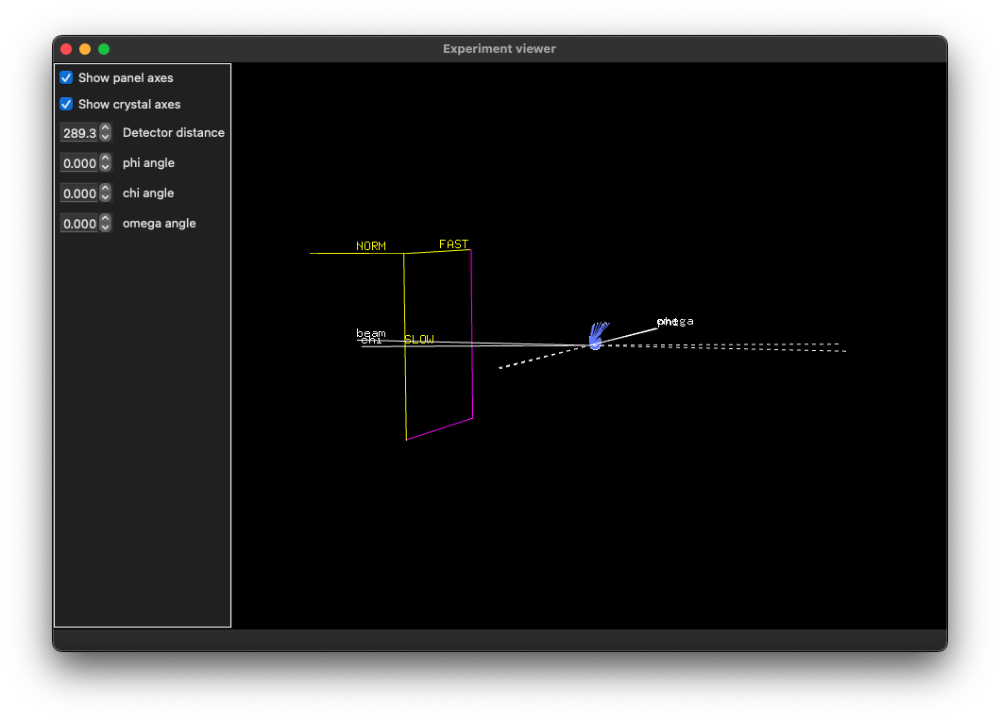

# DIALS Geometry Viewer

In X-ray diffraction experiments the experimental geometry is critical for the success of the data analysis. With "traditional" set ups where the detector was downstream of the sample, with the beam in about the middle and only one way of sitting the detector on a mount this was straightforward, and the geometry was encoded in just the distance, wavelength, beam centre and any deviations from the ideal geometry were assumed to be small and corrected for with parameters such as TILT and TWIST, or similar.

With imgCIF the possibility arrived to encode the geometry properly with very few assumptions, allowing e.g. the detector to sit above the sample, or upstream, and ensuring that the correct geometry could be reliably carried from the experiment to the data analysis alongside the raw image data. This concept was then extended to the NeXus format, which is a HDF5 representation of the same concepts following the same basic philosophy.

While these are genuine improvements to the recording of experimental metadata they are sadly _opaque_ - which is to say the general scientist has a challenge in understanding if they have got the settings in the headers / metadata areas _correct_. As this was a recurrent problem with DIALS users we implemented the DIALS geometry viewer to show a graphical and interactive representation of the recorded experimental geometry.

## Working with DIALS

The basic workflow of DIALS is to _import_ data before beginning any processing. This reads the metadata and saves it in a DIALS "experiment" file in a standard way:

```
dials.import /path/to/data/files
```

e.g.

```
Grey-Area geom :) $ dials.import ~/data/i03-2021-run1-small/xtal_1_5.nxs 
DIALS (2018) Acta Cryst. D74, 85-97. https://doi.org/10.1107/S2059798317017235
DIALS 3.dev.964-g641fcbbf1
The following parameters have been modified:

input {
  experiments = <image files>
}

--------------------------------------------------------------------------------
  format: <class 'dxtbx.format.FormatNXmxDLS16M.FormatNXmxDLS16M'>
  template: /Users/graeme/data/i03-2021-run1-small/xtal_1_5.nxs:1:500
  num images: 500
  sequences:
    still:    0
    sweep:    1
  num stills: 0
--------------------------------------------------------------------------------
Writing experiments to imported.expt
```

The content of this file can be shown as human-readable text with `dials.show` e.g.

```
dials.show imported.expt
```

<details>
  <summary>Full output</summary>

```
DIALS (2018) Acta Cryst. D74, 85-97. https://doi.org/10.1107/S2059798317017235
The following parameters have been modified:

input {
  experiments = imported.expt
}

Experiment 0:
Experiment identifier: 72be34f3-a1bf-1046-9baa-f9ae973b5bb0
Image template: /Users/graeme/data/i03-2021-run1-small/xtal_1_5.nxs
Detector:
Panel:
  name: /entry/instrument/detector/module
  type: SENSOR_PAD
  identifier: 
  pixel_size:{0.075,0.075}
  image_size: {4148,4362}
  trusted_range: {0,9266}
  thickness: 0.45
  material: Si
  mu: 3.92208
  gain: 1
  pedestal: 0
  fast_axis: {1,0,0}
  slow_axis: {0,-1,0}
  origin: {-155.992,166.56,289.3}
  distance: -289.3
  pixel to millimeter strategy: ParallaxCorrectedPxMmStrategy
    mu: 3.92208
    t0: 0.45


Max resolution (at corners): 0.515708
Max resolution (inscribed):  0.545559

Beam:
    wavelength: 0.976254
    sample to source direction : {0,0,1}
    divergence: 0
    sigma divergence: 0
    polarization normal: {0,1,0}
    polarization fraction: 0.999
    flux: 0
    transmission: 1

Scan:
    number of images:   500
    image range:   {1,500}
    oscillation:   {0,0.1}
    exposure time: 0

Goniometer:
    Rotation axis:   {1,0,0}
    Fixed rotation:  {1,0,0,0,1,0,0,0,1}
    Setting rotation:{1,0,0,0,1,0,0,0,1}
    Axis #0 (phi):  {1,-0.0025,0.0056}
    Axis #1 (chi):  {-0.006,-0.0264,-0.9996}
    Axis #2 (omega):  {1,0,0}
    Angles: 0,0,0
    scan axis: #2 (omega)

```

</details>

the output of which shows a few derived quantities such as the beam centre and distance which are important for processing. A key point here is if any of these quantities have surprising values it could be an indicator that something is wrong! For example, a negative distance.

## The Geometry Viewer

The intention of the geometry viewer is to show a graphical representation of the same information as is included in the output of `dials.show` but in a far more scientist-friendly way. The image below shows an example of the view:



This shows:

- the beam vector
- the panel vectors e.g. origin, fast, slow, normal
- the goniometer vectors (here chi is close to the beam, phi and omega coincident)

Key points here are the vectors from the sample to source are dashed, from the sample to detector solid i.e. if the detector intersects with the dashed line _something is wrong_. The UI allows modification of the geometry parameters, and will allow any goniometer shadows or similar to be displayed if the instrument configuration is known to DIALS.

Adjusting the setting parameters is an excellent way of comparing the description of the metadata with reality: if the axes move in the same way as they do in real life you can be fairly confident that things are correct. You can also see if the detector axes are aligned correctly with the beam and goniometer axes.
