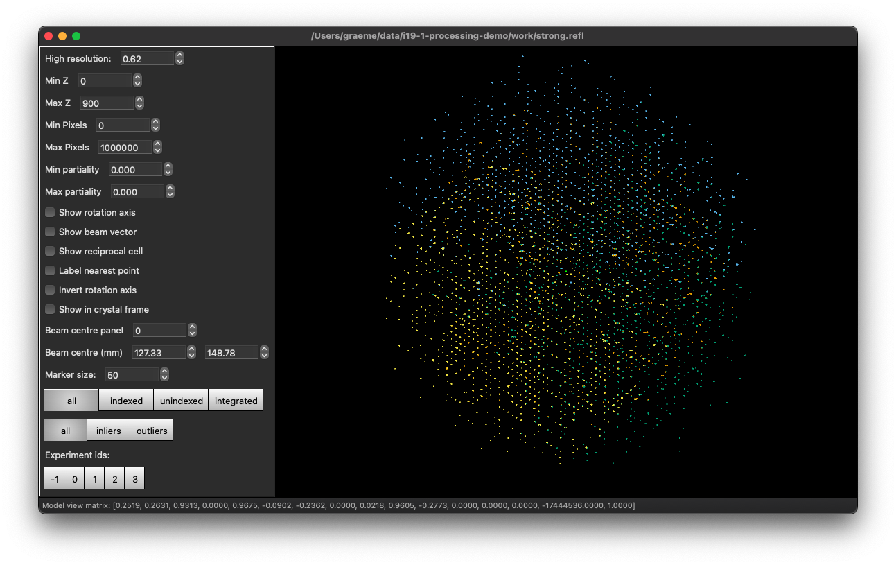
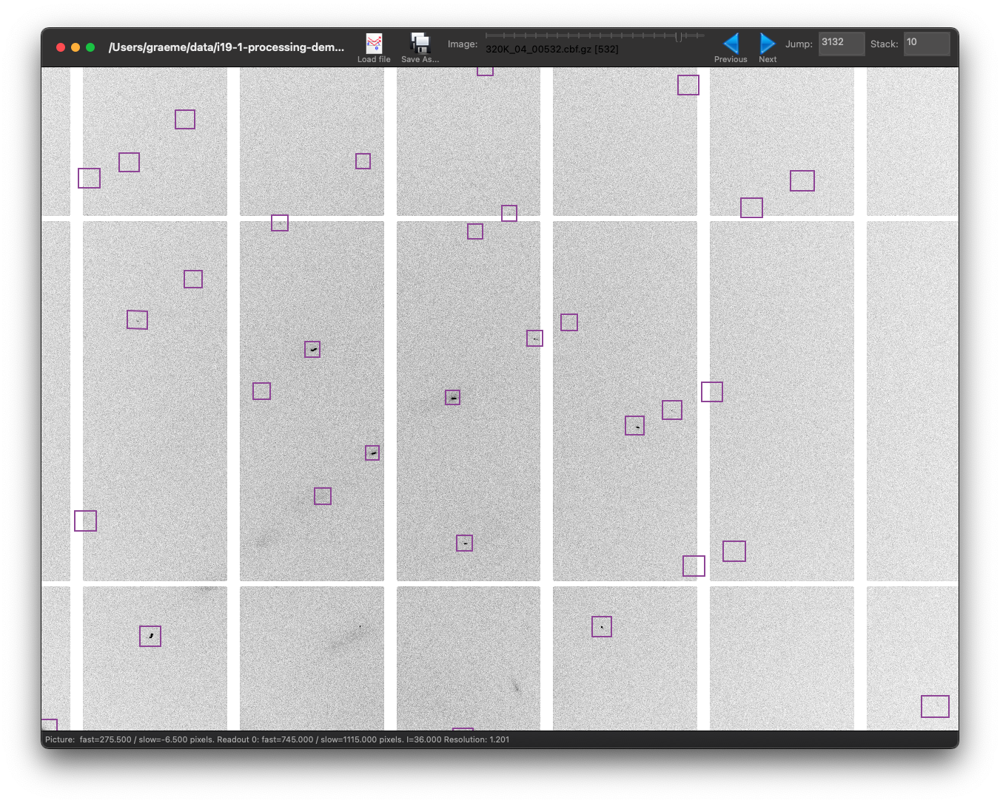

# DIALS

Processing X-ray diffraction data with the `dials` command-line tools allows a much more detailed understanding of what the data are like to be built up, but comes at the cost of having to type some occasionally arcane commands into a UNIX terminal. Today these commands have been substantially trimmed, so this is surprisingly straightforward in most cases, but it nevertheless does involve some potentially non-obvious options.

## Processing data with DIALS - overview

In the general sense this is exactly the same "workflow" as with `xia2` but this time we are going through the steps by hand, looking at the results and making up our own minds about what choices to make rather than delegating the choices to an automated system.

As before, the data are imported, spots found, indexing and integration performed and the data scaled, so you should end up with pretty much the same answer as `xia2` gets 🙂 but you will learn a little more and it will probably take a little longer.

### DIALS Commands
Below you will use several DIALS commands: accessing the commands is done through a terminal. DIALS is already installed on Diamond linux workstations, but you need to instruct linux that you want to use it by typing `module load dials` into the terminal.

This will give you access to the dials commands, which are all of the format `dials.the_thing_you_want_to_do`. Obviously we don't want the first step to be memorizing every single command (there will _not_ be a test at the end) - so just remember that the \<tab\> key is your friend. Typing some of the command and double tapping \<tab\> will autocomplete as far as it can and show you all the matching options. Try it yourself by typing `dials.` and double-tapping \<tab\>. 

You also don't want to have to remember the arguments you need to type into any given command. If you just type one of the commands and hit \<enter\> then it will tell you some of the potential arguments / options it's expecting.  

There are a couple of _really_ useful DIALS commands which you can basically use whenever you like as you progress through the chain of commands to inspect your data. 

`dials.image_viewer` can be used to... _view your images_

`dials.show` will show you a synopsis of the information contained in a DIALS file (see below)

`dials.reciprocal_lattice_viewer` launches a graphical application to view your reflection data in reciprocal space

### DIALS Files
There are two main types of file which DIALS uses. They are not ascii files so they're not that easy to look at with a text editor - use `dials.show` instead!  

Files with the extension `expt` are _experiment_ files which contain informaion describing the experiment: things like the detector type and geometry, incident beam definition, goniometer, UB matrix, etc. 

Files with the extension `refl` are _reflection_ files, which contain information describing the reflections: their positions in real space, intensities, etc. 

Many of the DIALS commands will finish with a line telling you it has created or edited some more files: 

```bash
...
Writing experiments to imported.expt
```
They will be automatically named to reflect the DIALS command which created them - perhaps you can guess the name of the command that creates this file?! Whenever a command makes a file like this, feel free to explore them using the helpful commands above. 

## Importing

In all honesty importing the data is usually the most troublesome point in any practical tutorial, as you have to correctly type the location of the data to import the right frames. For our example the data are in FIXME add this, so we want to import _all_ the data with:

```bash
dials.import xia2 image=/dls/i19-2/data/2023/cy12345-6/foo/foo_*.cbf
```

which should show you something which looks a little like:

```
DIALS (2018) Acta Cryst. D74, 85-97. https://doi.org/10.1107/S2059798317017235
DIALS 3.12.1-2-g1c07bc2b3-release
The following parameters have been modified:

input {
  experiments = <image files>
}

--------------------------------------------------------------------------------
  format: <class 'dxtbx.format.FormatCBFFullPilatus.FormatCBFFullPilatus'>
  num images: 3450
  sequences:
    still:    0
    sweep:    4
  num stills: 0
--------------------------------------------------------------------------------
Writing experiments to imported.expt
```

This expresses what DIALS importing understood about your data set: that we have 4 runs and a total of 3,450 images in the data set. From this point on you can carry all the data through all steps of processing using something I call "ensemble processing".

## Spot Finding

This is just a matter of:

```bash
dials.find_spots imported.expt
```

which will make your computer make a whirring-busy-sound for a few minutes and produce _quite a lot_ of output. At the end of this is a spot finding summary which is very similar to the one in `xia2` as:

```
Histogram of per-image spot count for imageset 0:
1451 spots found on 900 images (max 42 / bin)
                      *                                     
                      *                                     
                      *    *        *      *   *      **    
*  *      *           * * ** ***  *** *    *   ***    **    
*  *      *           * * ****** ******************** ** *  
* **   *  * **  * *** ************************************  
****   * ***** ** ******************************************
**** ********* *********************************************
************************************************************
************************************************************
1                         image                          900

Histogram of per-image spot count for imageset 1:
1224 spots found on 850 images (max 29 / bin)
                *                          *     *          
    **  **      *     * *  *** * *   **    *  *  **         
    **  **  *   ** * ** ** ***** * * ** * **  *  **   *     
  * **  ***** * ** * ** ** ***** ****** ***** *  ** *** *  *
  * ** *********** * ***** ****************** *  ** *** *  *
 ** ** *********** ************************** * *** *** * **
 ********************************************** ******* ****
************************************************************
************************************************************
************************************************************
1                         image                          850

Histogram of per-image spot count for imageset 2:
1174 spots found on 848 images (max 29 / bin)
                           *              *      *          
                   *    *  * *  *  *      *  **  *          
 * * *   * *   *  **    *  ***  *  *    * * ***  *          
** * *   *******  ** *  *  ***  *  **   * * *** *** *  **  *
** ***** ******* *** ** *  *** ****** * * *********** **** *
** ************* *** ***** ************ * ******************
************************** *********************************
************************************************************
************************************************************
************************************************************
1                         image                          848

Histogram of per-image spot count for imageset 3:
1109 spots found on 850 images (max 33 / bin)
                                                           *
                                                           *
     **   * *             *    *                         * *
*   ***   * *  ** * *     *    *   *            *    *   ***
*  **********  ** * *  *  *    *  ***  *        *    ** ****
***************** * ***** ****** *******  * *** * *  ** ****
******************* ***** ****** ******* ************** ****
**************************************** *******************
************************************************************
************************************************************
1                         image                          850

--------------------------------------------------------------------------------
Saved 4958 reflections to strong.refl
```

as before, these should make sense in the context of your experiment. However, because you are running through each of the steps by hand you can now take a short sojourn in reciprocal space with the `dials.reciprocal_lattice_viewer`...

## An Excusrsion in Reciprocal Space

_You do not need to do this to process your data!_ it is however very instructive to learn your way around these tools as you may later need this insight to process more challenging data sets. The reciprocal lattice viewer allows you to look at every spot found in your data set all at once, in _reciprocal_ space. This means you can see how the lattices align between runs, whether you have one or more lattices and so on.

```bash
dials.reciprocal_lattice_viewer imported.expt strong.refl
```

This will pop up a viewer which looks a little like this:



Here each of the runs is a different colour, you can switch on and off with the "experiment id" toggles. You can also rotate the view with the mouse. I cannot really type out a tutorial here beyond this:

Go play. Have fun. Come back here when you feel like you have found everything. You can run this again later too. You can also run `dials.image_viewer imported.expt strong.refl` to explore _real_ space with your diffraction data. I should really write something on that in this tutorial.

## Indexing

OK, so you have just come back from a little voyage in reciprocal space, I hope you had fun. Now we will get back to work and figure out the lattice parameters and crystal orientation for these data using `dials.index`:

```bash
dials.index imported.expt strong.refl
```

This will map all the spots to reciprocal space, do a bunch of Fourier transforms and other mathematics and try to figure out a three dimensional basis which does a good job of matching up with the spot positions in reciprocal space. This starts off at low resolution, indexes the spots, refines and then iterates, so you may see stuff which looks very familiar fly past. This is by design, as it makes processing the high resolution data more robust. This also indexes all of the sweeps at once, so there is one `UB` matrix only. This is particularly important if you have the detector at very high two-theta angles for some of the runs.

The output here you want to pay attention to is really at the end:

```
RMSDs by experiment:
+-------+--------+----------+----------+------------+
|   Exp |   Nref |   RMSD_X |   RMSD_Y |     RMSD_Z |
|    id |        |     (px) |     (px) |   (images) |
|-------+--------+----------+----------+------------|
|     0 |    964 |  0.68836 |  0.62197 |    0.46931 |
|     1 |    874 |  0.46612 |  0.86498 |    0.55976 |
|     2 |    781 |  0.51527 |  0.63582 |    0.7987  |
|     3 |    789 |  0.59745 |  1.0156  |    1.067   |
+-------+--------+----------+----------+------------+

Refined crystal models:
model 1 (1129 reflections):
Crystal:
    Unit cell: 4.08082(13), 9.8441(5), 11.2146(6), 89.996(2), 89.998(3), 100.684(2)
    Space group: P 1
    U matrix:  {{-0.6607, -0.7296,  0.1762},
                { 0.0610,  0.1817,  0.9815},
                {-0.7481,  0.6592, -0.0755}}
    B matrix:  {{ 0.2450,  0.0000,  0.0000},
                { 0.0462,  0.1034,  0.0000},
                {-0.0000, -0.0000,  0.0892}}
    A = UB:    {{-0.1956, -0.0754,  0.0157},
                { 0.0233,  0.0188,  0.0875},
                {-0.1528,  0.0682, -0.0067}}

---------8<------- more matrices etc. not very interesing -----

+------------+-------------+---------------+-------------+
|   Imageset |   # indexed |   # unindexed | % indexed   |
|------------+-------------+---------------+-------------|
|          0 |        1129 |           322 | 77.8%       |
|          1 |        1022 |           202 | 83.5%       |
|          2 |         938 |           236 | 79.9%       |
|          3 |         896 |           213 | 80.8%       |
+------------+-------------+---------------+-------------+

Saving refined experiments to indexed.expt
Saving refined reflections to indexed.refl
```

Here we see the R.M.S. deviations between where we found the spots on the images and where they should be according to our model, the matrix we determined, the unit cell with some uncertainties (which are not as good as we are going to get them at the end) and the fraction of indexed reflections. Here we have indexed most - if we later look closely we could find that the spot is a little split, but if you have e.g. two distinct lattices then you may find that the indexed percentage is 50% or lower.

Guess what? You can go explore reciprocal space again but this time looking at the _indexed_ data - which will allow you to look at what was not indexed (exploring the buttons to do this is an exercise for the reader):

```bash
dials.reciprocal_lattice_viewer indexed.expt indexed.refl
```

## Refinement

The indexing just assigns a single orientation matrix to your data which is very helpful for ensuring consistent indexing but less so when it comes to actually modelling the data, as our instrumentation is not ångstrom precise. Therefore, with the refinement, we firstly allow a little bit of variation in orientation and unit cell between sweeps and secondly within sweeps, to account for beam damage or sample wobbling or similar.

In general the output from refinement is not very interesting, with many numbers, but the very end is:

```
RMSDs by experiment:
+-------+--------+----------+----------+------------+
|   Exp |   Nref |   RMSD_X |   RMSD_Y |     RMSD_Z |
|    id |        |     (px) |     (px) |   (images) |
|-------+--------+----------+----------+------------|
|     0 |    824 |  0.46029 |  0.37353 |    0.23481 |
|     1 |    721 |  0.34769 |  0.49482 |    0.18088 |
|     2 |    678 |  0.26417 |  0.39351 |    0.29746 |
|     3 |    685 |  0.2785  |  0.41499 |    0.35178 |
+-------+--------+----------+----------+------------+
```

These are pretty reasonable numbers - the predictions match up well between where we found spots and where we calculate them to be. Mathematically we are never going to get better than about 1/6th of a pixel, and in real life we rarely see anything better than about a half a pixel. If these are much more than a couple of pixels we may need to back and look at the images, because the integration shoeboxes will be made to be big enough to accomodate this deviation.

## Integration

Despite this being one of the most computationally expensive steps, fundamentally it is very simple. Draw a box around where we calculate spots to be, subtract an estimate of the background, the write out the intensity. There is not much to see from the console output of this, but the image viewer is now really useful to see how the spot predictions match up with the observed spots:

```bash
dials.image_viewer integrated.expt integrated.refl
```

Which shows:



I note here that stacking images is _really_ useful for getting an idea of what the diffraction actually looks like. Again, it is worth playing.

## Symmetry Determination

This is usually a straightforward step which is reliable and robust - running:

```bash
dials.symmetry integration.expt integration.refl
```

There is analysis of individual elements:

```
Scoring individual symmetry elements

+--------------+--------+------+------+-----+--------------+
|   likelihood |   Z-CC |   CC |    N |     | Operator     |
|--------------+--------+------+------+-----+--------------|
|        0.926 |   9.63 | 0.96 | 5754 | *** | 1 |(0, 0, 0) |
|        0.085 |   2.29 | 0.23 | 5533 |     | 2 |(1, 0, 0) |
|        0.928 |   9.68 | 0.97 | 5657 | *** | 2 |(0, 0, 1) |
|        0.084 |   2.25 | 0.23 | 5579 |     | 2 |(1, 2, 0) |
+--------------+--------+------+------+-----+--------------+
```

then composing the selected operations into a space group:

```
Scoring all possible sub-groups

+-------------------+-----+--------------+----------+--------+--------+------+-------+---------+--------------------+
| Patterson group   |     |   Likelihood |   NetZcc |   Zcc+ |   Zcc- |   CC |   CC- |   delta | Reindex operator   |
|-------------------+-----+--------------+----------+--------+--------+------+-------+---------+--------------------|
| P 1 2/m 1         | *** |        0.909 |     7.38 |   9.65 |   2.27 | 0.97 |  0.23 |     0   | x+y,-z,y           |
| P -1              |     |        0.07  |     3.74 |   9.63 |   5.89 | 0.96 |  0.48 |     0   | -a,a-b,c           |
| C m m m           |     |        0.008 |     7.01 |   7.01 |   0    | 0.6  |  0    |     1.3 | -a,a-2*b,c         |
| C 1 2/m 1         |     |        0.007 |    -0.03 |   7    |   7.03 | 0.6  |  0.6  |     1.3 | a-2*b,a,c          |
| C 1 2/m 1         |     |        0.006 |    -0.04 |   6.99 |   7.03 | 0.6  |  0.6  |     1.3 | -a,a-2*b,c         |
+-------------------+-----+--------------+----------+--------+--------+------+-------+---------+--------------------+
```

Here we see a clear winner: at the very least the pointgroup is probably correct.

## Scaling

This is the first real point where we have a good idea of what the data quality is like. The scaling figures out corrections for the experimental contributions to the data e.g. sample absorption, overall scale factor, radiation damage. Usually the defaults work well e.g.:

```bash
dials.scale symmetrized.expt symmetrized.refl
```

If you have a lot of heavy atoms, or a large crystal, it could be beneficial to relax the constraints on the absorption correction with `absorption_level=medium` or `high`. This will give a summary at the end which includes an estimate of the resolution limit and some overall scaling statistics:

```
Resolution limit suggested from CC½ fit (limit CC½=0.3): 0.61

            -------------Summary of merging statistics--------------           

                                            Suggested   Low    High  Overall
High resolution limit                           0.61    1.64    0.61    0.59
Low resolution limit                           11.21   11.21    0.62   11.21
Completeness                                   99.6   100.0    93.4    94.2
Multiplicity                                    4.5     7.9     2.0     4.4
I/sigma                                         8.7    51.1     0.0     8.4
Rmerge(I)                                     0.043   0.033   1.285   0.043
Rmerge(I+/-)                                  0.040   0.032   1.171   0.040
Rmeas(I)                                      0.047   0.036   1.624   0.047
Rmeas(I+/-)                                   0.047   0.037   1.656   0.047
Rpim(I)                                       0.018   0.013   0.977   0.018
Rpim(I+/-)                                    0.023   0.017   1.171   0.023
CC half                                       1.000   0.999   0.559   1.000
Anomalous completeness                         92.9   100.0    46.6    85.0
Anomalous multiplicity                          2.4     4.4     1.3     2.4
Anomalous correlation                        -0.216  -0.192   0.188  -0.207
Anomalous slope                               0.189                        
dF/F                                          0.042                        
dI/s(dI)                                      0.390                        
Total observations                             9705     942     227    9806
Total unique                                   2169     119     114    2251
```

A little further up you will find some details about the error model as well, which can be useful but I am not going to discuss right now (FIXME add an appendix):

```
Error model details:
  Type: basic
  Parameters: a = 3.17464, b = 0.01101
  Error model formula: σ'² = a²(σ² + (bI)²)
  estimated I/sigma asymptotic limit: 28.616
```

We can re-scale the data to the recommended resolution limit with:

```bash
dials.scale symmetrized.expt symmetrized.refl d_min=0.61
```

Which gives different output with only three columns:

```
            -------------Summary of merging statistics--------------           

                                             Overall    Low     High
High resolution limit                           0.61    1.65    0.61
Low resolution limit                           11.21   11.21    0.62
Completeness                                   99.9   100.0    95.4
Multiplicity                                    4.5     7.9     2.3
I/sigma                                         8.8    46.4     0.1
Rmerge(I)                                     0.047   0.036   1.187
Rmerge(I+/-)                                  0.044   0.035   0.867
Rmeas(I)                                      0.051   0.039   1.507
Rmeas(I+/-)                                   0.051   0.040   1.226
Rpim(I)                                       0.019   0.014   0.913
Rpim(I+/-)                                    0.026   0.019   0.867
CC half                                       0.999   0.999   0.819
Anomalous completeness                         94.4   100.0    63.1
Anomalous multiplicity                          2.4     4.4     1.4
Anomalous correlation                        -0.267  -0.432   0.055
Anomalous slope                               0.215
dF/F                                          0.045
dI/s(dI)                                      0.471
Total observations                             9662     913     238
Total unique                                   2130     116     104
```

It is worth noting here that there are not really anomalous differences as the crystal is centric, but the scaling is barely affected by this so we can just move on with our workings.

## Next Steps

We can export the data into MTZ format used in MX with

```bash
dials.export scaled.expt scaled.refl
```

Then make SHELX `ins` and `hkl` files with

```bash
xia2.to_shelx scaled.mtz tbb CHBr
```

After which running `shelxt` and `shelxl` in the usual way is enough to get a nice structure... but that is out of context here.
