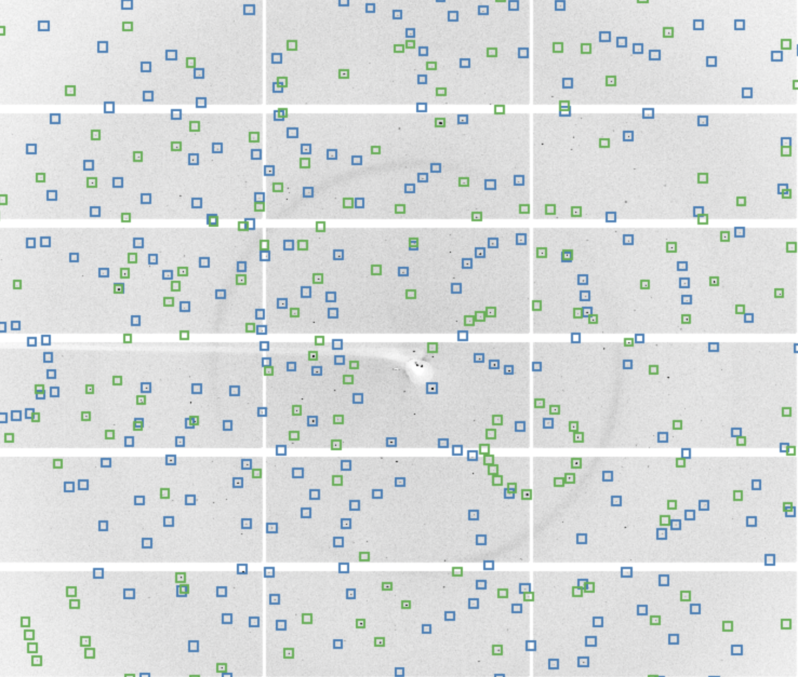
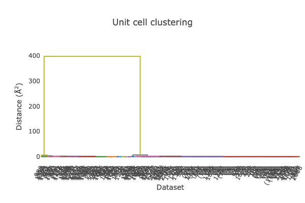

# Synchrotron Serial Crystallography

## Introduction

Synchrotron serial crystallography (SSX) data may be processed with DIALS _either_ through running through the command sequence in a similar way to the [more prosaic tutorials](./WORKFLOW.md) or through [xia2](https://gist.github.com/jbeilstenedmands/34c99139a64efa10e956d26f0a4483e7). Both offer advantages: in this tutorial the former will be explored first, to understand the _process_ of data analysis, before introducing the latter which largely automates many of the key steps.

## Workflow

For reference, the workflow for processing a simple rotation data set is:

```console
import → find spots → index → refine → integrate → symmetry → scale
```

For a many crystal data set we have:

```console
import → find spots → index → refine → integrate ↘
import → find spots → index → refine → integrate ↘
import → find spots → index → refine → integrate ↘
import → find spots → index → refine → integrate → symmetry → scale
import → find spots → index → refine → integrate ↗
import → find spots → index → refine → integrate ↗
import → find spots → index → refine → integrate ↗
```

Where each of the "runs" are treated independently until they are merged - even if they are run as an ensemble. Obviously if they are run independently then it is possible that inconsistent unit cells will appear in indexing so it is more truthful to present the latter as:

```console
import → find spots → index ↘        ↗ rerun-index → refine → integrate ↘
import → find spots → index ↘        ↗ rerun-index → refine → integrate ↘
import → find spots → index ↘        ↗ rerun-index → refine → integrate ↘
import → find spots → index → review → rerun-index → refine → integrate → symmetry → scale
import → find spots → index ↗        ↘ rerun-index → refine → integrate ↗
import → find spots → index ↗        ↘ rerun-index → refine → integrate ↗
import → find spots → index ↗        ↘ rerun-index → refine → integrate ↗
```

Here, the `review` step is where the unit cells for each run are inspected and a "guess" made as to the most likely set of parameters, whch are then provided as input to the `rerun-index` step. The `symmetry` determination step here is implemented with `cosym`, which simultaneously resolves the determination of the crystal symmetry and the potential indexing ambiguity between sweeps.

Making reference to the [cows, pigs, people](./COWS_PIGS_PEOPLE.md) data it is _even_ more truthful to express the flow as:

```console
import → find spots → index ↘        ↗ rerun-index → refine → integrate ↘
import → find spots → index ↘        ↗ rerun-index → refine → integrate ↘
import → find spots → index ↘        ↗ rerun-index → refine → integrate ↘                           ↗ scale
import → find spots → index → review → rerun-index → refine → integrate → symmetry → scale → cluter → scale
import → find spots → index ↗        ↘ rerun-index → refine → integrate ↗                           ↘ scale
import → find spots → index ↗        ↘ rerun-index → refine → integrate ↗
import → find spots → index ↗        ↘ rerun-index → refine → integrate ↗
```


An assumption going into this analysis however is that the unit cells and experimental geometry can be well refined for each sweep, so can be treated as effectively independent: the radius of convergence is typically also generous, so we don't need to worry too much about re-cycling the geometrical parameters. For SSX data these are both false.

## TL;DR

This is the script we will eventually run:

```bash
# phase 1: bootstrap the geometry calibration
dials.import ../*.cbf
dials.find_spots imported.expt
dials.ssx_index strong.refl imported.expt
# output 👀 - decide what is probably the right unit cell / lattice
dials.ssx_index strong.refl imported.expt space_group=P23 unit_cell="96.7 96.7 96.7 90 90 90"
dials.ssx_refine indexed.*
```

Then:

```bash
# phase 2: actually process this data with the refined geometry
dials.import ../*cbf reference_geometry=refined.expt use_beam_reference=0
dials.find_spots imported.expt
dials.ssx_index strong.refl imported.expt unit_cell="96.7 96.7 96.7 90 90 90" space_group=P23 max_lattices=3
dials.ssx_integrate indexed.expt indexed.refl
dials.cosym integrated* partiality_threshold=0.25 space_group=P213
dials.scale symmetrized.* scale.phil
```

**Note well** in here there are extra input files called `something.phil` - these will be explored below. There are also extra command parameters because SSX data are fundamentally different (as of August 2026) to rotation data.

## SSX Workflow

Two parts to the overall SSX workflow: calibration then full processing. The purpose of the calibration is to "tune up" our understanding of the experimental geometry before tackling the full data set, so we make a different set of decisions in the calibration to those we will make in the full processing.

### Calibration

The workflow for SSX essentially assumes that the experimental geometry encoded in the headers is good enough to get started, but will need some optimisation: the first "phase" of the analysis is therefore a bootstrap process, where we learn a little about the data set from a subset of the measurements and tune some of the parameters. As an example, of (say) 19,200 frames it may be typical to use a block of 1,000 for this. The start of the workflow looks similar to the simple case above:

```console
import → find spots → index → review
```

A nuance here, however, is that we use `dials.ssx_index` which is optimised for the problem of indexing unique patterns on each image independently though uses fundamentally similar algorithms under the hood. The start of the workflow is therefore:

```console
import → find spots → ssx_index → review
```

The `review` step here is made easier by `ssx_index` providing a summary of the frequency of the most common unit cell parameter clusters:

```console
Cluster_id       N_xtals  Med_a         Med_b         Med_c         Med_alpha    Med_beta     Med_gamma   Delta(deg)
357 in P 1.
cluster_01       357      96.80 (0.30 ) 96.68 (0.24 ) 96.68 (0.31 ) 90.00 (0.27) 89.94 (0.34) 89.99 (0.30)
      P m -3 m (No. 221)  96.72         96.72         96.72         90.00        90.00        90.00         0.086 
80 in P 1.
cluster_02       80       96.62 (0.37 ) 136.85(0.52 ) 136.84(0.71 ) 89.90 (0.34) 90.00 (0.37) 90.08 (0.35)
     P 4/m m m (No. 123)  136.85        136.85        96.62         90.00        90.00        90.00         0.13  
51 in P 1.
cluster_03       51       96.81 (0.38 ) 96.68 (0.33 ) 193.19(0.74 ) 89.98 (0.32) 89.98 (0.37) 89.89 (0.26)
     P 4/m m m (No. 123)  96.75         96.75         193.19        90.00        90.00        90.00         0.11  
46 in P 1.
cluster_04       46       136.88(0.47 ) 136.71(0.48 ) 136.79(0.43 ) 75.18 (24.54) 89.63 (24.47) 77.76 (28.42)
      I 1 2/m 1 (No. 12)  136.71        192.88        197.18        90.00        111.64       90.00         1.9   
```

Here we can see that the most common cluster (`cluster 01`) contains a cubic-looking unit cell, while other clusters have multiples of those same parameters e.g. multiplied by √2 or 2. We can therefore take a guess that the correct unit cell is cubic with ⍺⩬96.7Å with the multiples some mis-indexing of the pattern. Re-running the index step (without even constraining the unit cell to _be_ cubic, just giving that cell as an initial guess) nearly doubles the number of indexed crystals. This is run with:

```bash
dials.ssx_index imported.expt strong.refl unit_cell="96.7 96.7 96.7 90 90 90"
```

As these are still images, we get successful indexing by giving the hint for the cell, but we want to perform refinement with this: we would get better refinement results by reducing the number of parameters - in this case, constraining the cell to be cubic by adding `space_group=P23`. In general, you should have a good understanding of a crystal system before performing SSX experiments so knowing a unit cell and crystal symmetry in advance is reasonable.

Even with the lattice constrained by the space group, the refinement is still under-constrained. In particular, `dials.refine` by default attempts to refine the rotation axis, beam direction and detector position: in an SSX experiment there is degeneracy which makes this poorly constrained. We handle this here by reducing the amount of freedom in the model, which is achieved by using a customised version called `dials.ssx_refine`: this is essentially the same program with a collection of defaults assigned:

```json
refinement {
  parameterisation {
    auto_reduction {
      action = fail *fix remove
    }
    beam {
      fix = *all in_spindle_plane out_spindle_plane wavelength
    }
    detector {
      fix_list = "Tau1"
    }
  }
  refinery {
    engine = SimpleLBFGS LBFGScurvs GaussNewton LevMar *SparseLevMar
  }
  reflections {
    outlier {
      algorithm = null auto mcd tukey *sauter_poon
    }
  }
}
```

This is all [published ](https://journals.iucr.org/d/issues/2016/04/00/gm5043/index.html) if you would like to know the gory details, but for now it is safe to assume these are good defaults for processing serial data:

- if something is under-parameterised, reject it (i.e. we have indexed a pattern with only a few spots)
- fix the beam parameters (since these _cannot_ be refined)
- do not attempt to refine the detector rotation about the beam (since this is unconstrained experimentally)
- use the "sparse [Levenberg–Marquardt](https://en.wikipedia.org/wiki/Levenberg%E2%80%93Marquardt_algorithm)" minimiser
- use Sauter-Poon outlier rejection

For the record we could also pass each of these parameters on the command line, or write the above into `refine.phil` and pass that, but because we have the defaults encoded in the program we can simply use:

```bash
dials.ssx_refine indexed.*
```

The main purpose of this calibration was to work out a better detector position / orientation in the laboratory frame, which we now have - if you `dials.show refined.expt` you will see:

```console
  fast_axis: {1,0,-0.000324664}
  slow_axis: {-6.45868e-07,-0.999998,-0.00198934}
  origin: {-217.58,226.621,-248.621}
```

We can then recycle this information to improve the indexing, for actual data processing.

### Actual Processing

The processing starts off in the same way as the calibration above with two key differences:

- we now know more about the experimental geometry
- we will now use all the data

We get started by importing the data this time making use of the reference geometry:

```bash
dials.import reference_geometry=refined.expt ../*cbf use_beam_reference=false
```

As we did not refine the beam above, we do not want to include it in the reference. The spot finding is identical: indeed if you are processing the same subset of data it does not need to be repeated. Indexing will also work as before, but should give a slightly higher hit rate with the corrected geometry. We can also now look for multiple lattices, which can be fairly likely in an SSX experiment:

```bash
dials.ssx_index strong.refl imported.expt unit_cell="96.7 96.7 96.7 90 90 90" space_group=P23 max_lattices=3
```

At this point we now want to perform some integration rather than further refinement, which is quite different for SSX compared with rotation crystallography and uses `dials.ssx_integrate`:

```bash
dials.ssx_integrate indexed.*
```

This attempts to model the pixels on the image which are illuminated as a mechanism to predict the spot locations, and encodes a certain amount of additional refinement hence no need to re-run `dials.ssx_refine`. At this point you can take a look at the integration results with `dials.image_viewer integrated.*`, however before this we need a brief digression into _partiality_.

> Partiality: for rotation data we generally record _all_ of a reflection by capturing a little on every image then essentially "adding this up" (though in practice we integrate with a 3D profile) - this is possible because the crystal rotates by a measurable amount within every image. For a still shot we only sample _some_ of the reflection profile, and we have to try and model what fraction that is - in the opinion of the tutorial author this is the *principle* source of uncertainty in SSX data. Measurements with a low partiality are inherently unreliable.

Given this commentary on partiality, if we want to look at the integration results we need to filter the spots on the ones we are somewhat certain are present: the number of spots decreases rapidly as the partiality increases, so the vast majority have low partiality hence a higher chance of being absent. `dials.ssx_integrate` also works in batches, so to look at all images we want to combine the output then _filter_ the reflections as:

```bash
dials.combine_experiments integrated_*
dials.filter_reflections partiality.min=0.25 combined.refl
```

This outputs `combined.expt` and `combined.refl`, which is in turn filtered to give `filtered.refl` which we will only use for image viewing, with:

```bash
dials.image_viewer combined.expt filtered.refl
```

As you step though the images you will see that the different lattices have different coloured boxes, and a reasonable fraction (but by no means not all) have a spot in the middle of them:



In most cases where we know in advance the crystal unit cell and symmetry there will be no ambiguity in how the lattices are indexed. In some cases however (for example here) the crystal _lattice_ has higher symmetry than the crystal _intensities_ i.e. a cubic lattice has four-fold symmetry around the centre of each face but our crystals do not have that four-fold symmetry. As with the cubic insulin crystals in [cows, pigs, people](./COWS_PIGS_PEOPLE.md) we will use `dials.cosym` to resolve this ambiguity, though we need to use some specific settings to have this work correctly:

```bash
dials.cosym combined.* min_i_mean_over_sigma_mean=0.5 space_group=P213 cc_weights=sigma partiality_threshold=0.25
```

As before these reflect some of the specific issues which result from the data being still shots: high uncertainties and partiality. The cosym analysis clusters the intensities in reciprocal space to determine the correct indexing - and as a side-effect also shows that we have two populations of unit cell length, though one is dominant:



We won't explore this much more here but the full data set did show two different unit cell lengths. For the next step - scaling - there are quite a number of different options which are needed so these are best presented as a `phil` file:

```json
model = *KB array dose_decay physical
output {
  additional_stats = True
}
reflection_selection {
  method = quasi_random *intensity_ranges use_all random
  Isigma_range = 2.0,0.0
  min_partiality = 0.25
  intensity_choice = profile sum *combine
}
weighting {
  error_model {
    reset_error_model = True
  }
}
cut_data {
  partiality_cutoff = 0.25
}
scaling_options {
  nproc = 8
  full_matrix = False
  outlier_rejection = standard *simple
  outlier_zmax = 4.0
}
```

This should be saved as `scale.phil` (say) and run with:

```bash
dials.scale symmetrized.* scale.phil
```

Many of these parameters will be familiar from earlier steps (e.g, the min_partiality) - some reflect the fact that there are a _lot_ of parameters when scaling SSX data because each crystal gets its own `k` and `B` parameter. As with rotation data processing `dials.scale` makes a recommendation for the resolution limit based on the CC½ parameter - re-running with this limit set with `d_min=1.76` (for example) will truncate the data set.
