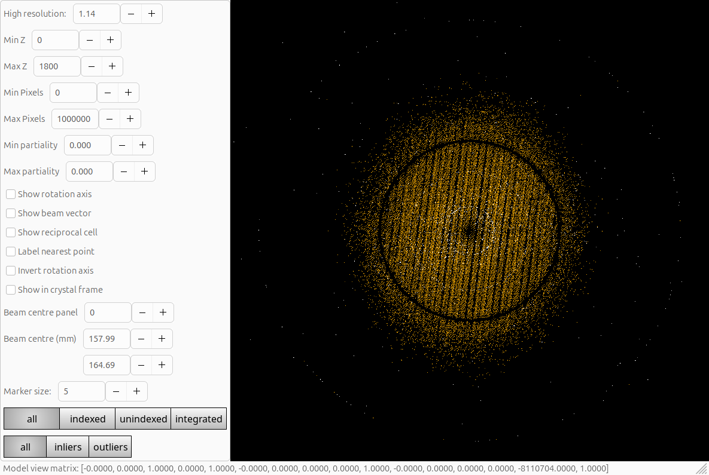

# NE-CAT Staff and User Tutorial

This is a tutorial on what shape the data are and how to manage them, from 24ID-E at the APS: the idea here is to also highlight some of the things to look at during data collection or beamline set-up as well as for _actually_ processing your data.

There are a couple of tutorials here:

- processing a simple data set
- combining a couple of data sets, in the presence of indexing ambiguity
- diagnosing multiple lattices, processing such data

The intent is that the instructions allow you to follow along at your own pace. In the general sense the instructions are _not_ beamline specific however as you work through other tutorials you may find that the focus will vary slightly from one tutorial to another, depending on the questions which have been raised.

[Data uploaded to Zenodo here](https://zenodo.org/records/16413016). For this the data are _small_ as they are recorded as CBF, and can be bzip2 compressed to ~2GB / run. All the data were taken by Kay Perry with "standard beamline protocols" so show minimal signs of radiation damage and consist of 360° of rotation at 0.2° / image.

There are also some notes on [processing with XDS](./XDS.md).

## Too Long, Didn't read

To be honest most of the time I run this little script then pick through the bones of what was there: if the data are good or OK, this will probably just work:

```bash
dials.import ## THE DATA e.g. LIST OF CBF or foo_master.h5
dials.find_spots imported.expt
dials.index imported.expt strong.refl
dials.refine indexed.expt indexed.refl
dials.integrate refined.expt refined.refl
dials.symmetry integrated.expt integrated.refl
dials.scale symmetrized.expt symmetrized.refl anomalous=true absorption_level=medium
```

so in this case we will want:

```bash
dials.import ../*cbf
dials.find_spots imported.expt
dials.index imported.expt strong.refl
dials.refine indexed.expt indexed.refl
dials.integrate refined.expt refined.refl
dials.symmetry integrated.expt integrated.refl
dials.scale symmetrized.expt symmetrized.refl anomalous=true absorption_level=medium
```

This will:

- import the data (discussed below)
- find spots on _every_ frame
- index those spots
- refine the model from indexing
- integrate the spots
- derive the symmetry
- scale the data

There are alternative tracks you can adopt which will be discussed in the longer form narratives below.

## Importing Data, Viewing

To keep things simple first look at a _boring_ data set: `insulin_042225_15_1_00####.cbf`. With any processing with DIALS the first thing you do is _import_ the data: this reads the headers to make sense of the data set & also explains to _you_ what it found so you can make sense of it. Usually I make a subdirectory of the data area to process a data set, e.g. `work`, but you can process it from anywhere. I would usually recommend _not_ processing in the same folder as the data are. Assuming you have done `mkdir work` or similar, then run:

```bash
dials.import ../insulin_042225_15_1_00*cbf
```

In this case it will show:

```console
DIALS (2018) Acta Cryst. D74, 85-97. https://doi.org/10.1107/S2059798317017235
DIALS 3.dev.1291-ge4527ba53
The following parameters have been modified:

input {
  experiments = <image files>
}

--------------------------------------------------------------------------------
  format: <class 'dxtbx.format.FormatCBFMiniEiger.FormatCBFMiniEiger'>
  template: /home/graeme/data/necat-e/insulin-2025-04-22/insulin_042225_15/insulin_042225_15_1_######.cbf:1:1800
  num images: 1800
  sequences:
    still:    0
    sweep:    1
  num stills: 0
--------------------------------------------------------------------------------
Writing experiments to imported.expt
```

This is printed to the screen but also written to `dials.import.log` - this is helpful when trying to work out what happened later on. Here we see we found 1,800 images forming a single sweep - consistent and therefore reassuring. The most useful things to do now are (i) look at the images and (ii) find spots. Looking at the images is easy enough:

```bash
dials.image_viewer imported.expt
```

Which pops up a window with the image in, and gives you a lot of options to play. The basic view is pretty basic, but there are some useful options to view finely sliced diffraction data. The viewer:


has a "stack" option which allows multiple images to be stacked to make up e.g. a 1° image:


Here I also tweaked the "brightness" in the controls widget:


At this point simply playing will be useful, but you can learn some more by reducing stack to 1 then selecting "threshold" at the bottom of the controls - this is the "spot finder view" of the data and very useful for interpreting weak data:


we will come back to this in a minute. Right now, take a few minutes to play with the settings and decide how best _you_ like to look at the images. Also play with the mouse wheel: you can zoom and pan, which is great for looking at itty bitty little spots.

## An Aside: Files

DIALS creates two principal file types:

- experiment files called `something.expt`
- reflection files called `something.refl`

"Experiment" in DIALS has a very specific meaning - the capturing of data from one set of detector, beam, goniometer and crystal - so if you have two scans from one crystal this is two experiments, if you have two lattices on one data set this is two experiments. In most cases you can ignore this distinction though.

Usually the output filenames will correspond to the name of the DIALS program that created them e.g. `indexed.refl` and `indexed.expt` from `dials.index`. The only deviations from this are on import (see below) where we are only reading experiment models and spot finding where we find _strong_ reflections so write these to `strong.refl` - and we create no models so (by default) there is no output experiment file.

At any time you can _look_ at these files with `dials.show` which will summarise the content of the files to the terminal.

## Spot Finding

Mostly the spot finding is automatic, assuming you do not have either very special beam characteristics or an experimental detector (neither apply for us here at NE-CAT): `dials.find_spots imported.expt`. Now you're computer's fans will spin up - this is one of the more computationally expensive steps.

After a little while you will see the spot finder summary which looks like this:

```console
Extracted 115807 spots
Removed 43692 spots with size < 3 pixels
Removed 3 spots with size > 1000 pixels
Calculated 72112 spot centroids
Calculated 72112 spot intensities
Filtered 71205 of 72112 spots by peak-centroid distance

Histogram of per-image spot count for imageset 0:
71205 spots found on 1800 images (max 1382 / bin)
              *****                         ******* *       
         ************                   ****************** *
************************ ****** **  ************************
************************************************************
************************************************************
************************************************************
************************************************************
************************************************************
************************************************************
************************************************************
1                         image                         1800

--------------------------------------------------------------------------------
Saved 71205 reflections to strong.refl
```

This shows an ASCII art histogram of the spots / rotation angle. If you have a full turn of data you should hopefully get back to where you started. Already a lot of pathologies can be spotted at this stage, but this is boring data so there is nothing fun to see. You can now also look at the spot finding results in the image viewer to get a sense of what it has done, with:

```bash
dials.image_viewer imported.expt strong.refl
```

Which should look like:


In the general sense you can look at _any_ `.expt` and `.refl` combo in the image viewer. There are other views to consider as well.

## The Reciprocal Lattice

While the image viewer is useful for individual or small numbers of frames, to look at the data set as a whole we can look at where these spots map to in reciprocal space - this is also an _excellent_ verification of your experimental geometry. Run: `dials.reciprocal_lattice_viewer imported.expt strong.refl` to see:


This shows where the spots are in reciprocal space: the further away from the centre of the view, the higher the resolution. If you have anisotropy it will be evident here, as will ice rings as they form spherical shells. For us here we have a fairly spherical fuzzy blob with a really obvious ring in - this is the inter-module gap on the detector. You can move this view around to get a feel for the lattice. With some fidding with the mouse you can see the lattice planes nicely:


The lattice lines are still a little squiggly because we have not refined the geometry yet, but the single lattice is clear. For the record I usually use this as either an education tool or for diagnostics, either beamline / instrumentation or working out why the data are not processing well.

## Indexing

The next useful step in processing is indexing: in DIALS this only worries about assigning a triclinic model by default though you can enforce symmetry if you know it (though it does not make that much difference).

```bash
dials.index imported.expt strong.refl
```

and some time will pass and a lot of words and numbers will be printed. Only really the stuff at the end matters:

```console
RMSDs by experiment:
+-------+--------+----------+----------+------------+
|   Exp |   Nref |   RMSD_X |   RMSD_Y |     RMSD_Z |
|    id |        |     (px) |     (px) |   (images) |
|-------+--------+----------+----------+------------|
|     0 |  36000 |  0.27885 |  0.25813 |     0.2302 |
+-------+--------+----------+----------+------------+

Refined crystal models:
model 1 (68909 reflections):
Crystal:
    Unit cell: 67.1980(14), 67.1782(14), 67.1619(13), 109.4179(3), 109.4693(3), 109.4854(4)
    Space group: P 1
    U matrix:  {{-0.1560,  0.2049,  0.9663},
                {-0.1068, -0.9760,  0.1897},
                { 0.9820, -0.0736,  0.1742}}
    B matrix:  {{ 0.0149,  0.0000,  0.0000},
                { 0.0053,  0.0158,  0.0000},
                { 0.0091,  0.0091,  0.0182}}
    A = UB:    {{ 0.0076,  0.0120,  0.0176},
                {-0.0050, -0.0137,  0.0035},
                { 0.0158,  0.0004,  0.0032}}
+------------+-------------+---------------+-------------+
|   Imageset |   # indexed |   # unindexed |   % indexed |
|------------+-------------+---------------+-------------|
|          0 |       68909 |          2294 |        96.8 |
+------------+-------------+---------------+-------------+
```

There are two major pieces of information here: the fraction of reflections which are indexed (anything more than 90% counts as "all of them" in most cases) and the R.M.S. deviation between the observed and calculated spot positions as part of the indexing in refinement. At this stage we are assuming a single orientation matrix, not accounting for any crystal slippage or unit cell variation - the values above represent good results which in turn reflect that this is a single crystal with quite unimodal spot shapes. If the fraction indexed was closer to half, you could have a second lattice or there may be strong ice rings: visualising the indexed and unindexed reflections in the reciprocal lattice viewer is instructive for reassuring yourself that the data are well indexed. In particular, as we will see later, this can be useful when the indexing results are less good.




At this stage the "too long, didn't read" script above steps straight into the scan varying refinement step, but at this stage you can also start to explore what the shape of the unit cell is, and assess whether it is likely that the crystal symmetry is higher (in most cases it is). You then also have the opportunity to assign that symmetry in the refinement and later stages which could make the refinement more stable under some circumstances (µED, very low resolution data, narrow sweeps.)

## Optional Aside: Determine Bravais Symmetry

We can proceed to process the data just fine with a triclinic lattice (i.e. in P1) but sometimes things work better if you assign the correct symmetry. Maybe you know this in advance, but if you don't you can run `dials.refine_bravais_settings` to consider which lattices are consistent with this cell, and how well the data refine with that constraint applied. Here we will run

```bash
dials.refine_bravais_settings indexed.expt indexed.refl
```

which will test all the possible symmetries: since this is cubic insulin there are _a lot_:

```console
Selected 36000 / 71205 reflections for calculation
Chiral space groups corresponding to each Bravais lattice:
aP: P1
oF: F222
oI: I222 I212121
tI: I4 I41 I422 I4122
hR: R3:H R32:H
cI: I23 I213 I432 I4132
mI: I2
+------------+--------------+--------+--------------+----------+-----------+-------------------------------------------+----------+-------------------+
|   Solution |   Metric fit |   rmsd | min/max cc   |   #spots | lattice   | unit_cell                                 |   volume | cb_op             |
|------------+--------------+--------+--------------+----------+-----------+-------------------------------------------+----------+-------------------|
|   *     22 |       0.0633 |  0.03  | 0.812/0.949  |    33651 | cI        | 77.65  77.65  77.65  90.00  90.00  90.00  |   468141 | b+c,a+c,a+b       |
|   *     21 |       0.0633 |  0.03  | 0.876/0.878  |    33650 | hR        | 109.81 109.81  67.24  90.00  90.00 120.00 |   702104 | a+2*b+c,-b+c,a    |
|   *     20 |       0.0633 |  0.03  | 0.812/0.813  |    33559 | hR        | 109.80 109.80  67.23  90.00  90.00 120.00 |   701990 | a+b+2*c,a-c,b     |
|   *     19 |       0.0633 |  0.03  | 0.460/0.949  |    33583 | tI        | 77.64  77.64  77.61  90.00  90.00  90.00  |   467781 | b+c,a+c,a+b       |
|   *     18 |       0.0633 |  0.029 | 0.530/0.949  |    33490 | oF        | 77.60 109.76 109.79  90.00  90.00  90.00  |   935082 | a+b,-a+b,a+b+2*c  |
|   *     17 |       0.053  |  0.03  | 0.836/0.838  |    33848 | hR        | 109.86 109.86  67.24  90.00  90.00 120.00 |   702757 | 2*a+b+c,-a+b,c    |
|   *     16 |       0.0596 |  0.03  | 0.468/0.851  |    33690 | tI        | 77.65  77.65  77.63  90.00  90.00  90.00  |   468054 | a+b,b+c,a+c       |
|   *     15 |       0.0596 |  0.029 | 0.499/0.847  |    33693 | tI        | 77.60  77.60  77.64  90.00  90.00  90.00  |   467553 | a+c,a+b,b+c       |
|   *     14 |       0.0596 |  0.029 | 0.847/0.949  |    33680 | oI        | 77.60  77.61  77.63  90.00  90.00  90.00  |   467504 | a+b,a+c,-b-c      |
|   *     13 |       0.0596 |  0.029 | 0.949/0.949  |    33557 | mI        | 77.59  77.58  77.62  90.00  90.01  90.00  |   467230 | -a-c,-a-b,b+c     |
|   *     12 |       0.0633 |  0.029 | 0.550/0.550  |    33491 | mI        | 67.21 109.79  67.22  90.00 109.48  90.00  |   467551 | -b,a+b+2*c,-a     |
|   *     11 |       0.046  |  0.028 | 0.831/0.832  |    33251 | hR        | 109.72 109.72  67.23  90.00  90.00 120.00 |   700949 | b-c,-a+c,a+b+c    |
|   *     10 |       0.0532 |  0.029 | 0.444/0.851  |    33603 | oF        | 77.62 109.76 109.83  90.00  90.00  90.00  |   935725 | -a-c,-a+c,a+2*b+c |
|   *      9 |       0.0532 |  0.028 | 0.851/0.851  |    33724 | mI        | 77.59  77.60  77.62  90.00  90.03  90.00  |   467326 | a+b,a+c,-b-c      |
|   *      8 |       0.046  |  0.027 | 0.444/0.444  |    33344 | mI        | 67.19 109.71  67.23  90.00 109.50  90.00  |   467117 | b,a-c,-a-b-c      |
|   *      7 |       0.053  |  0.029 | 0.520/0.520  |    33849 | mI        | 67.22 109.86  67.25  90.00 109.47  90.00  |   468227 | -c,-a-2*b-c,-a    |
|   *      6 |       0.0283 |  0.028 | 0.484/0.847  |    34042 | oF        | 77.63 109.67 109.78  90.00  90.00  90.00  |   934665 | b+c,-b+c,2*a+b+c  |
|   *      5 |       0.0331 |  0.028 | 0.530/0.530  |    33648 | mI        | 67.18 109.75  67.24  90.00 109.50  90.00  |   467307 | c,-a+b,-a-b-c     |
|   *      4 |       0.0283 |  0.028 | 0.847/0.847  |    34022 | mI        | 77.58  77.63  77.59  90.00  90.06  90.00  |   467294 | -a-b,-b-c,a+c     |
|   *      3 |       0.0155 |  0.027 | 0.555/0.555  |    33816 | mI        | 67.19 109.63  67.21  90.00 109.47  90.00  |   466787 | a,-b+c,-a-b-c     |
|   *      2 |       0.0245 |  0.028 | 0.484/0.484  |    34031 | mI        | 67.19 109.79  67.20  90.00 109.42  90.00  |   467512 | -c,2*a+b+c,-b     |
|   *      1 |       0      |  0.027 | -/-          |    33897 | aP        | 67.19  67.17  67.16 109.42 109.47 109.49  |   233471 | a,b,c             |
+------------+--------------+--------+--------------+----------+-----------+-------------------------------------------+----------+-------------------+
* = recommended solution
```

The correct lattice is cI, which has quite a number of compatible sub-lattices, which have a wide range of different reindexing operations. In addition to the quality of the metric fit, there is also a hint about the actual crystal symmetry derived from looking at the symmetry operations implied by that lattice - the found spot intensities are transformed by each symmetry element, and the lowest and highest correlations with the original data assessed. This gives a maximum and minimum correlation coefficient - if these are both high the solution is probably good, but if one is low it may be a lower symmetry option is better. This can be helpful as an early diagnostic for pseudosymmetry.

In most cases you won't get any surprises!

If you want to use a result from this you will find that the experiment is already reindexed e.g. `bravais_setting_22.expt` for cI, but you will need to manually apply the reindexing operation (ed: check that this is actually _true_ because `change_of_basis_op=auto` may work?) with e.g.:

```bash
dials.reindex indexed.refl change_of_basis_op=b+c,a+c,a+b
```

which will output the data as `reindexed.refl` to be used in the subsequent refinement step. For this tutorial though I will assume you have not done this, and will decide the symmetry later.

## Refinement

At the end of indexing the static refinement gave R.M.S. deviations of:

```console
+-------+--------+----------+----------+------------+
|   Exp |   Nref |   RMSD_X |   RMSD_Y |     RMSD_Z |
|    id |        |     (px) |     (px) |   (images) |
|-------+--------+----------+----------+------------|
|     0 |  36000 |  0.27885 |  0.25813 |     0.2302 |
+-------+--------+----------+----------+------------+
```

These are pretty good, but probably not as good as we can make them because in real life the unit cell will be changing slightly and the crystal orientation will usually wobble a little. We improve on this with `dials.refine`:

```bash
dials.refine indexed.expt indexed.refl
```

which introduces a smoothed scan varying unit cell and orientation, to aid in modelling the positions of the diffraction spots. In some cases the difference is modest, in others substantial. The key outcome from this is shown in the improved R.M.S. deviations, to:

```console
+-------+--------+----------+----------+------------+
|   Exp |   Nref |   RMSD_X |   RMSD_Y |     RMSD_Z |
|    id |        |     (px) |     (px) |   (images) |
|-------+--------+----------+----------+------------|
|     0 |  52901 |  0.21336 |  0.18773 |    0.13341 |
+-------+--------+----------+----------+------------+
```

This is a small but measurable improvement. _How_ this is achieved is best visualized by generating the HTML report from the data and opening this:

```bash
dials.report refined.expt refined.refl
```

which will include e.g. the scan varying crystal orientation parameters:


At the end of refinement you can open the experiment and reflections in either the image viewer or reciprocal lattice viewer to see how the geometry has been improved.

## Integration

Despite being the most computationally expensive part of the whole process, the actual integration with DIALS tells you very little beyond how much work it was to perform. What you can do though is look at the integrated reflections, which really shows why we do all the refinement - the calculated and observed spot positions match up very well:


## Symmetry Determination and Scaling

Once we have integrated the data we can analyse both the intensities and the refined unit cell to derive the most likely crystal symmetry - this works in a similar manner to pointless, computing the maximum possible symmetry, testing every operation then combining those which appear consistent with the data to arrive at a conclusion. From `dials.symmetry integrated.ref integrated.expt` you will get:

```console
Input crystal symmetry:
Unit cell: (67.2202, 67.1596, 67.1764, 109.42, 109.495, 109.494)
Space group: P 1 (No. 1)
Change of basis op to minimum cell: x-y,x-z,x
Crystal symmetry in minimum cell:
Unit cell: (67.1596, 67.1764, 67.1916, 109.486, 109.467, 109.42)
Space group: P 1 (No. 1)
Lattice point group: I m -3 m (y+z,x+z,x+y)

Overall CC for 20000 unrelated pairs: 0.453
Estimated expectation value of true correlation coefficient E(CC) = 0.918
Estimated sd(CC) = 0.697 / sqrt(N)
Estimated E(CC) of true correlation coefficient from identity = 0.955

--------------------------------------------------------------------------------

Scoring individual symmetry elements

+--------------+--------+------+--------+----+---------------+
|   likelihood |   Z-CC |   CC |      N |    | Operator      |
|--------------+--------+------+--------+----+---------------|
|        0.885 |   9.12 | 0.91 | 475958 | ** | 1 |(0, 0, 0)  |
|        0.198 |   5.15 | 0.52 | 806032 |    | 4 |(1, 1, 0)  |
|        0.195 |   5.11 | 0.51 | 816162 |    | 4 |(1, 0, 1)  |
|        0.196 |   5.12 | 0.51 | 818434 |    | 4 |(0, 1, 1)  |
|        0.873 |   9.03 | 0.9  | 822490 | ** | 3 |(1, 0, 0)  |
|        0.881 |   9.09 | 0.91 | 819092 | ** | 3 |(0, 1, 0)  |
|        0.884 |   9.12 | 0.91 | 817624 | ** | 3 |(0, 0, 1)  |
|        0.873 |   9.02 | 0.9  | 814974 | ** | 3 |(1, 1, 1)  |
|        0.88  |   9.08 | 0.91 | 408352 | ** | 2 |(1, 1, 0)  |
|        0.198 |   5.15 | 0.51 | 405844 |    | 2 |(-1, 1, 0) |
|        0.881 |   9.09 | 0.91 | 408116 | ** | 2 |(1, 0, 1)  |
|        0.195 |   5.11 | 0.51 | 405426 |    | 2 |(-1, 0, 1) |
|        0.864 |   8.96 | 0.9  | 443252 | ** | 2 |(0, 1, 1)  |
|        0.196 |   5.12 | 0.51 | 411448 |    | 2 |(0, -1, 1) |
|        0.196 |   5.13 | 0.51 | 401876 |    | 2 |(1, 1, 2)  |
|        0.195 |   5.11 | 0.51 | 408816 |    | 2 |(1, 2, 1)  |
|        0.197 |   5.13 | 0.51 | 410244 |    | 2 |(2, 1, 1)  |
+--------------+--------+------+--------+----+---------------+
```

as the list of potential operations then

```console
+-------------------+-----+--------------+----------+--------+--------+------+-------+---------+---------------------+
| Patterson group   |     |   Likelihood |   NetZcc |   Zcc+ |   Zcc- |   CC |   CC- |   delta | Reindex operator    |
|-------------------+-----+--------------+----------+--------+--------+------+-------+---------+---------------------|
| I m -3            | *** |            1 |     3.94 |   9.06 |   5.13 | 0.91 |  0.51 |     0.1 | a+b,a+c,-b-c        |
| I m m m           |     |            0 |     2.47 |   9.06 |   6.59 | 0.91 |  0.68 |     0.1 | a+b,a+c,-b-c        |
| R -3 :H           |     |            0 |     2.16 |   9.12 |   6.96 | 0.91 |  0.69 |     0.1 | a-b,b-c,a+b+c       |
| I 1 2/m 1         |     |            0 |     2.14 |   9.11 |   6.97 | 0.91 |  0.71 |     0   | -a-b,-a-c,-b-c      |
| R -3 :H           |     |            0 |     2.14 |   9.11 |   6.97 | 0.91 |  0.69 |     0.1 | 2*a+b+c,-a-2*b-c,-c |
| I 1 2/m 1         |     |            0 |     2.13 |   9.1  |   6.97 | 0.91 |  0.71 |     0   | a+b,-b-c,-a-c       |
| R -3 :H           |     |            0 |     2.1  |   9.07 |   6.97 | 0.91 |  0.7  |     0.1 | a-c,a+b+2*c,-b      |
| R -3 :H           |     |            0 |     2.1  |   9.07 |   6.97 | 0.91 |  0.7  |     0   | -a-b-2*c,a+2*b+c,a  |
| I 1 2/m 1         |     |            0 |     2.06 |   9.04 |   6.98 | 0.9  |  0.71 |     0.1 | a+c,a+b,b+c         |
| I 4/m m m         |     |            0 |     0.66 |   7.63 |   6.97 | 0.73 |  0.72 |     0.1 | a+b,a+c,-b-c        |
| I 4/m m m         |     |            0 |     0.65 |   7.63 |   6.97 | 0.73 |  0.72 |     0.1 | a+c,-b-c,a+b        |
| I 4/m m m         |     |            0 |     0.65 |   7.62 |   6.98 | 0.73 |  0.72 |     0.1 | -b-c,a+b,a+c        |
| I m -3 m          |     |            0 |     7.25 |   7.25 |   0    | 0.72 |  0    |     0.1 | a+b,a+c,-b-c        |
| I 4/m             |     |            0 |     0.92 |   8    |   7.08 | 0.73 |  0.72 |     0.1 | a+b,a+c,-b-c        |
| I 4/m             |     |            0 |     0.92 |   8    |   7.08 | 0.73 |  0.72 |     0.1 | -b-c,a+b,a+c        |
| I 4/m             |     |            0 |     0.86 |   7.95 |   7.09 | 0.73 |  0.72 |     0.1 | a+c,-b-c,a+b        |
| P -1              |     |            0 |     2    |   9.12 |   7.12 | 0.91 |  0.72 |     0   | a,b,c               |
| F m m m           |     |            0 |     0.18 |   7.39 |   7.21 | 0.73 |  0.72 |     0   | -b-c,b-c,2*a+b+c    |
| F m m m           |     |            0 |     0.18 |   7.38 |   7.21 | 0.73 |  0.72 |     0.1 | -a-c,a+2*b+c,a-c    |
| F m m m           |     |            0 |     0.13 |   7.35 |   7.22 | 0.73 |  0.72 |     0.1 | a+b,a+b+2*c,a-b     |
| I 1 2/m 1         |     |            0 |     0.18 |   7.41 |   7.23 | 0.74 |  0.72 |     0   | a+b+c,b-c,-a        |
| I 1 2/m 1         |     |            0 |     0.17 |   7.4  |   7.23 | 0.74 |  0.72 |     0.1 | c,-a+b,-a-b-c       |
| I 1 2/m 1         |     |            0 |     0.17 |   7.4  |   7.23 | 0.74 |  0.72 |     0   | b,-2*a-b-c,c        |
| I 1 2/m 1         |     |            0 |     0.17 |   7.4  |   7.23 | 0.74 |  0.72 |     0   | -b,a+b+2*c,-a       |
| I 1 2/m 1         |     |            0 |     0.16 |   7.39 |   7.23 | 0.74 |  0.72 |     0.1 | b,a-c,-a-b-c        |
| I 1 2/m 1         |     |            0 |     0.16 |   7.39 |   7.23 | 0.73 |  0.72 |     0   | -c,-a-2*b-c,-a      |
| R -3 m :H         |     |            0 |    -0.35 |   7    |   7.35 | 0.73 |  0.72 |     0.1 | a-b,b-c,a+b+c       |
| R -3 m :H         |     |            0 |    -0.36 |   6.99 |   7.35 | 0.73 |  0.72 |     0.1 | 2*a+b+c,-a-2*b-c,-c |
| R -3 m :H         |     |            0 |    -0.38 |   6.98 |   7.36 | 0.73 |  0.72 |     0   | -a-b-2*c,a+2*b+c,a  |
| R -3 m :H         |     |            0 |    -0.39 |   6.98 |   7.36 | 0.73 |  0.72 |     0.1 | a-c,a+b+2*c,-b      |
+-------------------+-----+--------------+----------+--------+--------+------+-------+---------+---------------------+

Best solution: I m -3
Unit cell: 77.581, 77.581, 77.581, 90.000, 90.000, 90.000
Reindex operator: a+b,a+c,-b-c
Laue group probability: 1.000
Laue group confidence: 0.999

+-------------------+--------------------------+
| Patterson group   | Corresponding MX group   |
|-------------------+--------------------------|
| I m -3            | I 2 3                    |
+-------------------+--------------------------+
```

as the summary of the outcomes and the conclusion - unambiguously I23 or I213 here. The scaling which follows then uses the fact that these symmetry related reflections should have the same intensities to derive corrections for experimental factors such as variations in illuminated volume, beam intensity, absorption and radiation damage.

The scaling is run with `dials.scale symmetrized.expt symmetrized.refl` and generates a lot of output, including:

```console
Resolution limit suggested from CC½ fit (limit CC½=0.3): 1.61
```

which can be applied by adding `d_min=1.61` above. The rest of the output can now be explored. The overall "reliability" of the data can be assessed by looking at the ISa:

```console
Error model details:
  Type: basic
  Parameters: a = 0.94288, b = 0.04507
  Error model formula: σ'² = a²(σ² + (bI)²)
  estimated I/sigma asymptotic limit: 23.533
```

This is partly a measure of the stability of the beam and partly a measure of sample quality. At the end you will find the "table 1":

```console
            -------------Summary of merging statistics--------------

                                             Overall    Low     High
High resolution limit                           1.61    4.37    1.61
Low resolution limit                           54.86   54.89    1.64
Completeness                                  100.0   100.0   100.0
Multiplicity                                   40.6    40.8    41.2
I/sigma                                        15.2    84.9     0.2
Rmerge(I)                                     0.117   0.047   8.953
Rmerge(I+/-)                                  0.116   0.046   8.907
Rmeas(I)                                      0.118   0.048   9.064
Rmeas(I+/-)                                   0.119   0.047   9.124
Rpim(I)                                       0.018   0.007   1.408
Rpim(I+/-)                                    0.026   0.010   1.975
CC half                                       1.000   1.000   0.128
Anomalous completeness                        100.0   100.0   100.0
Anomalous multiplicity                         21.2    23.0    21.3
Anomalous correlation                         0.026  -0.048   0.008
Anomalous slope                               0.520
dF/F                                          0.050
dI/s(dI)                                      0.576
Total observations                           414932   22907   21310
Total unique                                  10221     561     517
```

More detailed reporting can be found by opening `dials.scale.html`.

## Damage Analysis

Finally, the presence or absence of radiation damage can be explored by looking at the scaled data with `dials.damage_analysis scaled.expt scaled.refl`. This generates a number of useful statistics which can be used to tension data completeness / multiplicity and the presence of damage. Open `dials.damage_analysis.html` for more info.
