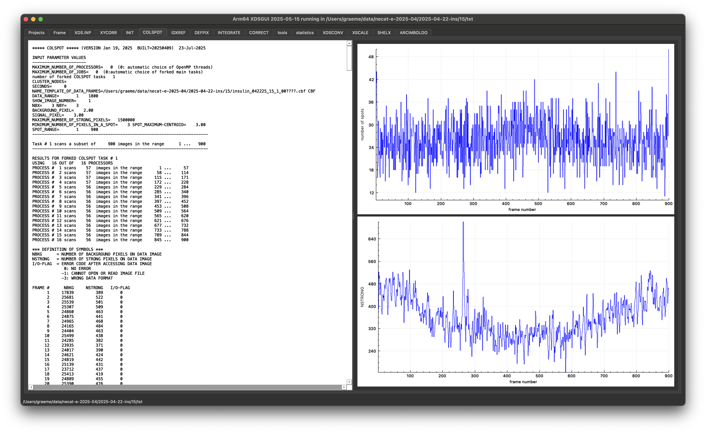
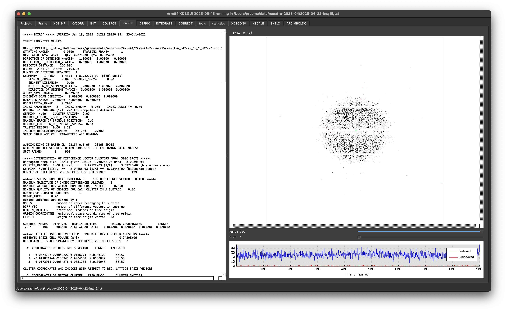
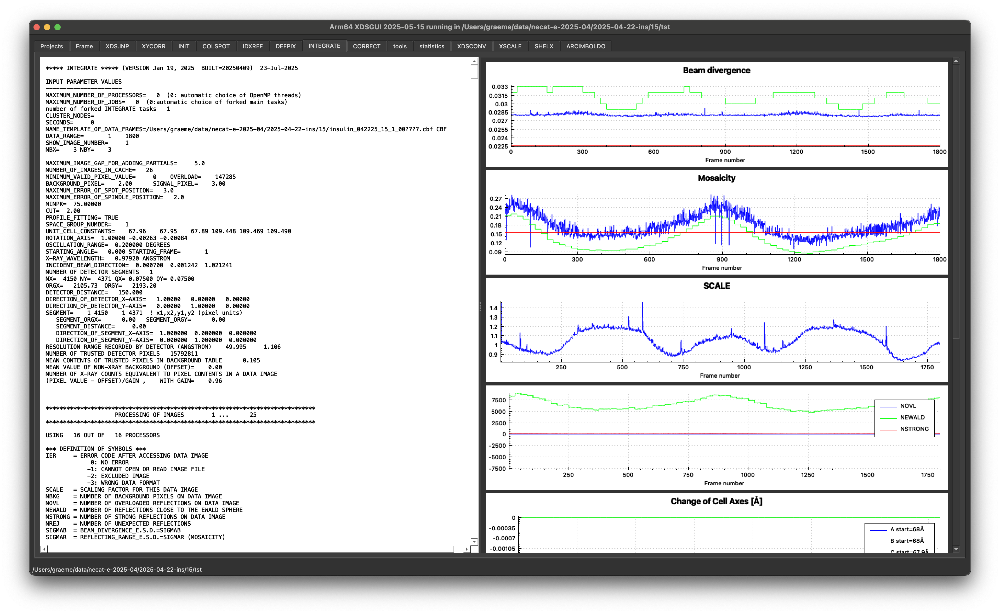
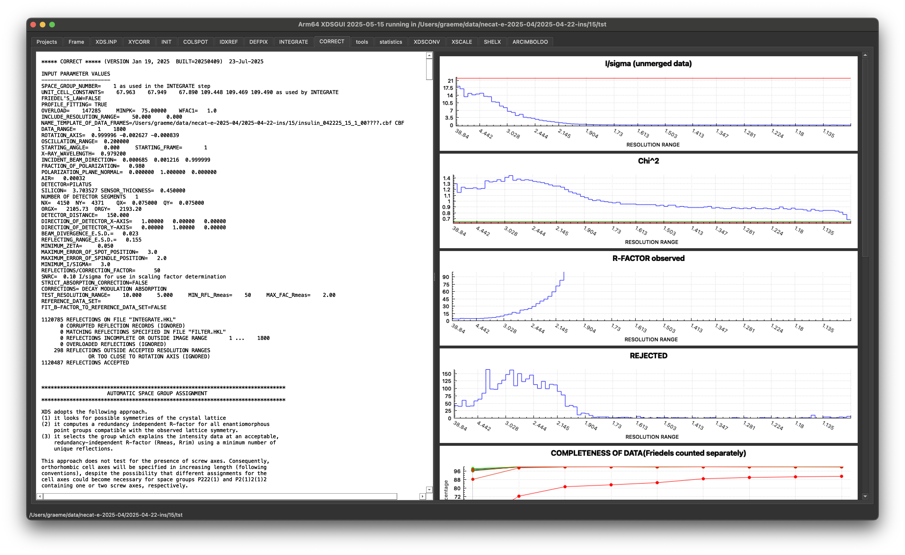
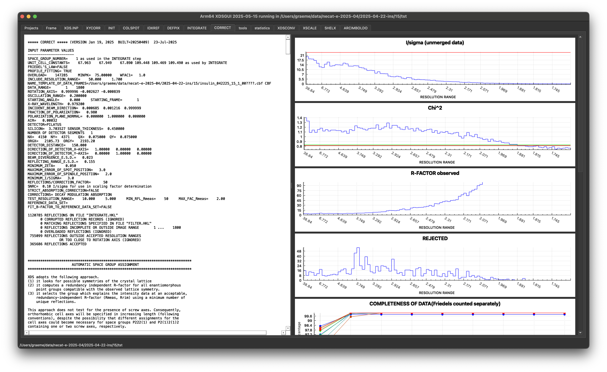

# Processing with XDS

XDS is a very well established, very quick data processing program. The classic program is used on the command line, though there is also the XDS-GUI. In this tutorial we will run XDS on the command line, then review what was done with the XDS GUI. There is [documentation on the wiki](https://wiki.uni-konstanz.de/xds/index.php/Main_Page) as well as [formal online documentation](https://xds.mr.mpg.de/html_doc/XDS.html). The program reads a file called `XDS.INP` which contains the instructions as to what to do. We will use `generate_XDS.INP`, a script maintained by Kay Diederichs, to generate the input file.

## Too Long Didn't Read

I am too busy and I don't have time for this:

```console
generate_XDS.INP "../insulin_042225_15_1_00????.cbf"
xds_par
```

This will print _a lot_ of stuff to the output and, if something goes wrong, you will need to read that output. If all goes well, you will need to review the output to decide e.g. on the resolution and explore the "ISa" of your data (which is one of the statistics that encapsulates the "quality" of your data).

## Optional: XDS.INP

The `XDS.INP` file contains some very old and shouty instructions on all they key parameters for processing your data: XDS _does not_ read the image headers (contrast this with DIALS).

```console
JOB= XYCORR INIT COLSPOT IDXREF DEFPIX INTEGRATE CORRECT
ORGX= 2105.73 ORGY= 2193.20
DETECTOR_DISTANCE= 150.00000
OSCILLATION_RANGE= 0.2000
STARTING_ANGLE= 0.0000
X-RAY_WAVELENGTH= 0.97920
NAME_TEMPLATE_OF_DATA_FRAMES=/Users/graeme/data/necat-e-2025-04/2025-04-22-ins/15/insulin_042225_15_1_00????.cbf
DATA_RANGE=1 1800
SPOT_RANGE=1 900
INCLUDE_RESOLUTION_RANGE=50 0
FRIEDEL'S_LAW=FALSE
TRUSTED_REGION=0.0 1.2
VALUE_RANGE_FOR_TRUSTED_DETECTOR_PIXELS=6000. 30000.
MINIMUM_NUMBER_OF_PIXELS_IN_A_SPOT=3
SEPMIN=4  CLUSTER_RADIUS=2
REFINE(IDXREF)=CELL BEAM ORIENTATION AXIS
REFINE(INTEGRATE)= POSITION BEAM ORIENTATION
REFINE(CORRECT)= CELL BEAM ORIENTATION AXIS POSITION
DETECTOR= PILATUS MINIMUM_VALID_PIXEL_VALUE=0 OVERLOAD= 147285
SENSOR_THICKNESS= 0.45
NX= 4150 NY= 4371  QX= 0.075  QY= 0.075
ROTATION_AXIS=1 0 0
DIRECTION_OF_DETECTOR_X-AXIS=1 0 0
DIRECTION_OF_DETECTOR_Y-AXIS=0 1 0
INCIDENT_BEAM_DIRECTION=0 0 1
FRACTION_OF_POLARIZATION=0.98
POLARIZATION_PLANE_NORMAL=0 1 0
NUMBER_OF_PROFILE_GRID_POINTS_ALONG_ALPHA/BETA=13
NUMBER_OF_PROFILE_GRID_POINTS_ALONG_GAMMA=13
UNTRUSTED_RECTANGLE=    0 4150    513  553
UNTRUSTED_RECTANGLE=    0 4150   1064 1104
UNTRUSTED_RECTANGLE=    0 4150   1615 1655
UNTRUSTED_RECTANGLE=    0 4150   2166 2206
UNTRUSTED_RECTANGLE=    0 4150   2717 2757
UNTRUSTED_RECTANGLE=    0 4150   3268 3308
UNTRUSTED_RECTANGLE=    0 4150   3819 3859
UNTRUSTED_RECTANGLE= 1029 1042      0 4371
UNTRUSTED_RECTANGLE= 2069 2082      0 4371
UNTRUSTED_RECTANGLE= 3109 3122      0 4371
```

The critical lines are:

```console
JOB= XYCORR INIT COLSPOT IDXREF DEFPIX INTEGRATE CORRECT
```

which defines, what processing needs to be performed, here geometric corrections, spot finding, integration and correction. The next lines:

```console
ORGX= 2105.73 ORGY= 2193.20
DETECTOR_DISTANCE= 150.00000
OSCILLATION_RANGE= 0.2000
STARTING_ANGLE= 0.0000
X-RAY_WAVELENGTH= 0.97920
```

define the geometry (beam centrw, wavelength, rotation info) then

```console
NAME_TEMPLATE_OF_DATA_FRAMES=/Users/graeme/data/necat-e-2025-04/2025-04-22-ins/15/insulin_042225_15_1_00????.cbf
DATA_RANGE=1 1800
SPOT_RANGE=1 900
```

defines what data to use in all processing (`DATA_RANGE=`) and spot finding (`SPOT_RANGE`). Finally, there is:

```console
INCLUDE_RESOLUTION_RANGE=50 0
```

which defines what data will be included - this is something we will revisit.

## Running

Type `xds_par`, wait. Maybe not very long, if you are on my laptop 😉 because XDS is very fast. You can also run everything through XDSGUI which allows you to run each step one at a time, review the results then proceed - I will demo this in real time.

## Results

Review in XDSGUI... this is the easiest way to look at the graphs in the output, and look at where the spots were found. In many respects the process of running XDS is very similar to DIALS, and we can look to find some very similar information.

### Spot Finding

The spot finding looks for spots in the first half of the data set by default, when running with `generate_XDS.INP`. You should see a fairly constant number of spots across the data set - if the spots _vanish_ at some point then reappear your crystal wasn't centred. If it goes down and never comes back that was probably radiation damage.



### Indexing

The most useful indexing output is in the text, showing the fraction of spots indexed:

```console

 ***** INDEXING OF OBSERVED SPOTS IN SPACE GROUP #   1 *****
     22729 OUT OF     23157 SPOTS INDEXED.
        2 REJECTED REFLECTIONS (REASON: OVERLAP)
      426 REJECTED REFLECTIONS (REASON: TOO FAR FROM IDEAL POSITION)
 EXPECTED ERROR IN SPINDLE  POSITION     0.207 DEGREES
 EXPECTED ERROR IN DETECTOR POSITION      0.92 PIXELS
```

then how well the spot positions match between computed and observed spot positions:

```console
 ***** DIFFRACTION PARAMETERS USED AT START OF INTEGRATION *****

 REFINED VALUES OF DIFFRACTION PARAMETERS DERIVED FROM     22729 INDEXED SPOTS
 REFINED PARAMETERS:   AXIS BEAM ORIENTATION CELL
 STANDARD DEVIATION OF SPOT    POSITION (PIXELS)     0.86
 STANDARD DEVIATION OF SPINDLE POSITION (DEGREES)    0.18
 SPACE GROUP NUMBER      1
 UNIT CELL PARAMETERS     67.963    67.948    67.890 109.448 109.469 109.490
 REC. CELL PARAMETERS   0.018022  0.018023  0.018037  60.018  60.006  59.993
 COORDINATES OF UNIT CELL A-AXIS   -10.644     7.175   -66.740
 COORDINATES OF UNIT CELL B-AXIS    16.835    60.100    26.862
 COORDINATES OF UNIT CELL C-AXIS    50.448   -44.263    10.238
 CRYSTAL MOSAICITY (DEGREES)     0.200
 LAB COORDINATES OF ROTATION AXIS  0.999996 -0.002627 -0.000839
 DIRECT BEAM COORDINATES (REC. ANGSTROEM)     0.000700    0.001242    1.021241
 DETECTOR COORDINATES (PIXELS) OF DIRECT BEAM    2107.10   2195.63
 DETECTOR ORIGIN (PIXELS) AT                     2105.73   2193.20
 CRYSTAL TO DETECTOR DISTANCE (mm)       150.00
 LAB COORDINATES OF DETECTOR X-AXIS  1.000000  0.000000  0.000000
 LAB COORDINATES OF DETECTOR Y-AXIS  0.000000  1.000000  0.000000
```

This is show in the GUI, which is a little easier, and shows choices for the lattice but by default it works in P1, and we can worry about the real symmetry later. The GUI also shows the number of spots which were indexed and unindexed as a function of frame number, which is probably the most useful graphical output:



### Integration

This is where we measure the strength of all the spots and get estimates of the uncertainties, as well as starting to get an idea of how the overall scale of the data changes - this should match with your expectations based on the geometry - a "blocky" crystal should have fairly uniform scales, a plate may have something completely different.



### Scaling

Thinking back to DIALS: in XDS the scaling includes symmetry estimation, and this is the first time we can get a proper idea of the data quality as assessed by the merging statistics.



This has the following text output, which gives an idea of the resolution limit:

```console
 SUBSET OF INTENSITY DATA WITH SIGNAL/NOISE >= -3.0 AS FUNCTION OF RESOLUTION
 RESOLUTION     NUMBER OF REFLECTIONS    COMPLETENESS R-FACTOR  R-FACTOR COMPARED I/SIGMA   R-meas  CC(1/2)  Anomal  SigAno   Nano
   LIMIT     OBSERVED  UNIQUE  POSSIBLE     OF DATA   observed  expected                                      Corr

     3.27       44225    2344      2345      100.0%       4.9%      4.6%    44225   58.52      5.0%   100.0*    19*   1.115    1062
     2.32       80635    4218      4218      100.0%      15.8%     13.2%    80635   20.53     16.2%    99.8*     8    1.036    2000
     1.89      103267    5480      5481      100.0%      75.0%     66.5%   103267    4.20     77.1%    94.9*     1    0.875    2633
     1.64      119439    6462      6464      100.0%     340.8%    334.1%   119439    0.42    350.4%    15.5*     2    0.637    3119
     1.47      141058    7383      7387       99.9%     466.4%    468.5%   141058    0.07    479.2%    -1.6     -2    0.530    3582
     1.34      142095    8065      8069      100.0%     470.3%    482.3%   142095    0.03    484.3%    -1.6     -4    0.514    3926
     1.24      162924    8864      8867      100.0%     487.7%    504.8%   162924   -0.02    501.6%    -0.7     -2    0.501    4320
     1.16      140086    9447      9449      100.0%     472.1%    491.0%   140086   -0.04    488.9%    -1.4     -1    0.495    4613
     1.09       59645    9200     10159       90.6%     440.0%    467.7%    58977   -0.01    476.1%     3.4     -1    0.519    4012
    total      993374   61463     62439       98.4%      25.9%     25.3%   992706    4.06     26.7%    99.9*     0    0.615   29267
```

We can feed this back by adding:

```console
INCLUDE_RESOLUTION_RANGE=50 1.7
```

to `XDS.INP` then changing the `JOB=` line to `JOB=CORRECT` and rerunning, to give:

```console
 SUBSET OF INTENSITY DATA WITH SIGNAL/NOISE >= -3.0 AS FUNCTION OF RESOLUTION
 RESOLUTION     NUMBER OF REFLECTIONS    COMPLETENESS R-FACTOR  R-FACTOR COMPARED I/SIGMA   R-meas  CC(1/2)  Anomal  SigAno   Nano
   LIMIT     OBSERVED  UNIQUE  POSSIBLE     OF DATA   observed  expected                                      Corr

     5.01       14930     658       659       99.8%       4.3%      4.2%    14930   70.37      4.4%    99.9*    44*   1.259     283
     3.56       25799    1168      1168      100.0%       4.8%      4.7%    25799   63.18      4.9%    99.9*     8    0.999     537
     2.91       30006    1510      1510      100.0%       8.4%      7.8%    30006   36.01      8.7%    99.9*    -1    0.917     709
     2.52       38677    1769      1769      100.0%      17.5%     15.8%    38677   19.71     17.9%    99.6*     4    0.897     839
     2.26       44936    2019      2019      100.0%      32.6%     30.5%    44936   10.79     33.4%    98.7*     2    0.907     961
     2.06       50437    2253      2253      100.0%      62.1%     60.0%    50437    5.47     63.6%    96.1*     0    0.812    1081
     1.91       49309    2428      2428      100.0%     137.4%    141.3%    49309    2.00    140.9%    71.6*     1    0.738    1169
     1.78       52291    2599      2599      100.0%     258.9%    281.0%    52291    0.77    265.6%    30.4*     4    0.670    1253
     1.68       58297    2796      2796      100.0%     384.7%    428.4%    58297    0.30    394.3%     3.6      1    0.571    1351
    total      364682   17200     17201      100.0%      11.4%     11.2%   364682   14.60     11.7%    99.9*     3    0.797    8183
```


