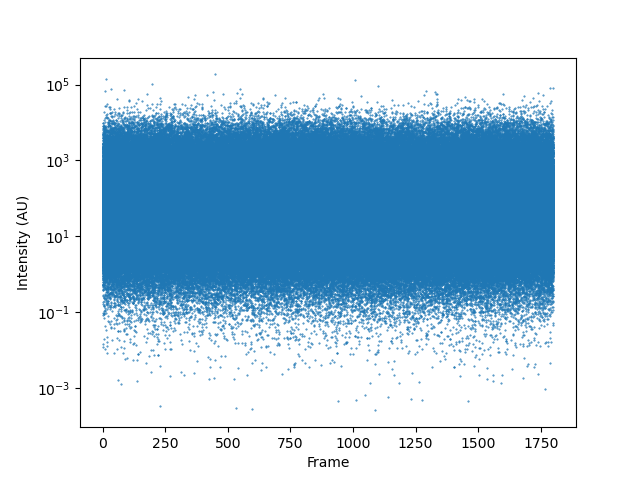

Python Scripting
================

Since much of DIALS is written in Python there is a lot you can do using the DIALS python interpreter `dials.python`. In particular, you can perform fine grained analysis or ask specific questions which the program authors have not answered for you.

Any non-trivial program could potentially be quite involved, but asking simple questions about e.g. spots is quite simple - for example "what is the distribution in spot sizes, in terms of signal pixels?" This explores sufficient terrain in the DIALS environment that it does something useful, without being punishing to follow along with.

DIALS Concepts
--------------

DIALS has two main types of data: the reflection data kept in files called `thing.refl` e.g. `indexed.refl` and then experiment descriptions in `thing.refl` e.g. `indexed.refl`. To ask this question we need only look at the reflections. The reflection data are kept in a "reflection table" which you can think of as a spreadsheet with one row for each reflection, and different columns for things like the X, Y position on the detector, image number and so on. Unlike a spreadsheet however data items can be _complex_ i.e. be themselves vectors (like a position in space, as `xyz.px.values` or Miller indices) or "ragged" e.g. the reflection shoe boxes from spot finding, where the boxes themselves vary in dimensions from one reflection to the next.

Inside DIALS the data are handled by CCTBX `flex` arrays, which can be converted to `numpy` arrays if needed with no copying - this is touched on below. `flex` also includes operations for e.g. mathematical operations and histogram generation, which we will use here.

To measure the spot size in terms of signal pixels, we need to know which pixels were signal and create an array of the number of such pixels. The pixels have "flag" values assigned in spot finding, which characterise them as e.g. peak, background, overloaded. Signal pixels are masked as "foreground" as they are not... background, so for each spot in the list we need to count the number of pixels which have the foreground flag. For bonus points, let's also filter out only the indexed reflections.

Practicalities
--------------

This tutorial was _not_ written based on knowing all the syntax: it was written by knowing how to open a DIALS reflection file in Python and knowing that `help(thing)` prints Python help. So, the start set of command lines looked like:

```python
from dials.array_family import flex
data = flex.reflection_table.from_file("indexed.refl")
help(data)
```

A little "poking around" indicated how to filter on indexed reflections:

```python
data = data.select(data.get_flags(data.flags.indexed))
```

and then how to read the shoebox mask

```python
data[0]["shoebox"].count_mask_values(MaskCode.Foreground)
```

This then means we can collate all the data we want. 

Script 1: how big are my spots?
-------------------------------

Adding the bits to collate all the data into an array then make a histogram was relatively straightforward:

```python
import sys

from dials.array_family import flex
from dials.algorithms.shoebox import MaskCode


def analysis(filename):
    data = flex.reflection_table.from_file(filename)
    data = data.select(data.get_flags(data.flags.indexed))

    pixels = flex.int()

    for j in range(data.size()):
        pixels.append(data[j]["shoebox"].count_mask_values(MaskCode.Foreground))

    hist = flex.histogram(pixels.as_double(), data_min=0, data_max=1000, n_slots=100)

    for centre, value in zip(hist.slot_centers(), hist.slots()):
        print(centre, value)


if __name__ == "__main__":
    analysis(sys.argv[1])
```

Plotting this however you like is fine - but here we are only extracting data and printing it, which really is not at all interesting (particularly if you know a little Python / numpy etc.)

Script 2: looking at the intensity vs. image number
---------------------------------------------------

Here we will start from an integrated data set and look to see how the intensity varies as a function of frame number, using `numpy` and `matplotlib` (since these come built in to a `dials` distribution).

First, we need to load the data as above but this time we will use the `flumpy` bridge to get a view on the data as `numpy` arrays rather than `flex`, since this is much more commonly used in the standard scientific Python ecosystem.

First, let's generate a scatter plot of the spot intensities vs. predicted centroid frame number. Plotting on a log scale for intensity is useful as the reflection intensities roughly follow a Wilson distribution. 

Script:

```python
import sys

from matplotlib import pyplot

from dials.array_family import flex
from dxtbx import flumpy

def analysis(filename):
    data = flex.reflection_table.from_file(filename)
    data = data.select(data.get_flags(data.flags.integrated))

    z = flumpy.to_numpy(data["xyzcal.px"].parts()[2])
    i = flumpy.to_numpy(data["intensity.sum.value"])

    # dig out matplotlib spells from stackoverflow
    fig = pyplot.figure()
    ax = fig.add_subplot(1, 1, 1)
    ax.scatter(z, i, s=0.2)
    ax.set_yscale("log")
    ax.set_xlabel("Frame")
    ax.set_ylabel("Intensity (AU)")
    pyplot.show()

if __name__ == "__main__":
    analysis(sys.argv[1])
```

Output:



Again, the author of this tutorial googled most of the "spells" needed from this, despite working with Python for close to 20 years 🙄 so don't feel bad if your find yourself doing so.

A more interesting question though: _where are these strong reflections?_

Script 3: where are the strong reflections?
-------------------------------------------

In here we start looking at `flex` selections - picking out a subset of the data based on some criterion. Looking at the plot above it would seem that the strongest reflections have over 1000 counts, so looking to see where those are on the detector seems like a neat idea.

```python
import sys

from matplotlib import pyplot

from dials.array_family import flex
from dxtbx import flumpy


def analysis(filename):
    data = flex.reflection_table.from_file(filename)
    data = data.select(data.get_flags(data.flags.integrated))

    strong = data["intensity.sum.value"] >= 5000

    data = data.select(strong)

    x, y, _ = data["xyzobs.px.value"].parts()

    x = flumpy.to_numpy(x)
    y = flumpy.to_numpy(y)

    fig = pyplot.figure()
    ax = fig.add_subplot(1, 1, 1)
    ax.scatter(x, y, s=0.2)
    ax.set_xlabel("X")
    ax.set_ylabel("Y")
    ax.axis("equal")
    pyplot.show()


if __name__ == "__main__":
    analysis(sys.argv[1])
```

Unsurprisingly they appear to generally be at low resolution, and follow a "Wilson plot" in that they are strongest at low resolution, somewhat weaker then stronger before falling off at high resolution.
