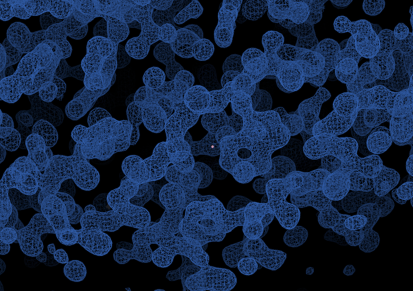

# Next

Using the data you have processed here is out of context for this tutorial however mention was made of selenourea soaking, which indicates that phasing should be possible.

It is.

It phases rather nicely 🙂. Magic spell:

```
xia2.to_shelxcde --sad scaled.mtz -s 5 sethau
bash sethau.sh 
shelxd sethau_fa
shelxe sethau sethau_fa -s0.5 -h -m20
coot --coords sethau.hat --data sethau.phs
```

The first line exports the data in `hkl` format for reading with `shelxc` and writes a command script which calls the data "sethau" and allows for 5 heavy atom sites - everything else is read from the `scaled.mtz` file from `dials.export` - which is _unmerged_ so `shelxc` can compute e.g. χ² values:

```
shelxc sethau << eof
cell 57.903400 57.903400 150.043701 90.000000 90.000000 90.000000
spag P41212
sad sethau.hkl
find 5
maxm 2
eof
```

This is where the space group assessment in `dials.symmetry` is particularly welcome, as we don't need to go exploring options. `shelxd` and `shelxe` here are run using "standard" options (which are not optimal here but good enough) and `coot` used to display the resulting map:



This is clearly good enough to look at building etc. - which is very much outside of context for this.
