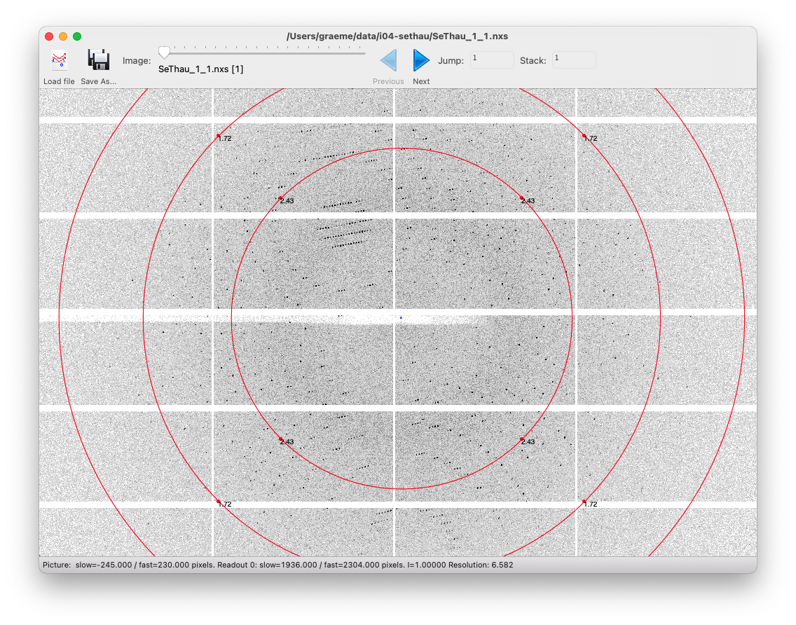
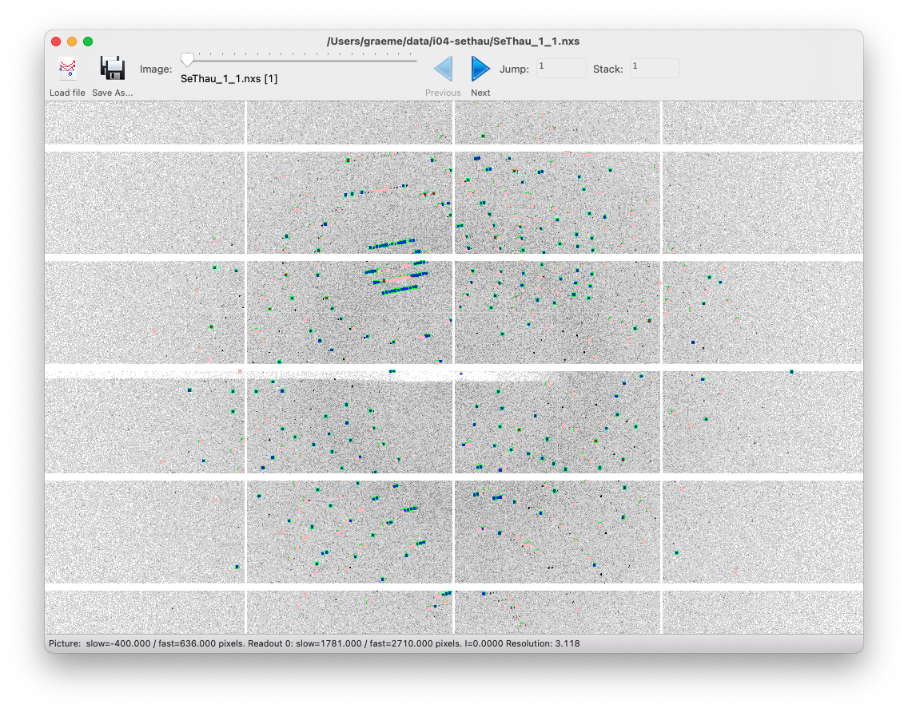
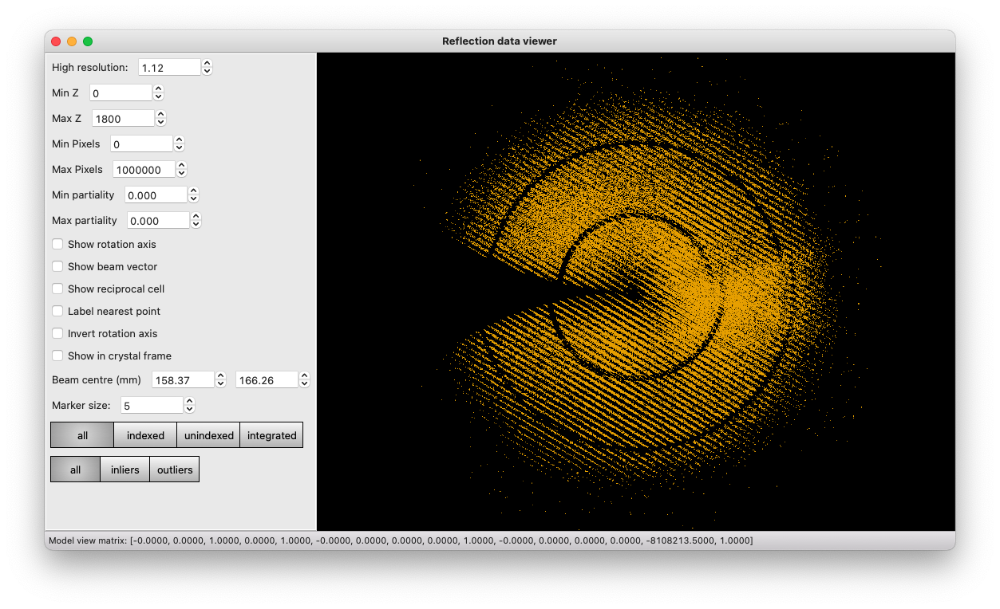
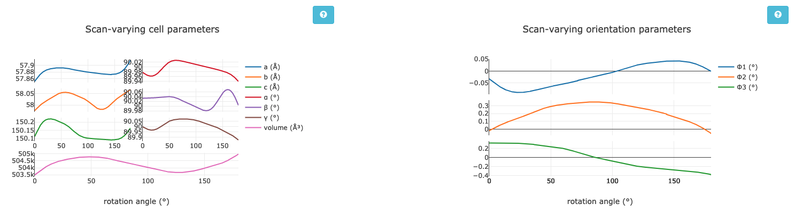

# Processing in Detail: selenourea soaked thaumatin (APS / CCP4 2021) 

## Introduction

DIALS processing may be performed by either running the individual
tools (spot finding, indexing, refinement, integration, symmetry,
scaling, exporting to MTZ) or you can run `xia2`, which makes
informed choices for you at each stage. In this tutorial we will run
through each of the steps in turn, taking a look at the output as we
go. We will also look at enforcing the correct lattice symmetry.

This data set is slightly more substantial than the small 50° set used
for the other thaumatin tutorial, but more "realistic" in processing
time and allows phasing from the data that are processed if you are so
inclined. 

The aim of this tutorial is to introduce you to the tools, not teach
about data processing - it is assumed you have some idea of the
overall process from e.g. associated lectures. With the graphical
tools, I am not making so much effort to explain the options as simply
"playing" will give you a chance to learn your way around and also
find the settings which work for you. Particularly with looking at
diffraction images, the "best" settings are very personal. 

## DIALS version

This tutorial assumes you are using [DIALS
version 3.5](https://dials.github.io/installation.html) and that you
have this set up (i.e. you've sourced the setup file).

If you type `dials.version` you should see something like:

```
DIALS 3.5.0-g82bac9855-release
Python 3.8.10
Installed in: /Applications/dials-v3-5-0/modules/dials
```

If you are running on the APS virtual machines, `module load
dials-3.5.0` will get you set up and there is no need to download the
data. If you are running at home on Linux or macOS then you should be
able to reproduce the results in here. If you are on Windows, try
installing the Linux version in a WSL terminal using e.g. Ubuntu.

## Tutorial data

The following example uses a selenourea soaked Thaumatin data set
collected on beamline i04 at Diamond Light Source, which is available
[from OneDrive](https://dlsltd-my.sharepoint.com/:f:/g/personal/graeme_winter_diamond_ac_uk/EnAVwtJMH1tFpkCVMQCodUQB8rfrfDT8coLdW8noM0rDmg?e=kzujT6). You
are probably better off downloading the files one at a time rather
than as a zip file, as some systems struggle with zip files > 4GB.

## Files

DIALS creates two principle file types:

- experiment files called `something.expt`
- reflection files called `something.refl`

"Experiment" in DIALS has a very specific meaning - the capturing of
data from one set of detector, beam, goniometer and crystal - so if
you have two scans from one crystal this is two experiments, if you
have two lattices on one data set this is two experiments. In most
cases you can ignore this distinction though.

Usually the output filenames will correspond to the name of the DIALS
program which created them e.g. `indexed.refl` and `indexed.expt` from
`dials.index`. The only deviations from this are on import (see below)
where we are only reading experiment models and spot finding where we
find _strong_ reflections so write these to `strong.refl` - and we
create no models so (by default) there is no output experiment file. 

At any time you can _look_ at these files with `dials.show` which will
summarise the content of the files to the terminal. 

[If you're impatient...](./tldr.md)

## Parameters

All DIALS programs accept parameters in the form of
`parameter=value` - in most cases this will be sufficient though some
less frequently used options may require "name space" clarification
e.g. `index_assignment.method=local`. All of the DIALS programs
support the option

```
dials.program -c -e2
```

which will show you all possible configuration options - if you are
looking for an option this is the simplest way to search so e.g.

```
dials.index -c -e2 | less
```

will allow you to scroll through the extensive list of options you can
adjust. In most cases the defaults are relatively sensible for
synchrotron data from a pixel array detector, as we are using in this
tutorial. 

## Output

In the majority of cases the `dials` programs write their output to
`dials.program.log` e.g. `dials.find_spots.log` etc. - everything
which is printed to the terminal is also saved in this file, so you
can review the processing later. In the case where you are reporting
an issue to the developers including these log files in the error
report (particularly for the step which failed) is very helpful. 

From most stages you can generate a more verbose _report_ of the
current state of processing with:

```
dials.report step.expt step.refl
```

which will generate a detailed report as HTML describing the current
state of the processing. 
   
## Import

The starting point for any processing with DIALS is to _import_ the
data - here the metadata are read and a description of the data to be
processed saved to a file named `imported.expt`. This is "human
readable" in that the file is JSON format (roughly readable text with
brackets around to structure for computers). While you can edit this
file if you know what you are doing, usually this is not necessary. 

```
dials.import SeThau_1_1_master.h5
```

will read the metadata from this `master` file and write
`imported.expt` from this - equally in this case you could import from
the NeXus formatted file (which is functionally equivalent) with

```
dials.import SeThau_1_1.nxs
```

It is important to note that for well behaved data (i.e. anything
which is well collected from a well behaved sample) the commands below
will often be identical after importing.

At this point you can actually look at the images with the
`dials.image_viewer` tool - 

```
dials.image_viewer imported.expt
```

in this tool there are many settings you can adjust, which could
depend on the source of the data and - most importantly - your
preferences. Personally the author finds for basic inspection of the
images the brightness is a bit high for pixel array data, and a value
of 5 / 10 may be better for viewing the diffraction pattern as a
whole. 



To get a sense of how the diffraction spots are spread, stacking
images can help - for example in this case setting the stack to 10
gives a good idea of the real separation between reflections. If the
data are not stacked the spot finding process can also be explored -
the controls at the bottom of the "Settings" window allow you to step
through these and can be very useful for getting a "computer's eye
view" of how the data look (particularly for establishing where the
diffraction is visible to.)

[Here](./import_detail.md) is a short discussion on some more details
of importing data. 

## Find Spots

The first "real" task in any processing using DIALS is the spot
finding. Since this is looking for spots on every image in the
dataset, this process can take some time so by default will use all of
the processors available in your machine - if you would like to
control this adjust with e.g. `nproc=4` - however the default is
usually sensible unless you are sharing the computer with many
others.

```
dials.find_spots imported.expt
```

This is one of the two steps where every image in the data set is read
and processed and hence can be moderately time consuming. This
contains a reflection file `strong.refl` which contains both the
positions of the strong spots and also "images" of the spot pixels
which we will use later. You can view these spots on top of the images
with

```
dials.image_viewer imported.expt strong.refl
```

to get a sense of what spots were found. You will see that the spots
are surrounded by little boxes - these are the _bounding boxes_ of
the reflections i.e. the outer extent of the pixels that belong to
that spot. The "signal" pixels are highlighted with green blobs
giving a sense of what is and is not "strong."



The default parameters for spot finding usually do a good job for
Pilatus or Eiger images, such as these. However they may not be
optimal for data from other detector types, such as CCDs or image
plates. Issues with  incorrectly set gain might, for example, lead to
background noise being extracted as spots. You can use the image mode
buttons to preview how the parameters affect the spot finding
algorithm. The final button 'threshold’ is the one on which spots were
found, so ensuring this produces peaks at real diffraction spot
positions will give the best chance of success. 

The second tool for visualisation of the found spots is the reciprocal
lattice viewer - which presents a view of the spot positions mapped to
reciprocal space.

```
dials.reciprocal_lattice_viewer imported.expt strong.refl
```

No matter the sample orientation you should be able
to rotate the space to "look down" the lines of reflections. If you
cannot, or the lines are not straight, it is likely that there are
some errors in the experiment parameters e.g. detector distance or
beam centre. If these are not too large they will likely be corrected
in the subsequent analysis.



Have a play with the settings - you can change the beam centre in the
viewer to see how nicely aligned spots move out of alignment. Some of
the options will only work after you have indexed the data. If the
geometry is not accurately recorded you may find it useful to run:

```
dials.search_beam_position imported.expt strong.refl
```

to determine an updated position for the beam centre - ideally the
shift that this calculates should be small if the beamline is well
calibrated - if it is a couple of mm or more it may be worth
discussing this with the beamline staff! Running the reciprocal
lattice viewer with the optimised experiment output:

```
dials.reciprocal_lattice_viewer optimised.expt strong.refl
```

should show straight lines, provided everything has worked correctly. 

Further discussion of the output can be found
[here](./find_spots_detail.md). 

## Indexing

The next step will be indexing of the found spots with `dials.index` -
by default this uses a 3D FFT algorithm to identify periodicy in the
reciprocal space mapped spot positions, though there are other
algorithms available which can be better suited to e.g. narrow data
sets.

```
dials.index imported.expt strong.refl
```

or

```
dials.index optimised.expt strong.refl
```
   
are the ways to trigger the program, and the most common parameters to
set are the `space_group` and `unit_cell` if these are known in
advance. While this does index the data it will also perform some
refinement with a static crystal model, and indicate in the output the
fraction of reflections which have been indexed - ideally this should
be close to 100%:

```
Refined crystal models:
model 1 (178887 reflections):
Crystal:
    Unit cell: 57.8418(17), 57.9446(18), 150.015(4), 89.9877(8), 90.0371(8), 90.0379(8)
    Space group: P 1
    U matrix:  {{ 0.2124, -0.0181, -0.9770},
                {-0.8378,  0.5112, -0.1916},
                { 0.5029,  0.8593,  0.0934}}
    B matrix:  {{ 0.0173,  0.0000,  0.0000},
                { 0.0000,  0.0173,  0.0000},
                { 0.0000, -0.0000,  0.0067}}
    A = UB:    {{ 0.0037, -0.0003, -0.0065},
                {-0.0145,  0.0088, -0.0013},
                { 0.0087,  0.0148,  0.0006}}
+------------+-------------+---------------+-------------+
|   Imageset |   # indexed |   # unindexed | % indexed   |
|------------+-------------+---------------+-------------|
|          0 |      178887 |         55243 | 76.4%       |
+------------+-------------+---------------+-------------+
```

If it is significantly less than 100% it is possible
you have a second lattice - adding `max_lattices=2` (say) to the
command-line will indicate to the program that you would like to
consider attempting to separately index the unindexed reflections
after the first lattice has been identified. 

By default the triclinic lattice i.e. with `P1` no additional symmetry
is assumed - for the majority of data there are no differences in the
quality of the results from assigning the Bravais lattice at this
stage, even if as here it is perfectly obvious what the correct answer
is. 

If successful, `dials.index` writes the experiments and indexed
reflections to two new files `indexed.expt` and `indexed.refl` - if
these are loaded in the reciprocal lattice viewer you can see which
spots have been indexed and if you have multiple lattices switch them
"on and off" for comparison. 

The process that the indexing performs is quite complex -

- make a guess at the maximum unit cell from the pairwise separation
  of spots in reciprocal space
- transform spot positions to reciprocal space using the best
  available current model of the experimental geometry
- perform a Fourier transform of these positions or other algorithm to
  identify the _basis vectors_ of these positions e.g. the spacing
  between one position and the next
- determine a set of these basis vectors which best describes the
  reciprocal space positions
- transform this set of three basis vectors into a unit cell
  description, which is then manipulated according to some standard
  rules to give the best _triclinic_ unit cell to describe the
  reflections - if a unit cell and space group have been provided
  these will be enforced at this stage
- _assign indices_ to the reflections by "dividing through"
  the reciprocal space position by the unit cell parallelopiped (this
  is strictly the actual indexing step)
- take the indexed reflections and refine the unit cell parameters and
  model of the experimental geometry by comparing where the
  reflections should be and where they are found
- save the indexed reflections and experiment models to the output
  files

The indexing process takes place over a number of cycles, where low
resolution reflections are initially indexed and refined before
including more reflections at high resolution - this improves the
overall success of the procedure by allowing some refinement as a part
of the process. 
  
During this process an effort is made to eliminate "outlier"
reflections - these are reflections which do not strictly belong to
the crystal lattice but are accidentally close to a reciprocal space
position and hence can be indexed. Most often this is an issue with
small satellite lattices or ice / powder on the sample. Usually this
should not be a cause for concern. 


## Bravais Lattice Determination (optional!)

Once you have indexed the data you may optionally attempt to infer the
correct Bravais lattice and assign this to constrain the unit cell in
subsequent processing. If, for example, the unit cell from indexing
has all three angles close to 90 degrees and two unit cell lengths
with very similar values you could guess that the unit cell is
tetragonal. In `dials.refine_bravais_settings` we take away the
guesswork by transforming the unit cell to all possible Bravais
lattices which approximately match the triclinic unit cell, and then
performing some refinement - if the lattice constraints are correct
then imposing them should have little impact on the deviations between
the observed and calculated reflection positions (known as the R.M.S.
deviations). If a lattice constraint is incorrect it will manifest as
a significant increase in a deviation - however care must be taken as
it can be the case that the true _symmetry_ is lower than the shape of
the unit cell would indicate.

In the general case there is little harm in skipping this step,
however for information if you run

```
dials.refine_bravais_settings indexed.expt indexed.refl
```

you will see a table of possible unit cell / Bravais lattice /
R.M.S. deviations printed in the output - in the case of this tutorial
data they will all match, as the true symmetry is tetragonal.

```
Chiral space groups corresponding to each Bravais lattice:
aP: P1
mP: P2 P21
mC: C2
oP: P222 P2221 P21212 P212121
oC: C2221 C222
tP: P4 P41 P42 P43 P422 P4212 P4122 P41212 P4222 P42212 P4322 P43212
+------------+--------------+--------+--------------+----------+-----------+------------------------------------------+----------+------------+
|   Solution |   Metric fit |   rmsd | min/max cc   |   #spots | lattice   | unit_cell                                |   volume | cb_op      |
|------------+--------------+--------+--------------+----------+-----------+------------------------------------------+----------+------------|
|   *      9 |       0.1075 |  0.083 | 0.941/0.944  |    18000 | tP        | 57.86  57.86 149.97  90.00  90.00  90.00 |   502104 | a,b,c      |
|   *      8 |       0.1075 |  0.085 | 0.935/0.941  |    18000 | oC        | 81.81  81.87 149.99  90.00  90.00  90.00 |  1004617 | a+b,-a+b,c |
|   *      7 |       0.1032 |  0.084 | 0.941/0.941  |    18000 | mC        | 81.87  81.82 149.99  90.00  90.04  90.00 |  1004685 | a-b,a+b,c  |
|   *      6 |       0.1075 |  0.084 | 0.935/0.935  |    18000 | mC        | 81.80  81.85 149.97  90.00  90.02  90.00 |  1004200 | a+b,-a+b,c |
|   *      5 |       0.0531 |  0.064 | 0.940/0.957  |    18000 | oP        | 57.85  57.95 150.03  90.00  90.00  90.00 |   502974 | a,b,c      |
|   *      4 |       0.0531 |  0.064 | 0.940/0.940  |    18000 | mP        | 57.95  57.84 150.02  90.00  89.99  90.00 |   502845 | -b,-a,-c   |
|   *      3 |       0.0399 |  0.062 | 0.957/0.957  |    18000 | mP        | 57.84  57.95 150.01  90.00  90.04  90.00 |   502805 | a,b,c      |
|   *      2 |       0.0391 |  0.067 | 0.941/0.941  |    18000 | mP        | 57.85 150.03  57.95  90.00  90.04  90.00 |   502958 | -a,-c,-b   |
|   *      1 |       0      |  0.065 | -/-          |    18000 | aP        | 57.84  57.95 150.02  89.99  90.04  90.04 |   502865 | a,b,c      |
+------------+--------------+--------+--------------+----------+-----------+------------------------------------------+----------+------------+
```

If you wish to use one of the output experiments from this process
e.g. `bravais_setting_9.expt` you will need to reindex the reflection
data from indexing to match this - we do not output every option of
reindexed data as these files can be large. In most cases it is
simpler to re-run `dials.index` setting the chosen space group. 

The reader is reminded here - in most cases it is absolutely fine to
proceed without worrying about the crystal symmetry at this stage 🙂.

## Refinement

The model is already refined during indexing, but this is assuming
that a single crystal model is appropriate for every image in the data
set - in reality there are usually small changes in the unit cell and
crystal orientation throughout the experiment as the sample is
rotated. `dials.refine` will first re-run refinement with a fixed unit
cell and then perform scan-varying refinement. If you have indexed
multiple sweeps earlier in processing (not covered in this tutorial)
then the crystal models will be copied and split at this stage to
allow per-crystal-per-scan models to be refined. 

By and large one may run:

```
dials.refine indexed.expt indexed.refl
```

without any options and the program will do something sensible - if
you compare the R.M.S. deviations from the end of indexing with the
end of refinement you should see a small improvement e.g.

```
RMSDs by experiment:
+-------+--------+----------+----------+------------+
|   Exp |   Nref |   RMSD_X |   RMSD_Y |     RMSD_Z |
|    id |        |     (px) |     (px) |   (images) |
|-------+--------+----------+----------+------------|
|     0 |  18000 |  0.50174 |  0.69553 |    0.76912 |
+-------+--------+----------+----------+------------+
```

to:

```
RMSDs by experiment:
+-------+--------+----------+----------+------------+
|   Exp |   Nref |   RMSD_X |   RMSD_Y |     RMSD_Z |
|    id |        |     (px) |     (px) |   (images) |
|-------+--------+----------+----------+------------|
|     0 | 114818 |  0.31991 |  0.50414 |    0.45294 |
+-------+--------+----------+----------+------------+
```

If you look at
the output of `dials.report` at this stage you should see small
variations in the unit cell and sample orientation as the crystal is
rotated - if these do not appear small then it is likely that
something has happened during data collection e.g. severe radiation
damage:



## Integration

Once you have refined the model the next step is to integrate the
data - in effect this is using the refined model to calculate the
positions where all of the reflections in the data set will be found
and measure the background subtracted intensities:

```
dials.integrate refined.expt refined.refl
```

By default this will pass through the data twice, first looking at the
shapes of the predicted spots to form a reference profile model then
passing through a second time to use this profile model to integrate
the data, by being fit to the transformed pixel values. This is by far
the most computationally expensive step in the processing of the data!

by default all the processors in your computer are used, unless we
think this will exceed the memory available in the machine. At times,
however, if you have a large unit cell and / or a large data set you
may find that processing on a desktop workstation is more appropriate
than e.g. a laptop.

If you know in advance that the data do not diffract to anything close
to the edges of the detector you can assign a resolution limit at this
stage by adding `prediction.d_min=1.8` (say) to define a 1.8A
resolution limit - this should in general not be necessary. At the end
of integration two new files are created - `integrated.refl` and
`integrated.expt` - looking at these in the image viewer e.g.

```
dials.image_viewer integrated.expt integrated.refl
```

can be very enlightening as you should see little red boxes around
every reflection - if you select "integrated only" you can see what
was and was not integrated. You may see a selection of reflections
close to the rotation axis are missed - these are not well modelled or
predicted in any program so typically excluded from processing. 

## Symmetry analysis

Before the data may be scaled it is necessary that the crystal
symmetry is known - if this was assigned correctly at indexing
e.g. `space_group=P41212` then you can proceed directly to scaling. In
the majority of cases however it will be unknown or not set at this
point, so needs to be assigned between integration and scaling. Even
if the Bravais lattice was assigned earlier, the correct symmetry
_within_ that lattice is needed.

The symmetry analysis in DIALS takes the information from the spot
positions and also the spot intensities. The former are used to
effectively re-run `dials.refine_bravais_settings` to identify
possible lattices and hence candidate symmetry operations, and the
latter are used to assess the presence or absence of these symmetry
operations. Once the operations are found, the crystal rotational
symmetry is assigned by composing these operations into a putative
space group. In addition, systematically absent reflections are also
assessed to assign a best guess to translational elements of the
symmetry - though these are not needed for scaling, they may help with
downstream analysis rather than you having to manually identify them.

```
dials.symmetry integrated.expt integrated.refl
```

is how this step is run. At this point it is important to note that
the program is trying to identify all symmetry elements, and does not
know that e.g. inversion centres are not possible - so for an oP
lattice it will be testing for P/mmm symmetry which corresponds to
P2?2?2? in standard MX.

In the output you'll see first the individual symmetry operation:

```
Scoring individual symmetry elements

+--------------+--------+------+--------+-----+---------------+
|   likelihood |   Z-CC |   CC |      N |     | Operator      |
|--------------+--------+------+--------+-----+---------------|
|        0.94  |   9.9  | 0.99 | 362986 | *** | 1 |(0, 0, 0)  |
|        0.94  |   9.92 | 0.99 | 751640 | *** | 4 |(0, 0, 1)  |
|        0.941 |   9.92 | 0.99 | 373768 | *** | 2 |(1, 0, 0)  |
|        0.941 |   9.93 | 0.99 | 393952 | *** | 2 |(0, 1, 0)  |
|        0.94  |   9.91 | 0.99 | 364832 | *** | 2 |(0, 0, 1)  |
|        0.94  |   9.9  | 0.99 | 389620 | *** | 2 |(1, 1, 0)  |
|        0.94  |   9.91 | 0.99 | 367896 | *** | 2 |(-1, 1, 0) |
+--------------+--------+------+--------+-----+---------------+
```

followed by the results of composing these into the possible space
groups and the likelihood assessment of these - which takes into
consideration the elements present in the space group and also those
not present:

```
Scoring all possible sub-groups

+-------------------+-----+--------------+----------+--------+--------+------+-------+---------+--------------------+
| Patterson group   |     |   Likelihood |   NetZcc |   Zcc+ |   Zcc- |   CC |   CC- |   delta | Reindex operator   |
|-------------------+-----+--------------+----------+--------+--------+------+-------+---------+--------------------|
| P 4/m m m         | *** |        0.999 |     9.91 |   9.91 |   0    | 0.99 |  0    |     0.1 | a,b,c              |
| P m m m           |     |        0     |     0.01 |   9.92 |   9.91 | 0.99 |  0.99 |     0.1 | a,b,c              |
| C m m m           |     |        0     |    -0.02 |   9.91 |   9.92 | 0.99 |  0.99 |     0.1 | a+b,a-b,-c         |
| P 4/m             |     |        0     |    -0.01 |   9.91 |   9.92 | 0.99 |  0.99 |     0.1 | a,b,c              |
| P 1 2/m 1         |     |        0     |     0    |   9.91 |   9.91 | 0.99 |  0.99 |     0   | a,b,c              |
| P 1 2/m 1         |     |        0     |     0    |   9.91 |   9.91 | 0.99 |  0.99 |     0.1 | b,-a,c             |
| C 1 2/m 1         |     |        0     |    -0.01 |   9.91 |   9.92 | 0.99 |  0.99 |     0.1 | a-b,-a-b,-c        |
| P 1 2/m 1         |     |        0     |    -0.01 |   9.91 |   9.92 | 0.99 |  0.99 |     0   | -a,c,b             |
| C 1 2/m 1         |     |        0     |    -0.01 |   9.9  |   9.92 | 0.99 |  0.99 |     0.1 | a+b,a-b,-c         |
| P -1              |     |        0     |    -0.01 |   9.9  |   9.91 | 0.99 |  0.99 |     0   | a,b,c              |
+-------------------+-----+--------------+----------+--------+--------+------+-------+---------+--------------------+

Best solution: P 4/m m m
```

Here the symmetry appears to be `P4/mmm` i.e. 4-fold rotation and
three 2-fold mirror axes - and corresponds to some variation of
`P4?2?2` - this information is sufficient for scaling though for
structure solution identification of the correct space group is
necessary - `dials.symmetry` will also attempt to guess this as:

```
+---------------+---------+
| Space group   |   score |
|---------------+---------|
| P 4 2 2       |       0 |
| P 4 21 2      |       0 |
| P 41 2 2      |       0 |
| P 42 2 2      |       0 |
| P 41 21 2     |       1 |
| P 42 21 2     |       0 |
+---------------+---------+
Recommended space group: P 41 21 2
Space group with equivalent score (enantiomorphic pair): P 43 21 2
```


## Scaling and Merging

During the experiment there are effects which alter the measured
intensity of the reflections, not least radiation damage, changes to
beam intensity or illuminated volume or absorption within the
sample. The purpose of `dials.scale` like all scaling programs is to
attempt to correct for these effects by using the fact that symmetry
related reflections should share a common intensity. By default no
attempt is made to merge the reflections - this may be done
independently in `dials.merge` - but a table of merging statistics is
printed at the end along with resolution recommendations.

```
dials.scale symmetrized.expt symmetrized.refl [anomalous=True]
```

runs everything with the defaults which allows for:

- modest radiation damage
- changes in overall intensity
- modest sample absorption

with the latter being the parameter most likely changed. If you have a
data set recorded from a sample containing a large amount of metal
(not common in MX) or recorded at long wavelength e.g, for sulphur SAD
it may be necessary to adjust the extent to which the absorption
correction is constrained with

```
absorption_level=(low|medium|high)
```

setting low, the default, corresponds to ~ 1% absorption, medium to ~
5% and high to ~ 25% - these are not absolute, more a sense of what
you may expect. Testing has indicated that setting it too high is
unlikely to do any harm, but setting it too low can have a measurable
impact on the quality of the data for phasing
experiments. `dials.scale` generates a HTML report `dials.scale.html`
which includes a lot of information about how the models look, as well
as regions of the data which agree well and poorly - from a practical
perspective this is the point where you really _know_ about the final
quality of the data. The overall summary data are printed to the console and
the log file e.g.:

```
            -------------Summary of merging statistics--------------           

                                            Suggested   Low    High  Overall
High resolution limit                           1.18    3.20    1.18    1.08
Low resolution limit                          150.04  151.27    1.20  150.04
Completeness                                   93.3   100.0    59.9    79.6
Multiplicity                                   12.1    12.2     6.2    11.3
I/sigma                                        14.0    79.8     0.3    12.7
Rmerge(I)                                     0.086   0.031   1.904   0.088
Rmerge(I+/-)                                  0.082   0.028   1.731   0.083
Rmeas(I)                                      0.090   0.032   2.076   0.092
Rmeas(I+/-)                                   0.089   0.031   2.005   0.090
Rpim(I)                                       0.025   0.009   0.798   0.026
Rpim(I+/-)                                    0.034   0.012   0.996   0.035
CC half                                       0.999   1.000   0.316   0.999
Anomalous completeness                         92.9   100.0    57.8    77.5
Anomalous multiplicity                          6.4     7.1     3.2     6.0
Anomalous correlation                         0.192   0.300  -0.018   0.206
Anomalous slope                               0.519                        
dF/F                                          0.067                        
dI/s(dI)                                      0.565                        
Total observations                           957119   56962   15339  988441
Total unique                                  79095    4663    2492   87260
```

as well as a better estimate for the resolution, if this is lower than the full extent of the data. Further up you will also see an analysis of the error model:

```
Error model details:
  Type: basic
  Parameters: a = 0.98564, b = 0.02339
  Error model formula: σ'² = a²(σ² + (bI)²)
  estimated I/sigma asymptotic limit: 43.369
```

which is very useful for basic diagnostics. This is immediately comparable with
the ISa statistic from XDS. 

## Merging or Exporting

Most downstream software depends on a scaled _and merged_ data set
e.g. for molecular replacement, so at the end of processing you can
run

```
dials.export scaled.expt scaled.refl
```

to simply export the scaled reflections in MTZ format or

```
dials.merge scaled.expt scaled.refl
```

which will output a scaled and merged MTZ file. What you can go do
with this is [explored](./next.md) but out of context for this tutorial.
